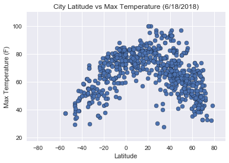
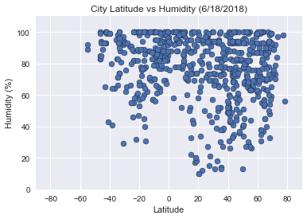
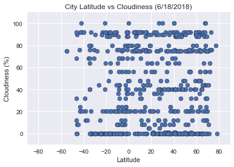
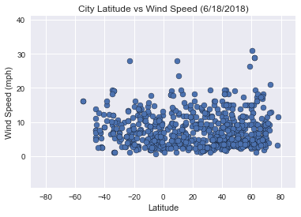

# WeatherPy

# Analysis

1. It can be concluded that there are significantly more cities in the nothern part of the word (Latitude 60 to 90), compered to cities in the southern part of the world (Latitude -60 to -90).
2. From the scatter plots it can also be seen that there isn't much correlation between latitude and wind speed or latitude and cloudiness at the time the data was taken on June 18, 2018.
3. The Latitude vs Max Temerature plot shows that as you move further away from the center, the maximun temerature is lower for cities compared to cities near the center on June 18, 2018.


```python
#import in needed dependencies and the API key to be used
import random
import pandas as pd
import numpy as np
import matplotlib.pyplot as plt
import requests
from pprint import pprint
OWkey = "b1f0c2d20eb09b5987b5a6d207ff81e1"
from citipy import citipy
import seaborn as sns; sns.set()
sns.set_color_codes()
import time
```

# Generate Dataframe with at least 500 Unique Cities


```python
#create an empty list to fill with country names and another one for country codes
names=[]
code =[]

#set a variable to 0 to use to run a while loop
x = 0
#use a while loop to create random coordiantes, find the closest city to them
#store the city's name and country code into a variable
#if the city's name isn't in the names list yet and there are less than 500 names in the list, add it to the list
while x < 500:
    #create coordinates for a random latitude 
    lat=(random.randint(-90,90))
    lng=(random.randint(-180,180))
    
    #use citipy to find the nearest city to the genreated coordinates and save the name and coutry code into variables
    city = citipy.nearest_city(lat, lng)
    cityName = city.city_name
    cityCCode = city.country_code

    #check to see if the name is in the list yet and that the list isn't full yet
    #if the conditions are met add the name to the names list and the country code to the code list
    if cityName not in names and len(names)<500:
        names.append(cityName)
        code.append(cityCCode)
    #set x to the length of names to run the loop again if there aren't enough unique countries    
    x = len(names)   

#create a dataframe using the names and code lists    
city_data = pd.DataFrame({
    "City Name":names,
    "Country Code": code
})

#get data for each city by making API calls
#create a variable for the url with the wanted units
url = "http://api.openweathermap.org/data/2.5/weather?units=Imperial&"
#create a variable to increment and show which call is being processed
p=0
#create empty lists to fill with data
clouds =[]
hum = []
date = []
Lat = []
Lng = []
maxTemp = []
windSpeed = []
#Show that the process is being started
print("Beginning Data Retrieval")
print("-"*30)


for cit in city_data["City Name"]:
    #Take the spaces out of each city's name to be used in the search url
    city = cit.replace(" ","")
    #create the full url by using the url, OWKey and city from the last step
    fullUrl = (f"{url}appid={OWkey}&q={city}")
    #increment p by 1
    p+=1
    #Display which number call is being done and the name of the city and the full url to make the call
    print(f"Processing Record {p} in set 1 | {city}")
    print(fullUrl)

    #create an object for the data
    obj = requests.get(fullUrl).json()
    
    #check to see if the data exists for a city by checking that 'cod' is 200, all other values can not be used
    if obj["cod"] == 200:
        #append the data to the proper list
        clouds.append(obj["clouds"]["all"])
        hum.append(obj["main"]["humidity"])
        date.append(obj["dt"])
        Lat.append(obj["coord"]["lat"])
        Lng.append(obj["coord"]["lon"])
        maxTemp.append(obj["main"]["temp_max"])
        windSpeed.append(obj["wind"]["speed"])
    else:    
        #if the data wasn't useable, append a value to the lists to be deleted later
        clouds.append("NA")
        hum.append("NA")
        date.append("NA")
        Lat.append("NA")
        Lng.append("NA")
        maxTemp.append("NA")
        windSpeed.append("NA")
    #The API key allows a maximun of 60 searches per minute, use time.sleep to pause the loop after each search to not exceed
    time.sleep(1)

#add new columns to the data frame for the new data
city_data["Cloudiness"] = clouds
city_data["Date"] = date
city_data["Humidity"] = hum
city_data["Lat"] = Lat
city_data["Lng"] = Lng
city_data["Max Temp"] = maxTemp
city_data["Wind Speed"] = windSpeed
# city_data.head()

#remove the rows that contain "NA" and reset the index
city_data2 = city_data[city_data.Date != "NA"]
city_data2 = city_data2.reset_index(drop=True)

#check to see if the there are enough unique cities in the data frame and if not find more cities
if len(city_data2) < 500:
    #reset the counting variable as well as the names and code lists
    x = 0
    names = []
    code = []
    #run the same loop to create coordinates and find their nearest city
    while x < 500:
        #create coordinates for a random latitude
        lat=(random.randint(-90,90))
        lng=(random.randint(-180,180))
        
        #use citipy to find the nearest city to the genreated coordinates and save the name and coutry code into variables
        city = citipy.nearest_city(lat, lng)
        cityName =city.city_name
        cityCCode = city.country_code

        #check to see if the name is in the list or the data frame yet and that the list isn't full yet
        #if the conditions are met add the name to the names list and the country code to the code list
        if cityName not in names and len(names)<500 and cityName not in city_data2["City Name"]:
            names.append(cityName)
            code.append(cityCCode)
        #set x to the length of names to run the loop again if there aren't enough unique countries    
        x = len(names)  

    #create a new data frame with the new data
    more_city_data = pd.DataFrame({
        "City Name":names,
        "Country Code": code})  
    
    #reset the counter and the lists to hold data
    p=0
    clouds =[]
    hum = []
    date = []
    Lat = []
    Lng = []
    maxTemp = []
    windSpeed = []
    
    for cit in more_city_data["City Name"]:
        #Take the spaces out of each city's name to be used in the search url
        city = cit.replace(" ","")
        #increment p by 1
        p+=1
        print(f"Processing Record {p} in set 2 | {city}")
        #create the full url by using the url, OWKey and city from the last step
        fullUrl = (f"{url}appid={OWkey}&q={city}")
        #display the full url that is being used
        print(fullUrl)
        

        #create an object for the data
        obj = requests.get(fullUrl).json()
        #check to see if the data exists for a city by checking that 'cod' is 200, all other values can not be used
        if obj["cod"] == 200:
            #append the data to the proper list
            clouds.append(obj["clouds"]["all"])
            hum.append(obj["main"]["humidity"])
            date.append(obj["dt"])
            Lat.append(obj["coord"]["lat"])
            Lng.append(obj["coord"]["lon"])
            maxTemp.append(obj["main"]["temp_max"])
            windSpeed.append(obj["wind"]["speed"])
        else:    
            #if the data wasn't useable, append a value to the lists to be deleted later
            clouds.append("NA")
            hum.append("NA")
            date.append("NA")
            Lat.append("NA")
            Lng.append("NA")
            maxTemp.append("NA")
            windSpeed.append("NA")
        #The API key allows a maximun of 60 searches per minute, use time.sleep to pause the loop after each search to not exceed
        time.sleep(1)
    #add new columns to the more_city_data  data frame for the new data    
    more_city_data["Cloudiness"] = clouds
    more_city_data["Date"] = date
    more_city_data["Humidity"] = hum
    more_city_data["Lat"] = Lat
    more_city_data["Lng"] = Lng
    more_city_data["Max Temp"] = maxTemp
    more_city_data["Wind Speed"] = windSpeed
    
    #merge the data frames together using "outer" to get all the data in one data frame
    city_data2 = pd.merge(city_data2, more_city_data, how="outer")

#Show that the process is complete
print("-"*30)
print("Data Retrieval Complete")
print("-"*30)
```

    Beginning Data Retrieval
    ------------------------------
    Processing Record 1 in set 1 | capetown
    http://api.openweathermap.org/data/2.5/weather?units=Imperial&appid=b1f0c2d20eb09b5987b5a6d207ff81e1&q=capetown
    Processing Record 2 in set 1 | mgandu
    http://api.openweathermap.org/data/2.5/weather?units=Imperial&appid=b1f0c2d20eb09b5987b5a6d207ff81e1&q=mgandu
    Processing Record 3 in set 1 | attawapiskat
    http://api.openweathermap.org/data/2.5/weather?units=Imperial&appid=b1f0c2d20eb09b5987b5a6d207ff81e1&q=attawapiskat
    Processing Record 4 in set 1 | ushuaia
    http://api.openweathermap.org/data/2.5/weather?units=Imperial&appid=b1f0c2d20eb09b5987b5a6d207ff81e1&q=ushuaia
    Processing Record 5 in set 1 | mardelplata
    http://api.openweathermap.org/data/2.5/weather?units=Imperial&appid=b1f0c2d20eb09b5987b5a6d207ff81e1&q=mardelplata
    Processing Record 6 in set 1 | carnarvon
    http://api.openweathermap.org/data/2.5/weather?units=Imperial&appid=b1f0c2d20eb09b5987b5a6d207ff81e1&q=carnarvon
    Processing Record 7 in set 1 | hilo
    http://api.openweathermap.org/data/2.5/weather?units=Imperial&appid=b1f0c2d20eb09b5987b5a6d207ff81e1&q=hilo
    Processing Record 8 in set 1 | touros
    http://api.openweathermap.org/data/2.5/weather?units=Imperial&appid=b1f0c2d20eb09b5987b5a6d207ff81e1&q=touros
    Processing Record 9 in set 1 | bengkulu
    http://api.openweathermap.org/data/2.5/weather?units=Imperial&appid=b1f0c2d20eb09b5987b5a6d207ff81e1&q=bengkulu
    Processing Record 10 in set 1 | butaritari
    http://api.openweathermap.org/data/2.5/weather?units=Imperial&appid=b1f0c2d20eb09b5987b5a6d207ff81e1&q=butaritari
    Processing Record 11 in set 1 | bredasdorp
    http://api.openweathermap.org/data/2.5/weather?units=Imperial&appid=b1f0c2d20eb09b5987b5a6d207ff81e1&q=bredasdorp
    Processing Record 12 in set 1 | lorengau
    http://api.openweathermap.org/data/2.5/weather?units=Imperial&appid=b1f0c2d20eb09b5987b5a6d207ff81e1&q=lorengau
    Processing Record 13 in set 1 | atuona
    http://api.openweathermap.org/data/2.5/weather?units=Imperial&appid=b1f0c2d20eb09b5987b5a6d207ff81e1&q=atuona
    Processing Record 14 in set 1 | dunedin
    http://api.openweathermap.org/data/2.5/weather?units=Imperial&appid=b1f0c2d20eb09b5987b5a6d207ff81e1&q=dunedin
    Processing Record 15 in set 1 | ambilobe
    http://api.openweathermap.org/data/2.5/weather?units=Imperial&appid=b1f0c2d20eb09b5987b5a6d207ff81e1&q=ambilobe
    Processing Record 16 in set 1 | castro
    http://api.openweathermap.org/data/2.5/weather?units=Imperial&appid=b1f0c2d20eb09b5987b5a6d207ff81e1&q=castro
    Processing Record 17 in set 1 | billings
    http://api.openweathermap.org/data/2.5/weather?units=Imperial&appid=b1f0c2d20eb09b5987b5a6d207ff81e1&q=billings
    Processing Record 18 in set 1 | pontadosol
    http://api.openweathermap.org/data/2.5/weather?units=Imperial&appid=b1f0c2d20eb09b5987b5a6d207ff81e1&q=pontadosol
    Processing Record 19 in set 1 | barentsburg
    http://api.openweathermap.org/data/2.5/weather?units=Imperial&appid=b1f0c2d20eb09b5987b5a6d207ff81e1&q=barentsburg
    Processing Record 20 in set 1 | pisco
    http://api.openweathermap.org/data/2.5/weather?units=Imperial&appid=b1f0c2d20eb09b5987b5a6d207ff81e1&q=pisco
    Processing Record 21 in set 1 | yuanping
    http://api.openweathermap.org/data/2.5/weather?units=Imperial&appid=b1f0c2d20eb09b5987b5a6d207ff81e1&q=yuanping
    Processing Record 22 in set 1 | nador
    http://api.openweathermap.org/data/2.5/weather?units=Imperial&appid=b1f0c2d20eb09b5987b5a6d207ff81e1&q=nador
    Processing Record 23 in set 1 | yellowknife
    http://api.openweathermap.org/data/2.5/weather?units=Imperial&appid=b1f0c2d20eb09b5987b5a6d207ff81e1&q=yellowknife
    Processing Record 24 in set 1 | taolanaro
    http://api.openweathermap.org/data/2.5/weather?units=Imperial&appid=b1f0c2d20eb09b5987b5a6d207ff81e1&q=taolanaro
    Processing Record 25 in set 1 | saofilipe
    http://api.openweathermap.org/data/2.5/weather?units=Imperial&appid=b1f0c2d20eb09b5987b5a6d207ff81e1&q=saofilipe
    Processing Record 26 in set 1 | eskasem
    http://api.openweathermap.org/data/2.5/weather?units=Imperial&appid=b1f0c2d20eb09b5987b5a6d207ff81e1&q=eskasem
    Processing Record 27 in set 1 | mataura
    http://api.openweathermap.org/data/2.5/weather?units=Imperial&appid=b1f0c2d20eb09b5987b5a6d207ff81e1&q=mataura
    Processing Record 28 in set 1 | jos
    http://api.openweathermap.org/data/2.5/weather?units=Imperial&appid=b1f0c2d20eb09b5987b5a6d207ff81e1&q=jos
    Processing Record 29 in set 1 | amderma
    http://api.openweathermap.org/data/2.5/weather?units=Imperial&appid=b1f0c2d20eb09b5987b5a6d207ff81e1&q=amderma
    Processing Record 30 in set 1 | portalfred
    http://api.openweathermap.org/data/2.5/weather?units=Imperial&appid=b1f0c2d20eb09b5987b5a6d207ff81e1&q=portalfred
    Processing Record 31 in set 1 | albany
    http://api.openweathermap.org/data/2.5/weather?units=Imperial&appid=b1f0c2d20eb09b5987b5a6d207ff81e1&q=albany
    Processing Record 32 in set 1 | mahebourg
    http://api.openweathermap.org/data/2.5/weather?units=Imperial&appid=b1f0c2d20eb09b5987b5a6d207ff81e1&q=mahebourg
    Processing Record 33 in set 1 | rikitea
    http://api.openweathermap.org/data/2.5/weather?units=Imperial&appid=b1f0c2d20eb09b5987b5a6d207ff81e1&q=rikitea
    Processing Record 34 in set 1 | kaitangata
    http://api.openweathermap.org/data/2.5/weather?units=Imperial&appid=b1f0c2d20eb09b5987b5a6d207ff81e1&q=kaitangata
    Processing Record 35 in set 1 | utiroa
    http://api.openweathermap.org/data/2.5/weather?units=Imperial&appid=b1f0c2d20eb09b5987b5a6d207ff81e1&q=utiroa
    Processing Record 36 in set 1 | hermanus
    http://api.openweathermap.org/data/2.5/weather?units=Imperial&appid=b1f0c2d20eb09b5987b5a6d207ff81e1&q=hermanus
    Processing Record 37 in set 1 | kishanganj
    http://api.openweathermap.org/data/2.5/weather?units=Imperial&appid=b1f0c2d20eb09b5987b5a6d207ff81e1&q=kishanganj
    Processing Record 38 in set 1 | nyakahanga
    http://api.openweathermap.org/data/2.5/weather?units=Imperial&appid=b1f0c2d20eb09b5987b5a6d207ff81e1&q=nyakahanga
    Processing Record 39 in set 1 | varberg
    http://api.openweathermap.org/data/2.5/weather?units=Imperial&appid=b1f0c2d20eb09b5987b5a6d207ff81e1&q=varberg
    Processing Record 40 in set 1 | hobart
    http://api.openweathermap.org/data/2.5/weather?units=Imperial&appid=b1f0c2d20eb09b5987b5a6d207ff81e1&q=hobart
    Processing Record 41 in set 1 | narsaq
    http://api.openweathermap.org/data/2.5/weather?units=Imperial&appid=b1f0c2d20eb09b5987b5a6d207ff81e1&q=narsaq
    Processing Record 42 in set 1 | puntaarenas
    http://api.openweathermap.org/data/2.5/weather?units=Imperial&appid=b1f0c2d20eb09b5987b5a6d207ff81e1&q=puntaarenas
    Processing Record 43 in set 1 | komsomolskiy
    http://api.openweathermap.org/data/2.5/weather?units=Imperial&appid=b1f0c2d20eb09b5987b5a6d207ff81e1&q=komsomolskiy
    Processing Record 44 in set 1 | abukamal
    http://api.openweathermap.org/data/2.5/weather?units=Imperial&appid=b1f0c2d20eb09b5987b5a6d207ff81e1&q=abukamal
    Processing Record 45 in set 1 | bluff
    http://api.openweathermap.org/data/2.5/weather?units=Imperial&appid=b1f0c2d20eb09b5987b5a6d207ff81e1&q=bluff
    Processing Record 46 in set 1 | lolua
    http://api.openweathermap.org/data/2.5/weather?units=Imperial&appid=b1f0c2d20eb09b5987b5a6d207ff81e1&q=lolua
    Processing Record 47 in set 1 | faro
    http://api.openweathermap.org/data/2.5/weather?units=Imperial&appid=b1f0c2d20eb09b5987b5a6d207ff81e1&q=faro
    Processing Record 48 in set 1 | cidreira
    http://api.openweathermap.org/data/2.5/weather?units=Imperial&appid=b1f0c2d20eb09b5987b5a6d207ff81e1&q=cidreira
    Processing Record 49 in set 1 | kavali
    http://api.openweathermap.org/data/2.5/weather?units=Imperial&appid=b1f0c2d20eb09b5987b5a6d207ff81e1&q=kavali
    Processing Record 50 in set 1 | birao
    http://api.openweathermap.org/data/2.5/weather?units=Imperial&appid=b1f0c2d20eb09b5987b5a6d207ff81e1&q=birao
    Processing Record 51 in set 1 | illoqqortoormiut
    http://api.openweathermap.org/data/2.5/weather?units=Imperial&appid=b1f0c2d20eb09b5987b5a6d207ff81e1&q=illoqqortoormiut
    Processing Record 52 in set 1 | tlazazalca
    http://api.openweathermap.org/data/2.5/weather?units=Imperial&appid=b1f0c2d20eb09b5987b5a6d207ff81e1&q=tlazazalca
    Processing Record 53 in set 1 | natal
    http://api.openweathermap.org/data/2.5/weather?units=Imperial&appid=b1f0c2d20eb09b5987b5a6d207ff81e1&q=natal
    Processing Record 54 in set 1 | portaugusta
    http://api.openweathermap.org/data/2.5/weather?units=Imperial&appid=b1f0c2d20eb09b5987b5a6d207ff81e1&q=portaugusta
    Processing Record 55 in set 1 | mahajanga
    http://api.openweathermap.org/data/2.5/weather?units=Imperial&appid=b1f0c2d20eb09b5987b5a6d207ff81e1&q=mahajanga
    Processing Record 56 in set 1 | vaitupu
    http://api.openweathermap.org/data/2.5/weather?units=Imperial&appid=b1f0c2d20eb09b5987b5a6d207ff81e1&q=vaitupu
    Processing Record 57 in set 1 | constitucion
    http://api.openweathermap.org/data/2.5/weather?units=Imperial&appid=b1f0c2d20eb09b5987b5a6d207ff81e1&q=constitucion
    Processing Record 58 in set 1 | ilulissat
    http://api.openweathermap.org/data/2.5/weather?units=Imperial&appid=b1f0c2d20eb09b5987b5a6d207ff81e1&q=ilulissat
    Processing Record 59 in set 1 | halberstadt
    http://api.openweathermap.org/data/2.5/weather?units=Imperial&appid=b1f0c2d20eb09b5987b5a6d207ff81e1&q=halberstadt
    Processing Record 60 in set 1 | butia
    http://api.openweathermap.org/data/2.5/weather?units=Imperial&appid=b1f0c2d20eb09b5987b5a6d207ff81e1&q=butia
    Processing Record 61 in set 1 | dingle
    http://api.openweathermap.org/data/2.5/weather?units=Imperial&appid=b1f0c2d20eb09b5987b5a6d207ff81e1&q=dingle
    Processing Record 62 in set 1 | canton
    http://api.openweathermap.org/data/2.5/weather?units=Imperial&appid=b1f0c2d20eb09b5987b5a6d207ff81e1&q=canton
    Processing Record 63 in set 1 | anloga
    http://api.openweathermap.org/data/2.5/weather?units=Imperial&appid=b1f0c2d20eb09b5987b5a6d207ff81e1&q=anloga
    Processing Record 64 in set 1 | portonovo
    http://api.openweathermap.org/data/2.5/weather?units=Imperial&appid=b1f0c2d20eb09b5987b5a6d207ff81e1&q=portonovo
    Processing Record 65 in set 1 | terracebay
    http://api.openweathermap.org/data/2.5/weather?units=Imperial&appid=b1f0c2d20eb09b5987b5a6d207ff81e1&q=terracebay
    Processing Record 66 in set 1 | grand-santi
    http://api.openweathermap.org/data/2.5/weather?units=Imperial&appid=b1f0c2d20eb09b5987b5a6d207ff81e1&q=grand-santi
    Processing Record 67 in set 1 | broome
    http://api.openweathermap.org/data/2.5/weather?units=Imperial&appid=b1f0c2d20eb09b5987b5a6d207ff81e1&q=broome
    Processing Record 68 in set 1 | mocuba
    http://api.openweathermap.org/data/2.5/weather?units=Imperial&appid=b1f0c2d20eb09b5987b5a6d207ff81e1&q=mocuba
    Processing Record 69 in set 1 | pamanukan
    http://api.openweathermap.org/data/2.5/weather?units=Imperial&appid=b1f0c2d20eb09b5987b5a6d207ff81e1&q=pamanukan
    Processing Record 70 in set 1 | tuktoyaktuk
    http://api.openweathermap.org/data/2.5/weather?units=Imperial&appid=b1f0c2d20eb09b5987b5a6d207ff81e1&q=tuktoyaktuk
    Processing Record 71 in set 1 | qaanaaq
    http://api.openweathermap.org/data/2.5/weather?units=Imperial&appid=b1f0c2d20eb09b5987b5a6d207ff81e1&q=qaanaaq
    Processing Record 72 in set 1 | miri
    http://api.openweathermap.org/data/2.5/weather?units=Imperial&appid=b1f0c2d20eb09b5987b5a6d207ff81e1&q=miri
    Processing Record 73 in set 1 | jamestown
    http://api.openweathermap.org/data/2.5/weather?units=Imperial&appid=b1f0c2d20eb09b5987b5a6d207ff81e1&q=jamestown
    Processing Record 74 in set 1 | vaini
    http://api.openweathermap.org/data/2.5/weather?units=Imperial&appid=b1f0c2d20eb09b5987b5a6d207ff81e1&q=vaini
    Processing Record 75 in set 1 | ciudadguayana
    http://api.openweathermap.org/data/2.5/weather?units=Imperial&appid=b1f0c2d20eb09b5987b5a6d207ff81e1&q=ciudadguayana
    Processing Record 76 in set 1 | longyearbyen
    http://api.openweathermap.org/data/2.5/weather?units=Imperial&appid=b1f0c2d20eb09b5987b5a6d207ff81e1&q=longyearbyen
    Processing Record 77 in set 1 | alofi
    http://api.openweathermap.org/data/2.5/weather?units=Imperial&appid=b1f0c2d20eb09b5987b5a6d207ff81e1&q=alofi
    Processing Record 78 in set 1 | sesheke
    http://api.openweathermap.org/data/2.5/weather?units=Imperial&appid=b1f0c2d20eb09b5987b5a6d207ff81e1&q=sesheke
    Processing Record 79 in set 1 | arraialdocabo
    http://api.openweathermap.org/data/2.5/weather?units=Imperial&appid=b1f0c2d20eb09b5987b5a6d207ff81e1&q=arraialdocabo
    Processing Record 80 in set 1 | hasaki
    http://api.openweathermap.org/data/2.5/weather?units=Imperial&appid=b1f0c2d20eb09b5987b5a6d207ff81e1&q=hasaki
    Processing Record 81 in set 1 | fukue
    http://api.openweathermap.org/data/2.5/weather?units=Imperial&appid=b1f0c2d20eb09b5987b5a6d207ff81e1&q=fukue
    Processing Record 82 in set 1 | gravdal
    http://api.openweathermap.org/data/2.5/weather?units=Imperial&appid=b1f0c2d20eb09b5987b5a6d207ff81e1&q=gravdal
    Processing Record 83 in set 1 | riogallegos
    http://api.openweathermap.org/data/2.5/weather?units=Imperial&appid=b1f0c2d20eb09b5987b5a6d207ff81e1&q=riogallegos
    Processing Record 84 in set 1 | kentau
    http://api.openweathermap.org/data/2.5/weather?units=Imperial&appid=b1f0c2d20eb09b5987b5a6d207ff81e1&q=kentau
    Processing Record 85 in set 1 | hovd
    http://api.openweathermap.org/data/2.5/weather?units=Imperial&appid=b1f0c2d20eb09b5987b5a6d207ff81e1&q=hovd
    Processing Record 86 in set 1 | salalah
    http://api.openweathermap.org/data/2.5/weather?units=Imperial&appid=b1f0c2d20eb09b5987b5a6d207ff81e1&q=salalah
    Processing Record 87 in set 1 | saint-joseph
    http://api.openweathermap.org/data/2.5/weather?units=Imperial&appid=b1f0c2d20eb09b5987b5a6d207ff81e1&q=saint-joseph
    Processing Record 88 in set 1 | boddentown
    http://api.openweathermap.org/data/2.5/weather?units=Imperial&appid=b1f0c2d20eb09b5987b5a6d207ff81e1&q=boddentown
    Processing Record 89 in set 1 | mysshmidta
    http://api.openweathermap.org/data/2.5/weather?units=Imperial&appid=b1f0c2d20eb09b5987b5a6d207ff81e1&q=mysshmidta
    Processing Record 90 in set 1 | eisiskes
    http://api.openweathermap.org/data/2.5/weather?units=Imperial&appid=b1f0c2d20eb09b5987b5a6d207ff81e1&q=eisiskes
    Processing Record 91 in set 1 | nizhneyansk
    http://api.openweathermap.org/data/2.5/weather?units=Imperial&appid=b1f0c2d20eb09b5987b5a6d207ff81e1&q=nizhneyansk
    Processing Record 92 in set 1 | naze
    http://api.openweathermap.org/data/2.5/weather?units=Imperial&appid=b1f0c2d20eb09b5987b5a6d207ff81e1&q=naze
    Processing Record 93 in set 1 | dikson
    http://api.openweathermap.org/data/2.5/weather?units=Imperial&appid=b1f0c2d20eb09b5987b5a6d207ff81e1&q=dikson
    Processing Record 94 in set 1 | mutis
    http://api.openweathermap.org/data/2.5/weather?units=Imperial&appid=b1f0c2d20eb09b5987b5a6d207ff81e1&q=mutis
    Processing Record 95 in set 1 | klaksvik
    http://api.openweathermap.org/data/2.5/weather?units=Imperial&appid=b1f0c2d20eb09b5987b5a6d207ff81e1&q=klaksvik
    Processing Record 96 in set 1 | busselton
    http://api.openweathermap.org/data/2.5/weather?units=Imperial&appid=b1f0c2d20eb09b5987b5a6d207ff81e1&q=busselton
    Processing Record 97 in set 1 | yulara
    http://api.openweathermap.org/data/2.5/weather?units=Imperial&appid=b1f0c2d20eb09b5987b5a6d207ff81e1&q=yulara
    Processing Record 98 in set 1 | portelizabeth
    http://api.openweathermap.org/data/2.5/weather?units=Imperial&appid=b1f0c2d20eb09b5987b5a6d207ff81e1&q=portelizabeth
    Processing Record 99 in set 1 | ostrovnoy
    http://api.openweathermap.org/data/2.5/weather?units=Imperial&appid=b1f0c2d20eb09b5987b5a6d207ff81e1&q=ostrovnoy
    Processing Record 100 in set 1 | bernalillo
    http://api.openweathermap.org/data/2.5/weather?units=Imperial&appid=b1f0c2d20eb09b5987b5a6d207ff81e1&q=bernalillo
    Processing Record 101 in set 1 | tasiilaq
    http://api.openweathermap.org/data/2.5/weather?units=Imperial&appid=b1f0c2d20eb09b5987b5a6d207ff81e1&q=tasiilaq
    Processing Record 102 in set 1 | jesusdelmonte
    http://api.openweathermap.org/data/2.5/weather?units=Imperial&appid=b1f0c2d20eb09b5987b5a6d207ff81e1&q=jesusdelmonte
    Processing Record 103 in set 1 | pirna
    http://api.openweathermap.org/data/2.5/weather?units=Imperial&appid=b1f0c2d20eb09b5987b5a6d207ff81e1&q=pirna
    Processing Record 104 in set 1 | avarua
    http://api.openweathermap.org/data/2.5/weather?units=Imperial&appid=b1f0c2d20eb09b5987b5a6d207ff81e1&q=avarua
    Processing Record 105 in set 1 | saint-philippe
    http://api.openweathermap.org/data/2.5/weather?units=Imperial&appid=b1f0c2d20eb09b5987b5a6d207ff81e1&q=saint-philippe
    Processing Record 106 in set 1 | puertoayora
    http://api.openweathermap.org/data/2.5/weather?units=Imperial&appid=b1f0c2d20eb09b5987b5a6d207ff81e1&q=puertoayora
    Processing Record 107 in set 1 | provideniya
    http://api.openweathermap.org/data/2.5/weather?units=Imperial&appid=b1f0c2d20eb09b5987b5a6d207ff81e1&q=provideniya
    Processing Record 108 in set 1 | pilar
    http://api.openweathermap.org/data/2.5/weather?units=Imperial&appid=b1f0c2d20eb09b5987b5a6d207ff81e1&q=pilar
    Processing Record 109 in set 1 | zabol
    http://api.openweathermap.org/data/2.5/weather?units=Imperial&appid=b1f0c2d20eb09b5987b5a6d207ff81e1&q=zabol
    Processing Record 110 in set 1 | sur
    http://api.openweathermap.org/data/2.5/weather?units=Imperial&appid=b1f0c2d20eb09b5987b5a6d207ff81e1&q=sur
    Processing Record 111 in set 1 | saleaula
    http://api.openweathermap.org/data/2.5/weather?units=Imperial&appid=b1f0c2d20eb09b5987b5a6d207ff81e1&q=saleaula
    Processing Record 112 in set 1 | brokenhill
    http://api.openweathermap.org/data/2.5/weather?units=Imperial&appid=b1f0c2d20eb09b5987b5a6d207ff81e1&q=brokenhill
    Processing Record 113 in set 1 | gaurnadi
    http://api.openweathermap.org/data/2.5/weather?units=Imperial&appid=b1f0c2d20eb09b5987b5a6d207ff81e1&q=gaurnadi
    Processing Record 114 in set 1 | sechura
    http://api.openweathermap.org/data/2.5/weather?units=Imperial&appid=b1f0c2d20eb09b5987b5a6d207ff81e1&q=sechura
    Processing Record 115 in set 1 | lagoa
    http://api.openweathermap.org/data/2.5/weather?units=Imperial&appid=b1f0c2d20eb09b5987b5a6d207ff81e1&q=lagoa
    Processing Record 116 in set 1 | izumo
    http://api.openweathermap.org/data/2.5/weather?units=Imperial&appid=b1f0c2d20eb09b5987b5a6d207ff81e1&q=izumo
    Processing Record 117 in set 1 | kunigal
    http://api.openweathermap.org/data/2.5/weather?units=Imperial&appid=b1f0c2d20eb09b5987b5a6d207ff81e1&q=kunigal
    Processing Record 118 in set 1 | grindavik
    http://api.openweathermap.org/data/2.5/weather?units=Imperial&appid=b1f0c2d20eb09b5987b5a6d207ff81e1&q=grindavik
    Processing Record 119 in set 1 | arica
    http://api.openweathermap.org/data/2.5/weather?units=Imperial&appid=b1f0c2d20eb09b5987b5a6d207ff81e1&q=arica
    Processing Record 120 in set 1 | ourofino
    http://api.openweathermap.org/data/2.5/weather?units=Imperial&appid=b1f0c2d20eb09b5987b5a6d207ff81e1&q=ourofino
    Processing Record 121 in set 1 | palu
    http://api.openweathermap.org/data/2.5/weather?units=Imperial&appid=b1f0c2d20eb09b5987b5a6d207ff81e1&q=palu
    Processing Record 122 in set 1 | belushyaguba
    http://api.openweathermap.org/data/2.5/weather?units=Imperial&appid=b1f0c2d20eb09b5987b5a6d207ff81e1&q=belushyaguba
    Processing Record 123 in set 1 | tumannyy
    http://api.openweathermap.org/data/2.5/weather?units=Imperial&appid=b1f0c2d20eb09b5987b5a6d207ff81e1&q=tumannyy
    Processing Record 124 in set 1 | yingkou
    http://api.openweathermap.org/data/2.5/weather?units=Imperial&appid=b1f0c2d20eb09b5987b5a6d207ff81e1&q=yingkou
    Processing Record 125 in set 1 | riberalta
    http://api.openweathermap.org/data/2.5/weather?units=Imperial&appid=b1f0c2d20eb09b5987b5a6d207ff81e1&q=riberalta
    Processing Record 126 in set 1 | sinkat
    http://api.openweathermap.org/data/2.5/weather?units=Imperial&appid=b1f0c2d20eb09b5987b5a6d207ff81e1&q=sinkat
    Processing Record 127 in set 1 | sentyabrskiy
    http://api.openweathermap.org/data/2.5/weather?units=Imperial&appid=b1f0c2d20eb09b5987b5a6d207ff81e1&q=sentyabrskiy
    Processing Record 128 in set 1 | erenhot
    http://api.openweathermap.org/data/2.5/weather?units=Imperial&appid=b1f0c2d20eb09b5987b5a6d207ff81e1&q=erenhot
    Processing Record 129 in set 1 | portlincoln
    http://api.openweathermap.org/data/2.5/weather?units=Imperial&appid=b1f0c2d20eb09b5987b5a6d207ff81e1&q=portlincoln
    Processing Record 130 in set 1 | mayo
    http://api.openweathermap.org/data/2.5/weather?units=Imperial&appid=b1f0c2d20eb09b5987b5a6d207ff81e1&q=mayo
    Processing Record 131 in set 1 | srednekolymsk
    http://api.openweathermap.org/data/2.5/weather?units=Imperial&appid=b1f0c2d20eb09b5987b5a6d207ff81e1&q=srednekolymsk
    Processing Record 132 in set 1 | abusamrah
    http://api.openweathermap.org/data/2.5/weather?units=Imperial&appid=b1f0c2d20eb09b5987b5a6d207ff81e1&q=abusamrah
    Processing Record 133 in set 1 | grandgaube
    http://api.openweathermap.org/data/2.5/weather?units=Imperial&appid=b1f0c2d20eb09b5987b5a6d207ff81e1&q=grandgaube
    Processing Record 134 in set 1 | magadan
    http://api.openweathermap.org/data/2.5/weather?units=Imperial&appid=b1f0c2d20eb09b5987b5a6d207ff81e1&q=magadan
    Processing Record 135 in set 1 | moron
    http://api.openweathermap.org/data/2.5/weather?units=Imperial&appid=b1f0c2d20eb09b5987b5a6d207ff81e1&q=moron
    Processing Record 136 in set 1 | tura
    http://api.openweathermap.org/data/2.5/weather?units=Imperial&appid=b1f0c2d20eb09b5987b5a6d207ff81e1&q=tura
    Processing Record 137 in set 1 | westport
    http://api.openweathermap.org/data/2.5/weather?units=Imperial&appid=b1f0c2d20eb09b5987b5a6d207ff81e1&q=westport
    Processing Record 138 in set 1 | kruisfontein
    http://api.openweathermap.org/data/2.5/weather?units=Imperial&appid=b1f0c2d20eb09b5987b5a6d207ff81e1&q=kruisfontein
    Processing Record 139 in set 1 | katy
    http://api.openweathermap.org/data/2.5/weather?units=Imperial&appid=b1f0c2d20eb09b5987b5a6d207ff81e1&q=katy
    Processing Record 140 in set 1 | pata
    http://api.openweathermap.org/data/2.5/weather?units=Imperial&appid=b1f0c2d20eb09b5987b5a6d207ff81e1&q=pata
    Processing Record 141 in set 1 | kapaa
    http://api.openweathermap.org/data/2.5/weather?units=Imperial&appid=b1f0c2d20eb09b5987b5a6d207ff81e1&q=kapaa
    Processing Record 142 in set 1 | leningradskiy
    http://api.openweathermap.org/data/2.5/weather?units=Imperial&appid=b1f0c2d20eb09b5987b5a6d207ff81e1&q=leningradskiy
    Processing Record 143 in set 1 | airai
    http://api.openweathermap.org/data/2.5/weather?units=Imperial&appid=b1f0c2d20eb09b5987b5a6d207ff81e1&q=airai
    Processing Record 144 in set 1 | guaruja
    http://api.openweathermap.org/data/2.5/weather?units=Imperial&appid=b1f0c2d20eb09b5987b5a6d207ff81e1&q=guaruja
    Processing Record 145 in set 1 | thompson
    http://api.openweathermap.org/data/2.5/weather?units=Imperial&appid=b1f0c2d20eb09b5987b5a6d207ff81e1&q=thompson
    Processing Record 146 in set 1 | burica
    http://api.openweathermap.org/data/2.5/weather?units=Imperial&appid=b1f0c2d20eb09b5987b5a6d207ff81e1&q=burica
    Processing Record 147 in set 1 | torbay
    http://api.openweathermap.org/data/2.5/weather?units=Imperial&appid=b1f0c2d20eb09b5987b5a6d207ff81e1&q=torbay
    Processing Record 148 in set 1 | tazovskiy
    http://api.openweathermap.org/data/2.5/weather?units=Imperial&appid=b1f0c2d20eb09b5987b5a6d207ff81e1&q=tazovskiy
    Processing Record 149 in set 1 | stoyba
    http://api.openweathermap.org/data/2.5/weather?units=Imperial&appid=b1f0c2d20eb09b5987b5a6d207ff81e1&q=stoyba
    Processing Record 150 in set 1 | axim
    http://api.openweathermap.org/data/2.5/weather?units=Imperial&appid=b1f0c2d20eb09b5987b5a6d207ff81e1&q=axim
    Processing Record 151 in set 1 | vardo
    http://api.openweathermap.org/data/2.5/weather?units=Imperial&appid=b1f0c2d20eb09b5987b5a6d207ff81e1&q=vardo
    Processing Record 152 in set 1 | flinders
    http://api.openweathermap.org/data/2.5/weather?units=Imperial&appid=b1f0c2d20eb09b5987b5a6d207ff81e1&q=flinders
    Processing Record 153 in set 1 | bethel
    http://api.openweathermap.org/data/2.5/weather?units=Imperial&appid=b1f0c2d20eb09b5987b5a6d207ff81e1&q=bethel
    Processing Record 154 in set 1 | newnorfolk
    http://api.openweathermap.org/data/2.5/weather?units=Imperial&appid=b1f0c2d20eb09b5987b5a6d207ff81e1&q=newnorfolk
    Processing Record 155 in set 1 | quinhon
    http://api.openweathermap.org/data/2.5/weather?units=Imperial&appid=b1f0c2d20eb09b5987b5a6d207ff81e1&q=quinhon
    Processing Record 156 in set 1 | aklavik
    http://api.openweathermap.org/data/2.5/weather?units=Imperial&appid=b1f0c2d20eb09b5987b5a6d207ff81e1&q=aklavik
    Processing Record 157 in set 1 | sorong
    http://api.openweathermap.org/data/2.5/weather?units=Imperial&appid=b1f0c2d20eb09b5987b5a6d207ff81e1&q=sorong
    Processing Record 158 in set 1 | paragominas
    http://api.openweathermap.org/data/2.5/weather?units=Imperial&appid=b1f0c2d20eb09b5987b5a6d207ff81e1&q=paragominas
    Processing Record 159 in set 1 | svetlaya
    http://api.openweathermap.org/data/2.5/weather?units=Imperial&appid=b1f0c2d20eb09b5987b5a6d207ff81e1&q=svetlaya
    Processing Record 160 in set 1 | kazalinsk
    http://api.openweathermap.org/data/2.5/weather?units=Imperial&appid=b1f0c2d20eb09b5987b5a6d207ff81e1&q=kazalinsk
    Processing Record 161 in set 1 | sabya
    http://api.openweathermap.org/data/2.5/weather?units=Imperial&appid=b1f0c2d20eb09b5987b5a6d207ff81e1&q=sabya
    Processing Record 162 in set 1 | dzhebariki-khaya
    http://api.openweathermap.org/data/2.5/weather?units=Imperial&appid=b1f0c2d20eb09b5987b5a6d207ff81e1&q=dzhebariki-khaya
    Processing Record 163 in set 1 | makat
    http://api.openweathermap.org/data/2.5/weather?units=Imperial&appid=b1f0c2d20eb09b5987b5a6d207ff81e1&q=makat
    Processing Record 164 in set 1 | carutapera
    http://api.openweathermap.org/data/2.5/weather?units=Imperial&appid=b1f0c2d20eb09b5987b5a6d207ff81e1&q=carutapera
    Processing Record 165 in set 1 | saojoaodabarra
    http://api.openweathermap.org/data/2.5/weather?units=Imperial&appid=b1f0c2d20eb09b5987b5a6d207ff81e1&q=saojoaodabarra
    Processing Record 166 in set 1 | cururupu
    http://api.openweathermap.org/data/2.5/weather?units=Imperial&appid=b1f0c2d20eb09b5987b5a6d207ff81e1&q=cururupu
    Processing Record 167 in set 1 | taywarah
    http://api.openweathermap.org/data/2.5/weather?units=Imperial&appid=b1f0c2d20eb09b5987b5a6d207ff81e1&q=taywarah
    Processing Record 168 in set 1 | rongcheng
    http://api.openweathermap.org/data/2.5/weather?units=Imperial&appid=b1f0c2d20eb09b5987b5a6d207ff81e1&q=rongcheng
    Processing Record 169 in set 1 | selenduma
    http://api.openweathermap.org/data/2.5/weather?units=Imperial&appid=b1f0c2d20eb09b5987b5a6d207ff81e1&q=selenduma
    Processing Record 170 in set 1 | jutai
    http://api.openweathermap.org/data/2.5/weather?units=Imperial&appid=b1f0c2d20eb09b5987b5a6d207ff81e1&q=jutai
    Processing Record 171 in set 1 | ketchikan
    http://api.openweathermap.org/data/2.5/weather?units=Imperial&appid=b1f0c2d20eb09b5987b5a6d207ff81e1&q=ketchikan
    Processing Record 172 in set 1 | sanpatricio
    http://api.openweathermap.org/data/2.5/weather?units=Imperial&appid=b1f0c2d20eb09b5987b5a6d207ff81e1&q=sanpatricio
    Processing Record 173 in set 1 | atambua
    http://api.openweathermap.org/data/2.5/weather?units=Imperial&appid=b1f0c2d20eb09b5987b5a6d207ff81e1&q=atambua
    Processing Record 174 in set 1 | gao
    http://api.openweathermap.org/data/2.5/weather?units=Imperial&appid=b1f0c2d20eb09b5987b5a6d207ff81e1&q=gao
    Processing Record 175 in set 1 | eastlondon
    http://api.openweathermap.org/data/2.5/weather?units=Imperial&appid=b1f0c2d20eb09b5987b5a6d207ff81e1&q=eastlondon
    Processing Record 176 in set 1 | marcona
    http://api.openweathermap.org/data/2.5/weather?units=Imperial&appid=b1f0c2d20eb09b5987b5a6d207ff81e1&q=marcona
    Processing Record 177 in set 1 | alenquer
    http://api.openweathermap.org/data/2.5/weather?units=Imperial&appid=b1f0c2d20eb09b5987b5a6d207ff81e1&q=alenquer
    Processing Record 178 in set 1 | abudhabi
    http://api.openweathermap.org/data/2.5/weather?units=Imperial&appid=b1f0c2d20eb09b5987b5a6d207ff81e1&q=abudhabi
    Processing Record 179 in set 1 | mitu
    http://api.openweathermap.org/data/2.5/weather?units=Imperial&appid=b1f0c2d20eb09b5987b5a6d207ff81e1&q=mitu
    Processing Record 180 in set 1 | bairiki
    http://api.openweathermap.org/data/2.5/weather?units=Imperial&appid=b1f0c2d20eb09b5987b5a6d207ff81e1&q=bairiki
    Processing Record 181 in set 1 | khatanga
    http://api.openweathermap.org/data/2.5/weather?units=Imperial&appid=b1f0c2d20eb09b5987b5a6d207ff81e1&q=khatanga
    Processing Record 182 in set 1 | leh
    http://api.openweathermap.org/data/2.5/weather?units=Imperial&appid=b1f0c2d20eb09b5987b5a6d207ff81e1&q=leh
    Processing Record 183 in set 1 | falam
    http://api.openweathermap.org/data/2.5/weather?units=Imperial&appid=b1f0c2d20eb09b5987b5a6d207ff81e1&q=falam
    Processing Record 184 in set 1 | laguna
    http://api.openweathermap.org/data/2.5/weather?units=Imperial&appid=b1f0c2d20eb09b5987b5a6d207ff81e1&q=laguna
    Processing Record 185 in set 1 | georgetown
    http://api.openweathermap.org/data/2.5/weather?units=Imperial&appid=b1f0c2d20eb09b5987b5a6d207ff81e1&q=georgetown
    Processing Record 186 in set 1 | sitka
    http://api.openweathermap.org/data/2.5/weather?units=Imperial&appid=b1f0c2d20eb09b5987b5a6d207ff81e1&q=sitka
    Processing Record 187 in set 1 | ancud
    http://api.openweathermap.org/data/2.5/weather?units=Imperial&appid=b1f0c2d20eb09b5987b5a6d207ff81e1&q=ancud
    Processing Record 188 in set 1 | victoria
    http://api.openweathermap.org/data/2.5/weather?units=Imperial&appid=b1f0c2d20eb09b5987b5a6d207ff81e1&q=victoria
    Processing Record 189 in set 1 | guerreronegro
    http://api.openweathermap.org/data/2.5/weather?units=Imperial&appid=b1f0c2d20eb09b5987b5a6d207ff81e1&q=guerreronegro
    Processing Record 190 in set 1 | lompoc
    http://api.openweathermap.org/data/2.5/weather?units=Imperial&appid=b1f0c2d20eb09b5987b5a6d207ff81e1&q=lompoc
    Processing Record 191 in set 1 | normanwells
    http://api.openweathermap.org/data/2.5/weather?units=Imperial&appid=b1f0c2d20eb09b5987b5a6d207ff81e1&q=normanwells
    Processing Record 192 in set 1 | tsaratanana
    http://api.openweathermap.org/data/2.5/weather?units=Imperial&appid=b1f0c2d20eb09b5987b5a6d207ff81e1&q=tsaratanana
    Processing Record 193 in set 1 | chokurdakh
    http://api.openweathermap.org/data/2.5/weather?units=Imperial&appid=b1f0c2d20eb09b5987b5a6d207ff81e1&q=chokurdakh
    Processing Record 194 in set 1 | ummlajj
    http://api.openweathermap.org/data/2.5/weather?units=Imperial&appid=b1f0c2d20eb09b5987b5a6d207ff81e1&q=ummlajj
    Processing Record 195 in set 1 | erfurt
    http://api.openweathermap.org/data/2.5/weather?units=Imperial&appid=b1f0c2d20eb09b5987b5a6d207ff81e1&q=erfurt
    Processing Record 196 in set 1 | cabosanlucas
    http://api.openweathermap.org/data/2.5/weather?units=Imperial&appid=b1f0c2d20eb09b5987b5a6d207ff81e1&q=cabosanlucas
    Processing Record 197 in set 1 | pevek
    http://api.openweathermap.org/data/2.5/weather?units=Imperial&appid=b1f0c2d20eb09b5987b5a6d207ff81e1&q=pevek
    Processing Record 198 in set 1 | losalgarrobos
    http://api.openweathermap.org/data/2.5/weather?units=Imperial&appid=b1f0c2d20eb09b5987b5a6d207ff81e1&q=losalgarrobos
    Processing Record 199 in set 1 | sarakhs
    http://api.openweathermap.org/data/2.5/weather?units=Imperial&appid=b1f0c2d20eb09b5987b5a6d207ff81e1&q=sarakhs
    Processing Record 200 in set 1 | adrar
    http://api.openweathermap.org/data/2.5/weather?units=Imperial&appid=b1f0c2d20eb09b5987b5a6d207ff81e1&q=adrar
    Processing Record 201 in set 1 | olinda
    http://api.openweathermap.org/data/2.5/weather?units=Imperial&appid=b1f0c2d20eb09b5987b5a6d207ff81e1&q=olinda
    Processing Record 202 in set 1 | hithadhoo
    http://api.openweathermap.org/data/2.5/weather?units=Imperial&appid=b1f0c2d20eb09b5987b5a6d207ff81e1&q=hithadhoo
    Processing Record 203 in set 1 | lebanon
    http://api.openweathermap.org/data/2.5/weather?units=Imperial&appid=b1f0c2d20eb09b5987b5a6d207ff81e1&q=lebanon
    Processing Record 204 in set 1 | grandriversoutheast
    http://api.openweathermap.org/data/2.5/weather?units=Imperial&appid=b1f0c2d20eb09b5987b5a6d207ff81e1&q=grandriversoutheast
    Processing Record 205 in set 1 | tiassale
    http://api.openweathermap.org/data/2.5/weather?units=Imperial&appid=b1f0c2d20eb09b5987b5a6d207ff81e1&q=tiassale
    Processing Record 206 in set 1 | porthedland
    http://api.openweathermap.org/data/2.5/weather?units=Imperial&appid=b1f0c2d20eb09b5987b5a6d207ff81e1&q=porthedland
    Processing Record 207 in set 1 | barrow
    http://api.openweathermap.org/data/2.5/weather?units=Imperial&appid=b1f0c2d20eb09b5987b5a6d207ff81e1&q=barrow
    Processing Record 208 in set 1 | chuy
    http://api.openweathermap.org/data/2.5/weather?units=Imperial&appid=b1f0c2d20eb09b5987b5a6d207ff81e1&q=chuy
    Processing Record 209 in set 1 | luau
    http://api.openweathermap.org/data/2.5/weather?units=Imperial&appid=b1f0c2d20eb09b5987b5a6d207ff81e1&q=luau
    Processing Record 210 in set 1 | kieta
    http://api.openweathermap.org/data/2.5/weather?units=Imperial&appid=b1f0c2d20eb09b5987b5a6d207ff81e1&q=kieta
    Processing Record 211 in set 1 | cherskiy
    http://api.openweathermap.org/data/2.5/weather?units=Imperial&appid=b1f0c2d20eb09b5987b5a6d207ff81e1&q=cherskiy
    Processing Record 212 in set 1 | nioaque
    http://api.openweathermap.org/data/2.5/weather?units=Imperial&appid=b1f0c2d20eb09b5987b5a6d207ff81e1&q=nioaque
    Processing Record 213 in set 1 | luderitz
    http://api.openweathermap.org/data/2.5/weather?units=Imperial&appid=b1f0c2d20eb09b5987b5a6d207ff81e1&q=luderitz
    Processing Record 214 in set 1 | pochutla
    http://api.openweathermap.org/data/2.5/weather?units=Imperial&appid=b1f0c2d20eb09b5987b5a6d207ff81e1&q=pochutla
    Processing Record 215 in set 1 | caravelas
    http://api.openweathermap.org/data/2.5/weather?units=Imperial&appid=b1f0c2d20eb09b5987b5a6d207ff81e1&q=caravelas
    Processing Record 216 in set 1 | faanui
    http://api.openweathermap.org/data/2.5/weather?units=Imperial&appid=b1f0c2d20eb09b5987b5a6d207ff81e1&q=faanui
    Processing Record 217 in set 1 | dubbo
    http://api.openweathermap.org/data/2.5/weather?units=Imperial&appid=b1f0c2d20eb09b5987b5a6d207ff81e1&q=dubbo
    Processing Record 218 in set 1 | perevolotskiy
    http://api.openweathermap.org/data/2.5/weather?units=Imperial&appid=b1f0c2d20eb09b5987b5a6d207ff81e1&q=perevolotskiy
    Processing Record 219 in set 1 | kirakira
    http://api.openweathermap.org/data/2.5/weather?units=Imperial&appid=b1f0c2d20eb09b5987b5a6d207ff81e1&q=kirakira
    Processing Record 220 in set 1 | upernavik
    http://api.openweathermap.org/data/2.5/weather?units=Imperial&appid=b1f0c2d20eb09b5987b5a6d207ff81e1&q=upernavik
    Processing Record 221 in set 1 | beringovskiy
    http://api.openweathermap.org/data/2.5/weather?units=Imperial&appid=b1f0c2d20eb09b5987b5a6d207ff81e1&q=beringovskiy
    Processing Record 222 in set 1 | bracebridge
    http://api.openweathermap.org/data/2.5/weather?units=Imperial&appid=b1f0c2d20eb09b5987b5a6d207ff81e1&q=bracebridge
    Processing Record 223 in set 1 | inhambane
    http://api.openweathermap.org/data/2.5/weather?units=Imperial&appid=b1f0c2d20eb09b5987b5a6d207ff81e1&q=inhambane
    Processing Record 224 in set 1 | coihaique
    http://api.openweathermap.org/data/2.5/weather?units=Imperial&appid=b1f0c2d20eb09b5987b5a6d207ff81e1&q=coihaique
    Processing Record 225 in set 1 | tessalit
    http://api.openweathermap.org/data/2.5/weather?units=Imperial&appid=b1f0c2d20eb09b5987b5a6d207ff81e1&q=tessalit
    Processing Record 226 in set 1 | kodiak
    http://api.openweathermap.org/data/2.5/weather?units=Imperial&appid=b1f0c2d20eb09b5987b5a6d207ff81e1&q=kodiak
    Processing Record 227 in set 1 | buin
    http://api.openweathermap.org/data/2.5/weather?units=Imperial&appid=b1f0c2d20eb09b5987b5a6d207ff81e1&q=buin
    Processing Record 228 in set 1 | kloulklubed
    http://api.openweathermap.org/data/2.5/weather?units=Imperial&appid=b1f0c2d20eb09b5987b5a6d207ff81e1&q=kloulklubed
    Processing Record 229 in set 1 | thurso
    http://api.openweathermap.org/data/2.5/weather?units=Imperial&appid=b1f0c2d20eb09b5987b5a6d207ff81e1&q=thurso
    Processing Record 230 in set 1 | jinan
    http://api.openweathermap.org/data/2.5/weather?units=Imperial&appid=b1f0c2d20eb09b5987b5a6d207ff81e1&q=jinan
    Processing Record 231 in set 1 | novoaripuana
    http://api.openweathermap.org/data/2.5/weather?units=Imperial&appid=b1f0c2d20eb09b5987b5a6d207ff81e1&q=novoaripuana
    Processing Record 232 in set 1 | donsak
    http://api.openweathermap.org/data/2.5/weather?units=Imperial&appid=b1f0c2d20eb09b5987b5a6d207ff81e1&q=donsak
    Processing Record 233 in set 1 | contamana
    http://api.openweathermap.org/data/2.5/weather?units=Imperial&appid=b1f0c2d20eb09b5987b5a6d207ff81e1&q=contamana
    Processing Record 234 in set 1 | nhulunbuy
    http://api.openweathermap.org/data/2.5/weather?units=Imperial&appid=b1f0c2d20eb09b5987b5a6d207ff81e1&q=nhulunbuy
    Processing Record 235 in set 1 | uvat
    http://api.openweathermap.org/data/2.5/weather?units=Imperial&appid=b1f0c2d20eb09b5987b5a6d207ff81e1&q=uvat
    Processing Record 236 in set 1 | viransehir
    http://api.openweathermap.org/data/2.5/weather?units=Imperial&appid=b1f0c2d20eb09b5987b5a6d207ff81e1&q=viransehir
    Processing Record 237 in set 1 | cumaribo
    http://api.openweathermap.org/data/2.5/weather?units=Imperial&appid=b1f0c2d20eb09b5987b5a6d207ff81e1&q=cumaribo
    Processing Record 238 in set 1 | fereydunshahr
    http://api.openweathermap.org/data/2.5/weather?units=Imperial&appid=b1f0c2d20eb09b5987b5a6d207ff81e1&q=fereydunshahr
    Processing Record 239 in set 1 | portosanto
    http://api.openweathermap.org/data/2.5/weather?units=Imperial&appid=b1f0c2d20eb09b5987b5a6d207ff81e1&q=portosanto
    Processing Record 240 in set 1 | severo-kurilsk
    http://api.openweathermap.org/data/2.5/weather?units=Imperial&appid=b1f0c2d20eb09b5987b5a6d207ff81e1&q=severo-kurilsk
    Processing Record 241 in set 1 | alvinopolis
    http://api.openweathermap.org/data/2.5/weather?units=Imperial&appid=b1f0c2d20eb09b5987b5a6d207ff81e1&q=alvinopolis
    Processing Record 242 in set 1 | elliotlake
    http://api.openweathermap.org/data/2.5/weather?units=Imperial&appid=b1f0c2d20eb09b5987b5a6d207ff81e1&q=elliotlake
    Processing Record 243 in set 1 | shingu
    http://api.openweathermap.org/data/2.5/weather?units=Imperial&appid=b1f0c2d20eb09b5987b5a6d207ff81e1&q=shingu
    Processing Record 244 in set 1 | saskylakh
    http://api.openweathermap.org/data/2.5/weather?units=Imperial&appid=b1f0c2d20eb09b5987b5a6d207ff81e1&q=saskylakh
    Processing Record 245 in set 1 | kolda
    http://api.openweathermap.org/data/2.5/weather?units=Imperial&appid=b1f0c2d20eb09b5987b5a6d207ff81e1&q=kolda
    Processing Record 246 in set 1 | huangpi
    http://api.openweathermap.org/data/2.5/weather?units=Imperial&appid=b1f0c2d20eb09b5987b5a6d207ff81e1&q=huangpi
    Processing Record 247 in set 1 | sola
    http://api.openweathermap.org/data/2.5/weather?units=Imperial&appid=b1f0c2d20eb09b5987b5a6d207ff81e1&q=sola
    Processing Record 248 in set 1 | kawardha
    http://api.openweathermap.org/data/2.5/weather?units=Imperial&appid=b1f0c2d20eb09b5987b5a6d207ff81e1&q=kawardha
    Processing Record 249 in set 1 | owando
    http://api.openweathermap.org/data/2.5/weather?units=Imperial&appid=b1f0c2d20eb09b5987b5a6d207ff81e1&q=owando
    Processing Record 250 in set 1 | katsuura
    http://api.openweathermap.org/data/2.5/weather?units=Imperial&appid=b1f0c2d20eb09b5987b5a6d207ff81e1&q=katsuura
    Processing Record 251 in set 1 | bihoro
    http://api.openweathermap.org/data/2.5/weather?units=Imperial&appid=b1f0c2d20eb09b5987b5a6d207ff81e1&q=bihoro
    Processing Record 252 in set 1 | huarmey
    http://api.openweathermap.org/data/2.5/weather?units=Imperial&appid=b1f0c2d20eb09b5987b5a6d207ff81e1&q=huarmey
    Processing Record 253 in set 1 | matagami
    http://api.openweathermap.org/data/2.5/weather?units=Imperial&appid=b1f0c2d20eb09b5987b5a6d207ff81e1&q=matagami
    Processing Record 254 in set 1 | margate
    http://api.openweathermap.org/data/2.5/weather?units=Imperial&appid=b1f0c2d20eb09b5987b5a6d207ff81e1&q=margate
    Processing Record 255 in set 1 | vilafrancadocampo
    http://api.openweathermap.org/data/2.5/weather?units=Imperial&appid=b1f0c2d20eb09b5987b5a6d207ff81e1&q=vilafrancadocampo
    Processing Record 256 in set 1 | bonnyville
    http://api.openweathermap.org/data/2.5/weather?units=Imperial&appid=b1f0c2d20eb09b5987b5a6d207ff81e1&q=bonnyville
    Processing Record 257 in set 1 | tecoanapa
    http://api.openweathermap.org/data/2.5/weather?units=Imperial&appid=b1f0c2d20eb09b5987b5a6d207ff81e1&q=tecoanapa
    Processing Record 258 in set 1 | makakilocity
    http://api.openweathermap.org/data/2.5/weather?units=Imperial&appid=b1f0c2d20eb09b5987b5a6d207ff81e1&q=makakilocity
    Processing Record 259 in set 1 | clyderiver
    http://api.openweathermap.org/data/2.5/weather?units=Imperial&appid=b1f0c2d20eb09b5987b5a6d207ff81e1&q=clyderiver
    Processing Record 260 in set 1 | mingguang
    http://api.openweathermap.org/data/2.5/weather?units=Imperial&appid=b1f0c2d20eb09b5987b5a6d207ff81e1&q=mingguang
    Processing Record 261 in set 1 | dipkarpaz
    http://api.openweathermap.org/data/2.5/weather?units=Imperial&appid=b1f0c2d20eb09b5987b5a6d207ff81e1&q=dipkarpaz
    Processing Record 262 in set 1 | birjand
    http://api.openweathermap.org/data/2.5/weather?units=Imperial&appid=b1f0c2d20eb09b5987b5a6d207ff81e1&q=birjand
    Processing Record 263 in set 1 | fortfrances
    http://api.openweathermap.org/data/2.5/weather?units=Imperial&appid=b1f0c2d20eb09b5987b5a6d207ff81e1&q=fortfrances
    Processing Record 264 in set 1 | gairo
    http://api.openweathermap.org/data/2.5/weather?units=Imperial&appid=b1f0c2d20eb09b5987b5a6d207ff81e1&q=gairo
    Processing Record 265 in set 1 | kharp
    http://api.openweathermap.org/data/2.5/weather?units=Imperial&appid=b1f0c2d20eb09b5987b5a6d207ff81e1&q=kharp
    Processing Record 266 in set 1 | codrington
    http://api.openweathermap.org/data/2.5/weather?units=Imperial&appid=b1f0c2d20eb09b5987b5a6d207ff81e1&q=codrington
    Processing Record 267 in set 1 | peleduy
    http://api.openweathermap.org/data/2.5/weather?units=Imperial&appid=b1f0c2d20eb09b5987b5a6d207ff81e1&q=peleduy
    Processing Record 268 in set 1 | merauke
    http://api.openweathermap.org/data/2.5/weather?units=Imperial&appid=b1f0c2d20eb09b5987b5a6d207ff81e1&q=merauke
    Processing Record 269 in set 1 | emerald
    http://api.openweathermap.org/data/2.5/weather?units=Imperial&appid=b1f0c2d20eb09b5987b5a6d207ff81e1&q=emerald
    Processing Record 270 in set 1 | arman
    http://api.openweathermap.org/data/2.5/weather?units=Imperial&appid=b1f0c2d20eb09b5987b5a6d207ff81e1&q=arman
    Processing Record 271 in set 1 | kalomo
    http://api.openweathermap.org/data/2.5/weather?units=Imperial&appid=b1f0c2d20eb09b5987b5a6d207ff81e1&q=kalomo
    Processing Record 272 in set 1 | saintgeorge
    http://api.openweathermap.org/data/2.5/weather?units=Imperial&appid=b1f0c2d20eb09b5987b5a6d207ff81e1&q=saintgeorge
    Processing Record 273 in set 1 | lebu
    http://api.openweathermap.org/data/2.5/weather?units=Imperial&appid=b1f0c2d20eb09b5987b5a6d207ff81e1&q=lebu
    Processing Record 274 in set 1 | pacificgrove
    http://api.openweathermap.org/data/2.5/weather?units=Imperial&appid=b1f0c2d20eb09b5987b5a6d207ff81e1&q=pacificgrove
    Processing Record 275 in set 1 | saldanha
    http://api.openweathermap.org/data/2.5/weather?units=Imperial&appid=b1f0c2d20eb09b5987b5a6d207ff81e1&q=saldanha
    Processing Record 276 in set 1 | bria
    http://api.openweathermap.org/data/2.5/weather?units=Imperial&appid=b1f0c2d20eb09b5987b5a6d207ff81e1&q=bria
    Processing Record 277 in set 1 | palimbang
    http://api.openweathermap.org/data/2.5/weather?units=Imperial&appid=b1f0c2d20eb09b5987b5a6d207ff81e1&q=palimbang
    Processing Record 278 in set 1 | canmore
    http://api.openweathermap.org/data/2.5/weather?units=Imperial&appid=b1f0c2d20eb09b5987b5a6d207ff81e1&q=canmore
    Processing Record 279 in set 1 | longlac
    http://api.openweathermap.org/data/2.5/weather?units=Imperial&appid=b1f0c2d20eb09b5987b5a6d207ff81e1&q=longlac
    Processing Record 280 in set 1 | washim
    http://api.openweathermap.org/data/2.5/weather?units=Imperial&appid=b1f0c2d20eb09b5987b5a6d207ff81e1&q=washim
    Processing Record 281 in set 1 | biggar
    http://api.openweathermap.org/data/2.5/weather?units=Imperial&appid=b1f0c2d20eb09b5987b5a6d207ff81e1&q=biggar
    Processing Record 282 in set 1 | yerbogachen
    http://api.openweathermap.org/data/2.5/weather?units=Imperial&appid=b1f0c2d20eb09b5987b5a6d207ff81e1&q=yerbogachen
    Processing Record 283 in set 1 | voh
    http://api.openweathermap.org/data/2.5/weather?units=Imperial&appid=b1f0c2d20eb09b5987b5a6d207ff81e1&q=voh
    Processing Record 284 in set 1 | ajaccio
    http://api.openweathermap.org/data/2.5/weather?units=Imperial&appid=b1f0c2d20eb09b5987b5a6d207ff81e1&q=ajaccio
    Processing Record 285 in set 1 | zanesville
    http://api.openweathermap.org/data/2.5/weather?units=Imperial&appid=b1f0c2d20eb09b5987b5a6d207ff81e1&q=zanesville
    Processing Record 286 in set 1 | iqaluit
    http://api.openweathermap.org/data/2.5/weather?units=Imperial&appid=b1f0c2d20eb09b5987b5a6d207ff81e1&q=iqaluit
    Processing Record 287 in set 1 | yumen
    http://api.openweathermap.org/data/2.5/weather?units=Imperial&appid=b1f0c2d20eb09b5987b5a6d207ff81e1&q=yumen
    Processing Record 288 in set 1 | louisbourg
    http://api.openweathermap.org/data/2.5/weather?units=Imperial&appid=b1f0c2d20eb09b5987b5a6d207ff81e1&q=louisbourg
    Processing Record 289 in set 1 | namatanai
    http://api.openweathermap.org/data/2.5/weather?units=Imperial&appid=b1f0c2d20eb09b5987b5a6d207ff81e1&q=namatanai
    Processing Record 290 in set 1 | ossora
    http://api.openweathermap.org/data/2.5/weather?units=Imperial&appid=b1f0c2d20eb09b5987b5a6d207ff81e1&q=ossora
    Processing Record 291 in set 1 | miguelopolis
    http://api.openweathermap.org/data/2.5/weather?units=Imperial&appid=b1f0c2d20eb09b5987b5a6d207ff81e1&q=miguelopolis
    Processing Record 292 in set 1 | aksu
    http://api.openweathermap.org/data/2.5/weather?units=Imperial&appid=b1f0c2d20eb09b5987b5a6d207ff81e1&q=aksu
    Processing Record 293 in set 1 | beisfjord
    http://api.openweathermap.org/data/2.5/weather?units=Imperial&appid=b1f0c2d20eb09b5987b5a6d207ff81e1&q=beisfjord
    Processing Record 294 in set 1 | izhma
    http://api.openweathermap.org/data/2.5/weather?units=Imperial&appid=b1f0c2d20eb09b5987b5a6d207ff81e1&q=izhma
    Processing Record 295 in set 1 | bako
    http://api.openweathermap.org/data/2.5/weather?units=Imperial&appid=b1f0c2d20eb09b5987b5a6d207ff81e1&q=bako
    Processing Record 296 in set 1 | svolvaer
    http://api.openweathermap.org/data/2.5/weather?units=Imperial&appid=b1f0c2d20eb09b5987b5a6d207ff81e1&q=svolvaer
    Processing Record 297 in set 1 | male
    http://api.openweathermap.org/data/2.5/weather?units=Imperial&appid=b1f0c2d20eb09b5987b5a6d207ff81e1&q=male
    Processing Record 298 in set 1 | qandala
    http://api.openweathermap.org/data/2.5/weather?units=Imperial&appid=b1f0c2d20eb09b5987b5a6d207ff81e1&q=qandala
    Processing Record 299 in set 1 | saint-augustin
    http://api.openweathermap.org/data/2.5/weather?units=Imperial&appid=b1f0c2d20eb09b5987b5a6d207ff81e1&q=saint-augustin
    Processing Record 300 in set 1 | ust-kuyga
    http://api.openweathermap.org/data/2.5/weather?units=Imperial&appid=b1f0c2d20eb09b5987b5a6d207ff81e1&q=ust-kuyga
    Processing Record 301 in set 1 | vestmannaeyjar
    http://api.openweathermap.org/data/2.5/weather?units=Imperial&appid=b1f0c2d20eb09b5987b5a6d207ff81e1&q=vestmannaeyjar
    Processing Record 302 in set 1 | ondjiva
    http://api.openweathermap.org/data/2.5/weather?units=Imperial&appid=b1f0c2d20eb09b5987b5a6d207ff81e1&q=ondjiva
    Processing Record 303 in set 1 | erdaojiang
    http://api.openweathermap.org/data/2.5/weather?units=Imperial&appid=b1f0c2d20eb09b5987b5a6d207ff81e1&q=erdaojiang
    Processing Record 304 in set 1 | riogrande
    http://api.openweathermap.org/data/2.5/weather?units=Imperial&appid=b1f0c2d20eb09b5987b5a6d207ff81e1&q=riogrande
    Processing Record 305 in set 1 | saint-pierre
    http://api.openweathermap.org/data/2.5/weather?units=Imperial&appid=b1f0c2d20eb09b5987b5a6d207ff81e1&q=saint-pierre
    Processing Record 306 in set 1 | ballina
    http://api.openweathermap.org/data/2.5/weather?units=Imperial&appid=b1f0c2d20eb09b5987b5a6d207ff81e1&q=ballina
    Processing Record 307 in set 1 | fayaoue
    http://api.openweathermap.org/data/2.5/weather?units=Imperial&appid=b1f0c2d20eb09b5987b5a6d207ff81e1&q=fayaoue
    Processing Record 308 in set 1 | sandwick
    http://api.openweathermap.org/data/2.5/weather?units=Imperial&appid=b1f0c2d20eb09b5987b5a6d207ff81e1&q=sandwick
    Processing Record 309 in set 1 | laasuncion
    http://api.openweathermap.org/data/2.5/weather?units=Imperial&appid=b1f0c2d20eb09b5987b5a6d207ff81e1&q=laasuncion
    Processing Record 310 in set 1 | laronge
    http://api.openweathermap.org/data/2.5/weather?units=Imperial&appid=b1f0c2d20eb09b5987b5a6d207ff81e1&q=laronge
    Processing Record 311 in set 1 | palauig
    http://api.openweathermap.org/data/2.5/weather?units=Imperial&appid=b1f0c2d20eb09b5987b5a6d207ff81e1&q=palauig
    Processing Record 312 in set 1 | bellary
    http://api.openweathermap.org/data/2.5/weather?units=Imperial&appid=b1f0c2d20eb09b5987b5a6d207ff81e1&q=bellary
    Processing Record 313 in set 1 | luanda
    http://api.openweathermap.org/data/2.5/weather?units=Imperial&appid=b1f0c2d20eb09b5987b5a6d207ff81e1&q=luanda
    Processing Record 314 in set 1 | batticaloa
    http://api.openweathermap.org/data/2.5/weather?units=Imperial&appid=b1f0c2d20eb09b5987b5a6d207ff81e1&q=batticaloa
    Processing Record 315 in set 1 | sanisidro
    http://api.openweathermap.org/data/2.5/weather?units=Imperial&appid=b1f0c2d20eb09b5987b5a6d207ff81e1&q=sanisidro
    Processing Record 316 in set 1 | fairbanks
    http://api.openweathermap.org/data/2.5/weather?units=Imperial&appid=b1f0c2d20eb09b5987b5a6d207ff81e1&q=fairbanks
    Processing Record 317 in set 1 | smolensk
    http://api.openweathermap.org/data/2.5/weather?units=Imperial&appid=b1f0c2d20eb09b5987b5a6d207ff81e1&q=smolensk
    Processing Record 318 in set 1 | mackay
    http://api.openweathermap.org/data/2.5/weather?units=Imperial&appid=b1f0c2d20eb09b5987b5a6d207ff81e1&q=mackay
    Processing Record 319 in set 1 | sistranda
    http://api.openweathermap.org/data/2.5/weather?units=Imperial&appid=b1f0c2d20eb09b5987b5a6d207ff81e1&q=sistranda
    Processing Record 320 in set 1 | pemba
    http://api.openweathermap.org/data/2.5/weather?units=Imperial&appid=b1f0c2d20eb09b5987b5a6d207ff81e1&q=pemba
    Processing Record 321 in set 1 | samusu
    http://api.openweathermap.org/data/2.5/weather?units=Imperial&appid=b1f0c2d20eb09b5987b5a6d207ff81e1&q=samusu
    Processing Record 322 in set 1 | havelock
    http://api.openweathermap.org/data/2.5/weather?units=Imperial&appid=b1f0c2d20eb09b5987b5a6d207ff81e1&q=havelock
    Processing Record 323 in set 1 | outjo
    http://api.openweathermap.org/data/2.5/weather?units=Imperial&appid=b1f0c2d20eb09b5987b5a6d207ff81e1&q=outjo
    Processing Record 324 in set 1 | puntaalta
    http://api.openweathermap.org/data/2.5/weather?units=Imperial&appid=b1f0c2d20eb09b5987b5a6d207ff81e1&q=puntaalta
    Processing Record 325 in set 1 | nome
    http://api.openweathermap.org/data/2.5/weather?units=Imperial&appid=b1f0c2d20eb09b5987b5a6d207ff81e1&q=nome
    Processing Record 326 in set 1 | arys
    http://api.openweathermap.org/data/2.5/weather?units=Imperial&appid=b1f0c2d20eb09b5987b5a6d207ff81e1&q=arys
    Processing Record 327 in set 1 | chumphon
    http://api.openweathermap.org/data/2.5/weather?units=Imperial&appid=b1f0c2d20eb09b5987b5a6d207ff81e1&q=chumphon
    Processing Record 328 in set 1 | bandar-etorkaman
    http://api.openweathermap.org/data/2.5/weather?units=Imperial&appid=b1f0c2d20eb09b5987b5a6d207ff81e1&q=bandar-etorkaman
    Processing Record 329 in set 1 | geraldton
    http://api.openweathermap.org/data/2.5/weather?units=Imperial&appid=b1f0c2d20eb09b5987b5a6d207ff81e1&q=geraldton
    Processing Record 330 in set 1 | lucea
    http://api.openweathermap.org/data/2.5/weather?units=Imperial&appid=b1f0c2d20eb09b5987b5a6d207ff81e1&q=lucea
    Processing Record 331 in set 1 | tuatapere
    http://api.openweathermap.org/data/2.5/weather?units=Imperial&appid=b1f0c2d20eb09b5987b5a6d207ff81e1&q=tuatapere
    Processing Record 332 in set 1 | taksimo
    http://api.openweathermap.org/data/2.5/weather?units=Imperial&appid=b1f0c2d20eb09b5987b5a6d207ff81e1&q=taksimo
    Processing Record 333 in set 1 | guozhen
    http://api.openweathermap.org/data/2.5/weather?units=Imperial&appid=b1f0c2d20eb09b5987b5a6d207ff81e1&q=guozhen
    Processing Record 334 in set 1 | lahaddatu
    http://api.openweathermap.org/data/2.5/weather?units=Imperial&appid=b1f0c2d20eb09b5987b5a6d207ff81e1&q=lahaddatu
    Processing Record 335 in set 1 | guadalupeycalvo
    http://api.openweathermap.org/data/2.5/weather?units=Imperial&appid=b1f0c2d20eb09b5987b5a6d207ff81e1&q=guadalupeycalvo
    Processing Record 336 in set 1 | blackriver
    http://api.openweathermap.org/data/2.5/weather?units=Imperial&appid=b1f0c2d20eb09b5987b5a6d207ff81e1&q=blackriver
    Processing Record 337 in set 1 | camacha
    http://api.openweathermap.org/data/2.5/weather?units=Imperial&appid=b1f0c2d20eb09b5987b5a6d207ff81e1&q=camacha
    Processing Record 338 in set 1 | dudinka
    http://api.openweathermap.org/data/2.5/weather?units=Imperial&appid=b1f0c2d20eb09b5987b5a6d207ff81e1&q=dudinka
    Processing Record 339 in set 1 | placidodecastro
    http://api.openweathermap.org/data/2.5/weather?units=Imperial&appid=b1f0c2d20eb09b5987b5a6d207ff81e1&q=placidodecastro
    Processing Record 340 in set 1 | hwange
    http://api.openweathermap.org/data/2.5/weather?units=Imperial&appid=b1f0c2d20eb09b5987b5a6d207ff81e1&q=hwange
    Processing Record 341 in set 1 | churapcha
    http://api.openweathermap.org/data/2.5/weather?units=Imperial&appid=b1f0c2d20eb09b5987b5a6d207ff81e1&q=churapcha
    Processing Record 342 in set 1 | coquimbo
    http://api.openweathermap.org/data/2.5/weather?units=Imperial&appid=b1f0c2d20eb09b5987b5a6d207ff81e1&q=coquimbo
    Processing Record 343 in set 1 | aripuana
    http://api.openweathermap.org/data/2.5/weather?units=Imperial&appid=b1f0c2d20eb09b5987b5a6d207ff81e1&q=aripuana
    Processing Record 344 in set 1 | tiksi
    http://api.openweathermap.org/data/2.5/weather?units=Imperial&appid=b1f0c2d20eb09b5987b5a6d207ff81e1&q=tiksi
    Processing Record 345 in set 1 | voi
    http://api.openweathermap.org/data/2.5/weather?units=Imperial&appid=b1f0c2d20eb09b5987b5a6d207ff81e1&q=voi
    Processing Record 346 in set 1 | sanvicente
    http://api.openweathermap.org/data/2.5/weather?units=Imperial&appid=b1f0c2d20eb09b5987b5a6d207ff81e1&q=sanvicente
    Processing Record 347 in set 1 | yilan
    http://api.openweathermap.org/data/2.5/weather?units=Imperial&appid=b1f0c2d20eb09b5987b5a6d207ff81e1&q=yilan
    Processing Record 348 in set 1 | waipawa
    http://api.openweathermap.org/data/2.5/weather?units=Imperial&appid=b1f0c2d20eb09b5987b5a6d207ff81e1&q=waipawa
    Processing Record 349 in set 1 | ngunguru
    http://api.openweathermap.org/data/2.5/weather?units=Imperial&appid=b1f0c2d20eb09b5987b5a6d207ff81e1&q=ngunguru
    Processing Record 350 in set 1 | padrauna
    http://api.openweathermap.org/data/2.5/weather?units=Imperial&appid=b1f0c2d20eb09b5987b5a6d207ff81e1&q=padrauna
    Processing Record 351 in set 1 | bathsheba
    http://api.openweathermap.org/data/2.5/weather?units=Imperial&appid=b1f0c2d20eb09b5987b5a6d207ff81e1&q=bathsheba
    Processing Record 352 in set 1 | faya
    http://api.openweathermap.org/data/2.5/weather?units=Imperial&appid=b1f0c2d20eb09b5987b5a6d207ff81e1&q=faya
    Processing Record 353 in set 1 | rockymountainhouse
    http://api.openweathermap.org/data/2.5/weather?units=Imperial&appid=b1f0c2d20eb09b5987b5a6d207ff81e1&q=rockymountainhouse
    Processing Record 354 in set 1 | muros
    http://api.openweathermap.org/data/2.5/weather?units=Imperial&appid=b1f0c2d20eb09b5987b5a6d207ff81e1&q=muros
    Processing Record 355 in set 1 | mandalgovi
    http://api.openweathermap.org/data/2.5/weather?units=Imperial&appid=b1f0c2d20eb09b5987b5a6d207ff81e1&q=mandalgovi
    Processing Record 356 in set 1 | svetlyy
    http://api.openweathermap.org/data/2.5/weather?units=Imperial&appid=b1f0c2d20eb09b5987b5a6d207ff81e1&q=svetlyy
    Processing Record 357 in set 1 | sangar
    http://api.openweathermap.org/data/2.5/weather?units=Imperial&appid=b1f0c2d20eb09b5987b5a6d207ff81e1&q=sangar
    Processing Record 358 in set 1 | namibe
    http://api.openweathermap.org/data/2.5/weather?units=Imperial&appid=b1f0c2d20eb09b5987b5a6d207ff81e1&q=namibe
    Processing Record 359 in set 1 | baracoa
    http://api.openweathermap.org/data/2.5/weather?units=Imperial&appid=b1f0c2d20eb09b5987b5a6d207ff81e1&q=baracoa
    Processing Record 360 in set 1 | coahuayana
    http://api.openweathermap.org/data/2.5/weather?units=Imperial&appid=b1f0c2d20eb09b5987b5a6d207ff81e1&q=coahuayana
    Processing Record 361 in set 1 | fortuna
    http://api.openweathermap.org/data/2.5/weather?units=Imperial&appid=b1f0c2d20eb09b5987b5a6d207ff81e1&q=fortuna
    Processing Record 362 in set 1 | denpasar
    http://api.openweathermap.org/data/2.5/weather?units=Imperial&appid=b1f0c2d20eb09b5987b5a6d207ff81e1&q=denpasar
    Processing Record 363 in set 1 | lasa
    http://api.openweathermap.org/data/2.5/weather?units=Imperial&appid=b1f0c2d20eb09b5987b5a6d207ff81e1&q=lasa
    Processing Record 364 in set 1 | manado
    http://api.openweathermap.org/data/2.5/weather?units=Imperial&appid=b1f0c2d20eb09b5987b5a6d207ff81e1&q=manado
    Processing Record 365 in set 1 | muli
    http://api.openweathermap.org/data/2.5/weather?units=Imperial&appid=b1f0c2d20eb09b5987b5a6d207ff81e1&q=muli
    Processing Record 366 in set 1 | bilibino
    http://api.openweathermap.org/data/2.5/weather?units=Imperial&appid=b1f0c2d20eb09b5987b5a6d207ff81e1&q=bilibino
    Processing Record 367 in set 1 | gamba
    http://api.openweathermap.org/data/2.5/weather?units=Imperial&appid=b1f0c2d20eb09b5987b5a6d207ff81e1&q=gamba
    Processing Record 368 in set 1 | manoelurbano
    http://api.openweathermap.org/data/2.5/weather?units=Imperial&appid=b1f0c2d20eb09b5987b5a6d207ff81e1&q=manoelurbano
    Processing Record 369 in set 1 | malindi
    http://api.openweathermap.org/data/2.5/weather?units=Imperial&appid=b1f0c2d20eb09b5987b5a6d207ff81e1&q=malindi
    Processing Record 370 in set 1 | nouadhibou
    http://api.openweathermap.org/data/2.5/weather?units=Imperial&appid=b1f0c2d20eb09b5987b5a6d207ff81e1&q=nouadhibou
    Processing Record 371 in set 1 | okha
    http://api.openweathermap.org/data/2.5/weather?units=Imperial&appid=b1f0c2d20eb09b5987b5a6d207ff81e1&q=okha
    Processing Record 372 in set 1 | juneau
    http://api.openweathermap.org/data/2.5/weather?units=Imperial&appid=b1f0c2d20eb09b5987b5a6d207ff81e1&q=juneau
    Processing Record 373 in set 1 | nikolskoye
    http://api.openweathermap.org/data/2.5/weather?units=Imperial&appid=b1f0c2d20eb09b5987b5a6d207ff81e1&q=nikolskoye
    Processing Record 374 in set 1 | mehamn
    http://api.openweathermap.org/data/2.5/weather?units=Imperial&appid=b1f0c2d20eb09b5987b5a6d207ff81e1&q=mehamn
    Processing Record 375 in set 1 | mattru
    http://api.openweathermap.org/data/2.5/weather?units=Imperial&appid=b1f0c2d20eb09b5987b5a6d207ff81e1&q=mattru
    Processing Record 376 in set 1 | lata
    http://api.openweathermap.org/data/2.5/weather?units=Imperial&appid=b1f0c2d20eb09b5987b5a6d207ff81e1&q=lata
    Processing Record 377 in set 1 | cunha
    http://api.openweathermap.org/data/2.5/weather?units=Imperial&appid=b1f0c2d20eb09b5987b5a6d207ff81e1&q=cunha
    Processing Record 378 in set 1 | ocosingo
    http://api.openweathermap.org/data/2.5/weather?units=Imperial&appid=b1f0c2d20eb09b5987b5a6d207ff81e1&q=ocosingo
    Processing Record 379 in set 1 | torquay
    http://api.openweathermap.org/data/2.5/weather?units=Imperial&appid=b1f0c2d20eb09b5987b5a6d207ff81e1&q=torquay
    Processing Record 380 in set 1 | lakatoro
    http://api.openweathermap.org/data/2.5/weather?units=Imperial&appid=b1f0c2d20eb09b5987b5a6d207ff81e1&q=lakatoro
    Processing Record 381 in set 1 | worland
    http://api.openweathermap.org/data/2.5/weather?units=Imperial&appid=b1f0c2d20eb09b5987b5a6d207ff81e1&q=worland
    Processing Record 382 in set 1 | roald
    http://api.openweathermap.org/data/2.5/weather?units=Imperial&appid=b1f0c2d20eb09b5987b5a6d207ff81e1&q=roald
    Processing Record 383 in set 1 | tianpeng
    http://api.openweathermap.org/data/2.5/weather?units=Imperial&appid=b1f0c2d20eb09b5987b5a6d207ff81e1&q=tianpeng
    Processing Record 384 in set 1 | beyneu
    http://api.openweathermap.org/data/2.5/weather?units=Imperial&appid=b1f0c2d20eb09b5987b5a6d207ff81e1&q=beyneu
    Processing Record 385 in set 1 | boyolangu
    http://api.openweathermap.org/data/2.5/weather?units=Imperial&appid=b1f0c2d20eb09b5987b5a6d207ff81e1&q=boyolangu
    Processing Record 386 in set 1 | lavrentiya
    http://api.openweathermap.org/data/2.5/weather?units=Imperial&appid=b1f0c2d20eb09b5987b5a6d207ff81e1&q=lavrentiya
    Processing Record 387 in set 1 | munster
    http://api.openweathermap.org/data/2.5/weather?units=Imperial&appid=b1f0c2d20eb09b5987b5a6d207ff81e1&q=munster
    Processing Record 388 in set 1 | westbay
    http://api.openweathermap.org/data/2.5/weather?units=Imperial&appid=b1f0c2d20eb09b5987b5a6d207ff81e1&q=westbay
    Processing Record 389 in set 1 | honiara
    http://api.openweathermap.org/data/2.5/weather?units=Imperial&appid=b1f0c2d20eb09b5987b5a6d207ff81e1&q=honiara
    Processing Record 390 in set 1 | warqla
    http://api.openweathermap.org/data/2.5/weather?units=Imperial&appid=b1f0c2d20eb09b5987b5a6d207ff81e1&q=warqla
    Processing Record 391 in set 1 | anadyr
    http://api.openweathermap.org/data/2.5/weather?units=Imperial&appid=b1f0c2d20eb09b5987b5a6d207ff81e1&q=anadyr
    Processing Record 392 in set 1 | siouxlookout
    http://api.openweathermap.org/data/2.5/weather?units=Imperial&appid=b1f0c2d20eb09b5987b5a6d207ff81e1&q=siouxlookout
    Processing Record 393 in set 1 | alashtar
    http://api.openweathermap.org/data/2.5/weather?units=Imperial&appid=b1f0c2d20eb09b5987b5a6d207ff81e1&q=alashtar
    Processing Record 394 in set 1 | manokwari
    http://api.openweathermap.org/data/2.5/weather?units=Imperial&appid=b1f0c2d20eb09b5987b5a6d207ff81e1&q=manokwari
    Processing Record 395 in set 1 | portland
    http://api.openweathermap.org/data/2.5/weather?units=Imperial&appid=b1f0c2d20eb09b5987b5a6d207ff81e1&q=portland
    Processing Record 396 in set 1 | manggar
    http://api.openweathermap.org/data/2.5/weather?units=Imperial&appid=b1f0c2d20eb09b5987b5a6d207ff81e1&q=manggar
    Processing Record 397 in set 1 | kamen-rybolov
    http://api.openweathermap.org/data/2.5/weather?units=Imperial&appid=b1f0c2d20eb09b5987b5a6d207ff81e1&q=kamen-rybolov
    Processing Record 398 in set 1 | juquitiba
    http://api.openweathermap.org/data/2.5/weather?units=Imperial&appid=b1f0c2d20eb09b5987b5a6d207ff81e1&q=juquitiba
    Processing Record 399 in set 1 | chichibu
    http://api.openweathermap.org/data/2.5/weather?units=Imperial&appid=b1f0c2d20eb09b5987b5a6d207ff81e1&q=chichibu
    Processing Record 400 in set 1 | ilo
    http://api.openweathermap.org/data/2.5/weather?units=Imperial&appid=b1f0c2d20eb09b5987b5a6d207ff81e1&q=ilo
    Processing Record 401 in set 1 | charterstowers
    http://api.openweathermap.org/data/2.5/weather?units=Imperial&appid=b1f0c2d20eb09b5987b5a6d207ff81e1&q=charterstowers
    Processing Record 402 in set 1 | kutum
    http://api.openweathermap.org/data/2.5/weather?units=Imperial&appid=b1f0c2d20eb09b5987b5a6d207ff81e1&q=kutum
    Processing Record 403 in set 1 | losllanosdearidane
    http://api.openweathermap.org/data/2.5/weather?units=Imperial&appid=b1f0c2d20eb09b5987b5a6d207ff81e1&q=losllanosdearidane
    Processing Record 404 in set 1 | opuwo
    http://api.openweathermap.org/data/2.5/weather?units=Imperial&appid=b1f0c2d20eb09b5987b5a6d207ff81e1&q=opuwo
    Processing Record 405 in set 1 | garowe
    http://api.openweathermap.org/data/2.5/weather?units=Imperial&appid=b1f0c2d20eb09b5987b5a6d207ff81e1&q=garowe
    Processing Record 406 in set 1 | hatinh
    http://api.openweathermap.org/data/2.5/weather?units=Imperial&appid=b1f0c2d20eb09b5987b5a6d207ff81e1&q=hatinh
    Processing Record 407 in set 1 | karlskrona
    http://api.openweathermap.org/data/2.5/weather?units=Imperial&appid=b1f0c2d20eb09b5987b5a6d207ff81e1&q=karlskrona
    Processing Record 408 in set 1 | tagab
    http://api.openweathermap.org/data/2.5/weather?units=Imperial&appid=b1f0c2d20eb09b5987b5a6d207ff81e1&q=tagab
    Processing Record 409 in set 1 | novoyegoryevskoye
    http://api.openweathermap.org/data/2.5/weather?units=Imperial&appid=b1f0c2d20eb09b5987b5a6d207ff81e1&q=novoyegoryevskoye
    Processing Record 410 in set 1 | ribeiragrande
    http://api.openweathermap.org/data/2.5/weather?units=Imperial&appid=b1f0c2d20eb09b5987b5a6d207ff81e1&q=ribeiragrande
    Processing Record 411 in set 1 | santiago
    http://api.openweathermap.org/data/2.5/weather?units=Imperial&appid=b1f0c2d20eb09b5987b5a6d207ff81e1&q=santiago
    Processing Record 412 in set 1 | souillac
    http://api.openweathermap.org/data/2.5/weather?units=Imperial&appid=b1f0c2d20eb09b5987b5a6d207ff81e1&q=souillac
    Processing Record 413 in set 1 | chitungwiza
    http://api.openweathermap.org/data/2.5/weather?units=Imperial&appid=b1f0c2d20eb09b5987b5a6d207ff81e1&q=chitungwiza
    Processing Record 414 in set 1 | sanquintin
    http://api.openweathermap.org/data/2.5/weather?units=Imperial&appid=b1f0c2d20eb09b5987b5a6d207ff81e1&q=sanquintin
    Processing Record 415 in set 1 | villanueva
    http://api.openweathermap.org/data/2.5/weather?units=Imperial&appid=b1f0c2d20eb09b5987b5a6d207ff81e1&q=villanueva
    Processing Record 416 in set 1 | greatyarmouth
    http://api.openweathermap.org/data/2.5/weather?units=Imperial&appid=b1f0c2d20eb09b5987b5a6d207ff81e1&q=greatyarmouth
    Processing Record 417 in set 1 | minab
    http://api.openweathermap.org/data/2.5/weather?units=Imperial&appid=b1f0c2d20eb09b5987b5a6d207ff81e1&q=minab
    Processing Record 418 in set 1 | yar-sale
    http://api.openweathermap.org/data/2.5/weather?units=Imperial&appid=b1f0c2d20eb09b5987b5a6d207ff81e1&q=yar-sale
    Processing Record 419 in set 1 | avera
    http://api.openweathermap.org/data/2.5/weather?units=Imperial&appid=b1f0c2d20eb09b5987b5a6d207ff81e1&q=avera
    Processing Record 420 in set 1 | vallenar
    http://api.openweathermap.org/data/2.5/weather?units=Imperial&appid=b1f0c2d20eb09b5987b5a6d207ff81e1&q=vallenar
    Processing Record 421 in set 1 | talas
    http://api.openweathermap.org/data/2.5/weather?units=Imperial&appid=b1f0c2d20eb09b5987b5a6d207ff81e1&q=talas
    Processing Record 422 in set 1 | kralendijk
    http://api.openweathermap.org/data/2.5/weather?units=Imperial&appid=b1f0c2d20eb09b5987b5a6d207ff81e1&q=kralendijk
    Processing Record 423 in set 1 | sanjose
    http://api.openweathermap.org/data/2.5/weather?units=Imperial&appid=b1f0c2d20eb09b5987b5a6d207ff81e1&q=sanjose
    Processing Record 424 in set 1 | shimoda
    http://api.openweathermap.org/data/2.5/weather?units=Imperial&appid=b1f0c2d20eb09b5987b5a6d207ff81e1&q=shimoda
    Processing Record 425 in set 1 | vilavelha
    http://api.openweathermap.org/data/2.5/weather?units=Imperial&appid=b1f0c2d20eb09b5987b5a6d207ff81e1&q=vilavelha
    Processing Record 426 in set 1 | cheuskiny
    http://api.openweathermap.org/data/2.5/weather?units=Imperial&appid=b1f0c2d20eb09b5987b5a6d207ff81e1&q=cheuskiny
    Processing Record 427 in set 1 | buraydah
    http://api.openweathermap.org/data/2.5/weather?units=Imperial&appid=b1f0c2d20eb09b5987b5a6d207ff81e1&q=buraydah
    Processing Record 428 in set 1 | vanimo
    http://api.openweathermap.org/data/2.5/weather?units=Imperial&appid=b1f0c2d20eb09b5987b5a6d207ff81e1&q=vanimo
    Processing Record 429 in set 1 | rosetta
    http://api.openweathermap.org/data/2.5/weather?units=Imperial&appid=b1f0c2d20eb09b5987b5a6d207ff81e1&q=rosetta
    Processing Record 430 in set 1 | tsihombe
    http://api.openweathermap.org/data/2.5/weather?units=Imperial&appid=b1f0c2d20eb09b5987b5a6d207ff81e1&q=tsihombe
    Processing Record 431 in set 1 | talah
    http://api.openweathermap.org/data/2.5/weather?units=Imperial&appid=b1f0c2d20eb09b5987b5a6d207ff81e1&q=talah
    Processing Record 432 in set 1 | matelica
    http://api.openweathermap.org/data/2.5/weather?units=Imperial&appid=b1f0c2d20eb09b5987b5a6d207ff81e1&q=matelica
    Processing Record 433 in set 1 | eldikan
    http://api.openweathermap.org/data/2.5/weather?units=Imperial&appid=b1f0c2d20eb09b5987b5a6d207ff81e1&q=eldikan
    Processing Record 434 in set 1 | shelburne
    http://api.openweathermap.org/data/2.5/weather?units=Imperial&appid=b1f0c2d20eb09b5987b5a6d207ff81e1&q=shelburne
    Processing Record 435 in set 1 | brae
    http://api.openweathermap.org/data/2.5/weather?units=Imperial&appid=b1f0c2d20eb09b5987b5a6d207ff81e1&q=brae
    Processing Record 436 in set 1 | inta
    http://api.openweathermap.org/data/2.5/weather?units=Imperial&appid=b1f0c2d20eb09b5987b5a6d207ff81e1&q=inta
    Processing Record 437 in set 1 | bargal
    http://api.openweathermap.org/data/2.5/weather?units=Imperial&appid=b1f0c2d20eb09b5987b5a6d207ff81e1&q=bargal
    Processing Record 438 in set 1 | severo-yeniseyskiy
    http://api.openweathermap.org/data/2.5/weather?units=Imperial&appid=b1f0c2d20eb09b5987b5a6d207ff81e1&q=severo-yeniseyskiy
    Processing Record 439 in set 1 | meridian
    http://api.openweathermap.org/data/2.5/weather?units=Imperial&appid=b1f0c2d20eb09b5987b5a6d207ff81e1&q=meridian
    Processing Record 440 in set 1 | selkirk
    http://api.openweathermap.org/data/2.5/weather?units=Imperial&appid=b1f0c2d20eb09b5987b5a6d207ff81e1&q=selkirk
    Processing Record 441 in set 1 | brody
    http://api.openweathermap.org/data/2.5/weather?units=Imperial&appid=b1f0c2d20eb09b5987b5a6d207ff81e1&q=brody
    Processing Record 442 in set 1 | bambousvirieux
    http://api.openweathermap.org/data/2.5/weather?units=Imperial&appid=b1f0c2d20eb09b5987b5a6d207ff81e1&q=bambousvirieux
    Processing Record 443 in set 1 | lovozero
    http://api.openweathermap.org/data/2.5/weather?units=Imperial&appid=b1f0c2d20eb09b5987b5a6d207ff81e1&q=lovozero
    Processing Record 444 in set 1 | kavaratti
    http://api.openweathermap.org/data/2.5/weather?units=Imperial&appid=b1f0c2d20eb09b5987b5a6d207ff81e1&q=kavaratti
    Processing Record 445 in set 1 | herveybay
    http://api.openweathermap.org/data/2.5/weather?units=Imperial&appid=b1f0c2d20eb09b5987b5a6d207ff81e1&q=herveybay
    Processing Record 446 in set 1 | labuhan
    http://api.openweathermap.org/data/2.5/weather?units=Imperial&appid=b1f0c2d20eb09b5987b5a6d207ff81e1&q=labuhan
    Processing Record 447 in set 1 | flagstaff
    http://api.openweathermap.org/data/2.5/weather?units=Imperial&appid=b1f0c2d20eb09b5987b5a6d207ff81e1&q=flagstaff
    Processing Record 448 in set 1 | oktyabrskoye
    http://api.openweathermap.org/data/2.5/weather?units=Imperial&appid=b1f0c2d20eb09b5987b5a6d207ff81e1&q=oktyabrskoye
    Processing Record 449 in set 1 | pringsewu
    http://api.openweathermap.org/data/2.5/weather?units=Imperial&appid=b1f0c2d20eb09b5987b5a6d207ff81e1&q=pringsewu
    Processing Record 450 in set 1 | marawi
    http://api.openweathermap.org/data/2.5/weather?units=Imperial&appid=b1f0c2d20eb09b5987b5a6d207ff81e1&q=marawi
    Processing Record 451 in set 1 | nanortalik
    http://api.openweathermap.org/data/2.5/weather?units=Imperial&appid=b1f0c2d20eb09b5987b5a6d207ff81e1&q=nanortalik
    Processing Record 452 in set 1 | yantal
    http://api.openweathermap.org/data/2.5/weather?units=Imperial&appid=b1f0c2d20eb09b5987b5a6d207ff81e1&q=yantal
    Processing Record 453 in set 1 | aasiaat
    http://api.openweathermap.org/data/2.5/weather?units=Imperial&appid=b1f0c2d20eb09b5987b5a6d207ff81e1&q=aasiaat
    Processing Record 454 in set 1 | berkak
    http://api.openweathermap.org/data/2.5/weather?units=Imperial&appid=b1f0c2d20eb09b5987b5a6d207ff81e1&q=berkak
    Processing Record 455 in set 1 | atka
    http://api.openweathermap.org/data/2.5/weather?units=Imperial&appid=b1f0c2d20eb09b5987b5a6d207ff81e1&q=atka
    Processing Record 456 in set 1 | portobelo
    http://api.openweathermap.org/data/2.5/weather?units=Imperial&appid=b1f0c2d20eb09b5987b5a6d207ff81e1&q=portobelo
    Processing Record 457 in set 1 | lamidan
    http://api.openweathermap.org/data/2.5/weather?units=Imperial&appid=b1f0c2d20eb09b5987b5a6d207ff81e1&q=lamidan
    Processing Record 458 in set 1 | miquelon
    http://api.openweathermap.org/data/2.5/weather?units=Imperial&appid=b1f0c2d20eb09b5987b5a6d207ff81e1&q=miquelon
    Processing Record 459 in set 1 | saintanthony
    http://api.openweathermap.org/data/2.5/weather?units=Imperial&appid=b1f0c2d20eb09b5987b5a6d207ff81e1&q=saintanthony
    Processing Record 460 in set 1 | baykit
    http://api.openweathermap.org/data/2.5/weather?units=Imperial&appid=b1f0c2d20eb09b5987b5a6d207ff81e1&q=baykit
    Processing Record 461 in set 1 | shitanjing
    http://api.openweathermap.org/data/2.5/weather?units=Imperial&appid=b1f0c2d20eb09b5987b5a6d207ff81e1&q=shitanjing
    Processing Record 462 in set 1 | xiaolingwei
    http://api.openweathermap.org/data/2.5/weather?units=Imperial&appid=b1f0c2d20eb09b5987b5a6d207ff81e1&q=xiaolingwei
    Processing Record 463 in set 1 | samalaeulu
    http://api.openweathermap.org/data/2.5/weather?units=Imperial&appid=b1f0c2d20eb09b5987b5a6d207ff81e1&q=samalaeulu
    Processing Record 464 in set 1 | waddan
    http://api.openweathermap.org/data/2.5/weather?units=Imperial&appid=b1f0c2d20eb09b5987b5a6d207ff81e1&q=waddan
    Processing Record 465 in set 1 | olavarria
    http://api.openweathermap.org/data/2.5/weather?units=Imperial&appid=b1f0c2d20eb09b5987b5a6d207ff81e1&q=olavarria
    Processing Record 466 in set 1 | kontagora
    http://api.openweathermap.org/data/2.5/weather?units=Imperial&appid=b1f0c2d20eb09b5987b5a6d207ff81e1&q=kontagora
    Processing Record 467 in set 1 | kavieng
    http://api.openweathermap.org/data/2.5/weather?units=Imperial&appid=b1f0c2d20eb09b5987b5a6d207ff81e1&q=kavieng
    Processing Record 468 in set 1 | chimbote
    http://api.openweathermap.org/data/2.5/weather?units=Imperial&appid=b1f0c2d20eb09b5987b5a6d207ff81e1&q=chimbote
    Processing Record 469 in set 1 | boende
    http://api.openweathermap.org/data/2.5/weather?units=Imperial&appid=b1f0c2d20eb09b5987b5a6d207ff81e1&q=boende
    Processing Record 470 in set 1 | necochea
    http://api.openweathermap.org/data/2.5/weather?units=Imperial&appid=b1f0c2d20eb09b5987b5a6d207ff81e1&q=necochea
    Processing Record 471 in set 1 | baoro
    http://api.openweathermap.org/data/2.5/weather?units=Imperial&appid=b1f0c2d20eb09b5987b5a6d207ff81e1&q=baoro
    Processing Record 472 in set 1 | longhua
    http://api.openweathermap.org/data/2.5/weather?units=Imperial&appid=b1f0c2d20eb09b5987b5a6d207ff81e1&q=longhua
    Processing Record 473 in set 1 | evensk
    http://api.openweathermap.org/data/2.5/weather?units=Imperial&appid=b1f0c2d20eb09b5987b5a6d207ff81e1&q=evensk
    Processing Record 474 in set 1 | kosonsoy
    http://api.openweathermap.org/data/2.5/weather?units=Imperial&appid=b1f0c2d20eb09b5987b5a6d207ff81e1&q=kosonsoy
    Processing Record 475 in set 1 | coldwater
    http://api.openweathermap.org/data/2.5/weather?units=Imperial&appid=b1f0c2d20eb09b5987b5a6d207ff81e1&q=coldwater
    Processing Record 476 in set 1 | bonfim
    http://api.openweathermap.org/data/2.5/weather?units=Imperial&appid=b1f0c2d20eb09b5987b5a6d207ff81e1&q=bonfim
    Processing Record 477 in set 1 | nabire
    http://api.openweathermap.org/data/2.5/weather?units=Imperial&appid=b1f0c2d20eb09b5987b5a6d207ff81e1&q=nabire
    Processing Record 478 in set 1 | esil
    http://api.openweathermap.org/data/2.5/weather?units=Imperial&appid=b1f0c2d20eb09b5987b5a6d207ff81e1&q=esil
    Processing Record 479 in set 1 | ust-karsk
    http://api.openweathermap.org/data/2.5/weather?units=Imperial&appid=b1f0c2d20eb09b5987b5a6d207ff81e1&q=ust-karsk
    Processing Record 480 in set 1 | mithatiwana
    http://api.openweathermap.org/data/2.5/weather?units=Imperial&appid=b1f0c2d20eb09b5987b5a6d207ff81e1&q=mithatiwana
    Processing Record 481 in set 1 | kamyzyak
    http://api.openweathermap.org/data/2.5/weather?units=Imperial&appid=b1f0c2d20eb09b5987b5a6d207ff81e1&q=kamyzyak
    Processing Record 482 in set 1 | dickinson
    http://api.openweathermap.org/data/2.5/weather?units=Imperial&appid=b1f0c2d20eb09b5987b5a6d207ff81e1&q=dickinson
    Processing Record 483 in set 1 | olden
    http://api.openweathermap.org/data/2.5/weather?units=Imperial&appid=b1f0c2d20eb09b5987b5a6d207ff81e1&q=olden
    Processing Record 484 in set 1 | gulshat
    http://api.openweathermap.org/data/2.5/weather?units=Imperial&appid=b1f0c2d20eb09b5987b5a6d207ff81e1&q=gulshat
    Processing Record 485 in set 1 | byronbay
    http://api.openweathermap.org/data/2.5/weather?units=Imperial&appid=b1f0c2d20eb09b5987b5a6d207ff81e1&q=byronbay
    Processing Record 486 in set 1 | taoudenni
    http://api.openweathermap.org/data/2.5/weather?units=Imperial&appid=b1f0c2d20eb09b5987b5a6d207ff81e1&q=taoudenni
    Processing Record 487 in set 1 | sobolevo
    http://api.openweathermap.org/data/2.5/weather?units=Imperial&appid=b1f0c2d20eb09b5987b5a6d207ff81e1&q=sobolevo
    Processing Record 488 in set 1 | finnsnes
    http://api.openweathermap.org/data/2.5/weather?units=Imperial&appid=b1f0c2d20eb09b5987b5a6d207ff81e1&q=finnsnes
    Processing Record 489 in set 1 | padilla
    http://api.openweathermap.org/data/2.5/weather?units=Imperial&appid=b1f0c2d20eb09b5987b5a6d207ff81e1&q=padilla
    Processing Record 490 in set 1 | fomboni
    http://api.openweathermap.org/data/2.5/weather?units=Imperial&appid=b1f0c2d20eb09b5987b5a6d207ff81e1&q=fomboni
    Processing Record 491 in set 1 | beira
    http://api.openweathermap.org/data/2.5/weather?units=Imperial&appid=b1f0c2d20eb09b5987b5a6d207ff81e1&q=beira
    Processing Record 492 in set 1 | muisne
    http://api.openweathermap.org/data/2.5/weather?units=Imperial&appid=b1f0c2d20eb09b5987b5a6d207ff81e1&q=muisne
    Processing Record 493 in set 1 | ambon
    http://api.openweathermap.org/data/2.5/weather?units=Imperial&appid=b1f0c2d20eb09b5987b5a6d207ff81e1&q=ambon
    Processing Record 494 in set 1 | antalaha
    http://api.openweathermap.org/data/2.5/weather?units=Imperial&appid=b1f0c2d20eb09b5987b5a6d207ff81e1&q=antalaha
    Processing Record 495 in set 1 | deerlake
    http://api.openweathermap.org/data/2.5/weather?units=Imperial&appid=b1f0c2d20eb09b5987b5a6d207ff81e1&q=deerlake
    Processing Record 496 in set 1 | pasni
    http://api.openweathermap.org/data/2.5/weather?units=Imperial&appid=b1f0c2d20eb09b5987b5a6d207ff81e1&q=pasni
    Processing Record 497 in set 1 | busayra
    http://api.openweathermap.org/data/2.5/weather?units=Imperial&appid=b1f0c2d20eb09b5987b5a6d207ff81e1&q=busayra
    Processing Record 498 in set 1 | beian
    http://api.openweathermap.org/data/2.5/weather?units=Imperial&appid=b1f0c2d20eb09b5987b5a6d207ff81e1&q=beian
    Processing Record 499 in set 1 | isangel
    http://api.openweathermap.org/data/2.5/weather?units=Imperial&appid=b1f0c2d20eb09b5987b5a6d207ff81e1&q=isangel
    Processing Record 500 in set 1 | esperance
    http://api.openweathermap.org/data/2.5/weather?units=Imperial&appid=b1f0c2d20eb09b5987b5a6d207ff81e1&q=esperance
    Processing Record 1 in set 2 | rikitea
    http://api.openweathermap.org/data/2.5/weather?units=Imperial&appid=b1f0c2d20eb09b5987b5a6d207ff81e1&q=rikitea
    Processing Record 2 in set 2 | ngerengere
    http://api.openweathermap.org/data/2.5/weather?units=Imperial&appid=b1f0c2d20eb09b5987b5a6d207ff81e1&q=ngerengere
    Processing Record 3 in set 2 | longyearbyen
    http://api.openweathermap.org/data/2.5/weather?units=Imperial&appid=b1f0c2d20eb09b5987b5a6d207ff81e1&q=longyearbyen
    Processing Record 4 in set 2 | larioja
    http://api.openweathermap.org/data/2.5/weather?units=Imperial&appid=b1f0c2d20eb09b5987b5a6d207ff81e1&q=larioja
    Processing Record 5 in set 2 | faanui
    http://api.openweathermap.org/data/2.5/weather?units=Imperial&appid=b1f0c2d20eb09b5987b5a6d207ff81e1&q=faanui
    Processing Record 6 in set 2 | saofilipe
    http://api.openweathermap.org/data/2.5/weather?units=Imperial&appid=b1f0c2d20eb09b5987b5a6d207ff81e1&q=saofilipe
    Processing Record 7 in set 2 | shitanjing
    http://api.openweathermap.org/data/2.5/weather?units=Imperial&appid=b1f0c2d20eb09b5987b5a6d207ff81e1&q=shitanjing
    Processing Record 8 in set 2 | moussoro
    http://api.openweathermap.org/data/2.5/weather?units=Imperial&appid=b1f0c2d20eb09b5987b5a6d207ff81e1&q=moussoro
    Processing Record 9 in set 2 | mtwango
    http://api.openweathermap.org/data/2.5/weather?units=Imperial&appid=b1f0c2d20eb09b5987b5a6d207ff81e1&q=mtwango
    Processing Record 10 in set 2 | marsamatruh
    http://api.openweathermap.org/data/2.5/weather?units=Imperial&appid=b1f0c2d20eb09b5987b5a6d207ff81e1&q=marsamatruh
    Processing Record 11 in set 2 | eastlondon
    http://api.openweathermap.org/data/2.5/weather?units=Imperial&appid=b1f0c2d20eb09b5987b5a6d207ff81e1&q=eastlondon
    Processing Record 12 in set 2 | kuytun
    http://api.openweathermap.org/data/2.5/weather?units=Imperial&appid=b1f0c2d20eb09b5987b5a6d207ff81e1&q=kuytun
    Processing Record 13 in set 2 | karratha
    http://api.openweathermap.org/data/2.5/weather?units=Imperial&appid=b1f0c2d20eb09b5987b5a6d207ff81e1&q=karratha
    Processing Record 14 in set 2 | portland
    http://api.openweathermap.org/data/2.5/weather?units=Imperial&appid=b1f0c2d20eb09b5987b5a6d207ff81e1&q=portland
    Processing Record 15 in set 2 | bredasdorp
    http://api.openweathermap.org/data/2.5/weather?units=Imperial&appid=b1f0c2d20eb09b5987b5a6d207ff81e1&q=bredasdorp
    Processing Record 16 in set 2 | sept-iles
    http://api.openweathermap.org/data/2.5/weather?units=Imperial&appid=b1f0c2d20eb09b5987b5a6d207ff81e1&q=sept-iles
    Processing Record 17 in set 2 | mardelplata
    http://api.openweathermap.org/data/2.5/weather?units=Imperial&appid=b1f0c2d20eb09b5987b5a6d207ff81e1&q=mardelplata
    Processing Record 18 in set 2 | mayumba
    http://api.openweathermap.org/data/2.5/weather?units=Imperial&appid=b1f0c2d20eb09b5987b5a6d207ff81e1&q=mayumba
    Processing Record 19 in set 2 | zhezkazgan
    http://api.openweathermap.org/data/2.5/weather?units=Imperial&appid=b1f0c2d20eb09b5987b5a6d207ff81e1&q=zhezkazgan
    Processing Record 20 in set 2 | saint-raymond
    http://api.openweathermap.org/data/2.5/weather?units=Imperial&appid=b1f0c2d20eb09b5987b5a6d207ff81e1&q=saint-raymond
    Processing Record 21 in set 2 | dikson
    http://api.openweathermap.org/data/2.5/weather?units=Imperial&appid=b1f0c2d20eb09b5987b5a6d207ff81e1&q=dikson
    Processing Record 22 in set 2 | butaritari
    http://api.openweathermap.org/data/2.5/weather?units=Imperial&appid=b1f0c2d20eb09b5987b5a6d207ff81e1&q=butaritari
    Processing Record 23 in set 2 | ilulissat
    http://api.openweathermap.org/data/2.5/weather?units=Imperial&appid=b1f0c2d20eb09b5987b5a6d207ff81e1&q=ilulissat
    Processing Record 24 in set 2 | puertoayora
    http://api.openweathermap.org/data/2.5/weather?units=Imperial&appid=b1f0c2d20eb09b5987b5a6d207ff81e1&q=puertoayora
    Processing Record 25 in set 2 | tecpan
    http://api.openweathermap.org/data/2.5/weather?units=Imperial&appid=b1f0c2d20eb09b5987b5a6d207ff81e1&q=tecpan
    Processing Record 26 in set 2 | elesbaoveloso
    http://api.openweathermap.org/data/2.5/weather?units=Imperial&appid=b1f0c2d20eb09b5987b5a6d207ff81e1&q=elesbaoveloso
    Processing Record 27 in set 2 | nikolskoye
    http://api.openweathermap.org/data/2.5/weather?units=Imperial&appid=b1f0c2d20eb09b5987b5a6d207ff81e1&q=nikolskoye
    Processing Record 28 in set 2 | fortuna
    http://api.openweathermap.org/data/2.5/weather?units=Imperial&appid=b1f0c2d20eb09b5987b5a6d207ff81e1&q=fortuna
    Processing Record 29 in set 2 | aden
    http://api.openweathermap.org/data/2.5/weather?units=Imperial&appid=b1f0c2d20eb09b5987b5a6d207ff81e1&q=aden
    Processing Record 30 in set 2 | puntaarenas
    http://api.openweathermap.org/data/2.5/weather?units=Imperial&appid=b1f0c2d20eb09b5987b5a6d207ff81e1&q=puntaarenas
    Processing Record 31 in set 2 | hilo
    http://api.openweathermap.org/data/2.5/weather?units=Imperial&appid=b1f0c2d20eb09b5987b5a6d207ff81e1&q=hilo
    Processing Record 32 in set 2 | hovd
    http://api.openweathermap.org/data/2.5/weather?units=Imperial&appid=b1f0c2d20eb09b5987b5a6d207ff81e1&q=hovd
    Processing Record 33 in set 2 | bajobaudo
    http://api.openweathermap.org/data/2.5/weather?units=Imperial&appid=b1f0c2d20eb09b5987b5a6d207ff81e1&q=bajobaudo
    Processing Record 34 in set 2 | castro
    http://api.openweathermap.org/data/2.5/weather?units=Imperial&appid=b1f0c2d20eb09b5987b5a6d207ff81e1&q=castro
    Processing Record 35 in set 2 | albany
    http://api.openweathermap.org/data/2.5/weather?units=Imperial&appid=b1f0c2d20eb09b5987b5a6d207ff81e1&q=albany
    Processing Record 36 in set 2 | kaitangata
    http://api.openweathermap.org/data/2.5/weather?units=Imperial&appid=b1f0c2d20eb09b5987b5a6d207ff81e1&q=kaitangata
    Processing Record 37 in set 2 | katherine
    http://api.openweathermap.org/data/2.5/weather?units=Imperial&appid=b1f0c2d20eb09b5987b5a6d207ff81e1&q=katherine
    Processing Record 38 in set 2 | palmer
    http://api.openweathermap.org/data/2.5/weather?units=Imperial&appid=b1f0c2d20eb09b5987b5a6d207ff81e1&q=palmer
    Processing Record 39 in set 2 | namtsy
    http://api.openweathermap.org/data/2.5/weather?units=Imperial&appid=b1f0c2d20eb09b5987b5a6d207ff81e1&q=namtsy
    Processing Record 40 in set 2 | santiago
    http://api.openweathermap.org/data/2.5/weather?units=Imperial&appid=b1f0c2d20eb09b5987b5a6d207ff81e1&q=santiago
    Processing Record 41 in set 2 | qaanaaq
    http://api.openweathermap.org/data/2.5/weather?units=Imperial&appid=b1f0c2d20eb09b5987b5a6d207ff81e1&q=qaanaaq
    Processing Record 42 in set 2 | batagay
    http://api.openweathermap.org/data/2.5/weather?units=Imperial&appid=b1f0c2d20eb09b5987b5a6d207ff81e1&q=batagay
    Processing Record 43 in set 2 | turochak
    http://api.openweathermap.org/data/2.5/weather?units=Imperial&appid=b1f0c2d20eb09b5987b5a6d207ff81e1&q=turochak
    Processing Record 44 in set 2 | kapaa
    http://api.openweathermap.org/data/2.5/weather?units=Imperial&appid=b1f0c2d20eb09b5987b5a6d207ff81e1&q=kapaa
    Processing Record 45 in set 2 | hobyo
    http://api.openweathermap.org/data/2.5/weather?units=Imperial&appid=b1f0c2d20eb09b5987b5a6d207ff81e1&q=hobyo
    Processing Record 46 in set 2 | dinghai
    http://api.openweathermap.org/data/2.5/weather?units=Imperial&appid=b1f0c2d20eb09b5987b5a6d207ff81e1&q=dinghai
    Processing Record 47 in set 2 | aljezur
    http://api.openweathermap.org/data/2.5/weather?units=Imperial&appid=b1f0c2d20eb09b5987b5a6d207ff81e1&q=aljezur
    Processing Record 48 in set 2 | southyubacity
    http://api.openweathermap.org/data/2.5/weather?units=Imperial&appid=b1f0c2d20eb09b5987b5a6d207ff81e1&q=southyubacity
    Processing Record 49 in set 2 | severo-yeniseyskiy
    http://api.openweathermap.org/data/2.5/weather?units=Imperial&appid=b1f0c2d20eb09b5987b5a6d207ff81e1&q=severo-yeniseyskiy
    Processing Record 50 in set 2 | luderitz
    http://api.openweathermap.org/data/2.5/weather?units=Imperial&appid=b1f0c2d20eb09b5987b5a6d207ff81e1&q=luderitz
    Processing Record 51 in set 2 | nemuro
    http://api.openweathermap.org/data/2.5/weather?units=Imperial&appid=b1f0c2d20eb09b5987b5a6d207ff81e1&q=nemuro
    Processing Record 52 in set 2 | avarua
    http://api.openweathermap.org/data/2.5/weather?units=Imperial&appid=b1f0c2d20eb09b5987b5a6d207ff81e1&q=avarua
    Processing Record 53 in set 2 | galesong
    http://api.openweathermap.org/data/2.5/weather?units=Imperial&appid=b1f0c2d20eb09b5987b5a6d207ff81e1&q=galesong
    Processing Record 54 in set 2 | najran
    http://api.openweathermap.org/data/2.5/weather?units=Imperial&appid=b1f0c2d20eb09b5987b5a6d207ff81e1&q=najran
    Processing Record 55 in set 2 | faya
    http://api.openweathermap.org/data/2.5/weather?units=Imperial&appid=b1f0c2d20eb09b5987b5a6d207ff81e1&q=faya
    Processing Record 56 in set 2 | twinfalls
    http://api.openweathermap.org/data/2.5/weather?units=Imperial&appid=b1f0c2d20eb09b5987b5a6d207ff81e1&q=twinfalls
    Processing Record 57 in set 2 | ushuaia
    http://api.openweathermap.org/data/2.5/weather?units=Imperial&appid=b1f0c2d20eb09b5987b5a6d207ff81e1&q=ushuaia
    Processing Record 58 in set 2 | chapleau
    http://api.openweathermap.org/data/2.5/weather?units=Imperial&appid=b1f0c2d20eb09b5987b5a6d207ff81e1&q=chapleau
    Processing Record 59 in set 2 | mataura
    http://api.openweathermap.org/data/2.5/weather?units=Imperial&appid=b1f0c2d20eb09b5987b5a6d207ff81e1&q=mataura
    Processing Record 60 in set 2 | saldanha
    http://api.openweathermap.org/data/2.5/weather?units=Imperial&appid=b1f0c2d20eb09b5987b5a6d207ff81e1&q=saldanha
    Processing Record 61 in set 2 | jacareacanga
    http://api.openweathermap.org/data/2.5/weather?units=Imperial&appid=b1f0c2d20eb09b5987b5a6d207ff81e1&q=jacareacanga
    Processing Record 62 in set 2 | taltal
    http://api.openweathermap.org/data/2.5/weather?units=Imperial&appid=b1f0c2d20eb09b5987b5a6d207ff81e1&q=taltal
    Processing Record 63 in set 2 | teanau
    http://api.openweathermap.org/data/2.5/weather?units=Imperial&appid=b1f0c2d20eb09b5987b5a6d207ff81e1&q=teanau
    Processing Record 64 in set 2 | idritsa
    http://api.openweathermap.org/data/2.5/weather?units=Imperial&appid=b1f0c2d20eb09b5987b5a6d207ff81e1&q=idritsa
    Processing Record 65 in set 2 | portlincoln
    http://api.openweathermap.org/data/2.5/weather?units=Imperial&appid=b1f0c2d20eb09b5987b5a6d207ff81e1&q=portlincoln
    Processing Record 66 in set 2 | bluff
    http://api.openweathermap.org/data/2.5/weather?units=Imperial&appid=b1f0c2d20eb09b5987b5a6d207ff81e1&q=bluff
    Processing Record 67 in set 2 | terrace
    http://api.openweathermap.org/data/2.5/weather?units=Imperial&appid=b1f0c2d20eb09b5987b5a6d207ff81e1&q=terrace
    Processing Record 68 in set 2 | narsaq
    http://api.openweathermap.org/data/2.5/weather?units=Imperial&appid=b1f0c2d20eb09b5987b5a6d207ff81e1&q=narsaq
    Processing Record 69 in set 2 | itoman
    http://api.openweathermap.org/data/2.5/weather?units=Imperial&appid=b1f0c2d20eb09b5987b5a6d207ff81e1&q=itoman
    Processing Record 70 in set 2 | upernavik
    http://api.openweathermap.org/data/2.5/weather?units=Imperial&appid=b1f0c2d20eb09b5987b5a6d207ff81e1&q=upernavik
    Processing Record 71 in set 2 | tsihombe
    http://api.openweathermap.org/data/2.5/weather?units=Imperial&appid=b1f0c2d20eb09b5987b5a6d207ff81e1&q=tsihombe
    Processing Record 72 in set 2 | nizhneyansk
    http://api.openweathermap.org/data/2.5/weather?units=Imperial&appid=b1f0c2d20eb09b5987b5a6d207ff81e1&q=nizhneyansk
    Processing Record 73 in set 2 | portalfred
    http://api.openweathermap.org/data/2.5/weather?units=Imperial&appid=b1f0c2d20eb09b5987b5a6d207ff81e1&q=portalfred
    Processing Record 74 in set 2 | clyderiver
    http://api.openweathermap.org/data/2.5/weather?units=Imperial&appid=b1f0c2d20eb09b5987b5a6d207ff81e1&q=clyderiver
    Processing Record 75 in set 2 | cidreira
    http://api.openweathermap.org/data/2.5/weather?units=Imperial&appid=b1f0c2d20eb09b5987b5a6d207ff81e1&q=cidreira
    Processing Record 76 in set 2 | jamestown
    http://api.openweathermap.org/data/2.5/weather?units=Imperial&appid=b1f0c2d20eb09b5987b5a6d207ff81e1&q=jamestown
    Processing Record 77 in set 2 | tasiilaq
    http://api.openweathermap.org/data/2.5/weather?units=Imperial&appid=b1f0c2d20eb09b5987b5a6d207ff81e1&q=tasiilaq
    Processing Record 78 in set 2 | kushima
    http://api.openweathermap.org/data/2.5/weather?units=Imperial&appid=b1f0c2d20eb09b5987b5a6d207ff81e1&q=kushima
    Processing Record 79 in set 2 | pisco
    http://api.openweathermap.org/data/2.5/weather?units=Imperial&appid=b1f0c2d20eb09b5987b5a6d207ff81e1&q=pisco
    Processing Record 80 in set 2 | chuy
    http://api.openweathermap.org/data/2.5/weather?units=Imperial&appid=b1f0c2d20eb09b5987b5a6d207ff81e1&q=chuy
    Processing Record 81 in set 2 | cherskiy
    http://api.openweathermap.org/data/2.5/weather?units=Imperial&appid=b1f0c2d20eb09b5987b5a6d207ff81e1&q=cherskiy
    Processing Record 82 in set 2 | saintgeorge
    http://api.openweathermap.org/data/2.5/weather?units=Imperial&appid=b1f0c2d20eb09b5987b5a6d207ff81e1&q=saintgeorge
    Processing Record 83 in set 2 | hermanus
    http://api.openweathermap.org/data/2.5/weather?units=Imperial&appid=b1f0c2d20eb09b5987b5a6d207ff81e1&q=hermanus
    Processing Record 84 in set 2 | bullsavanna
    http://api.openweathermap.org/data/2.5/weather?units=Imperial&appid=b1f0c2d20eb09b5987b5a6d207ff81e1&q=bullsavanna
    Processing Record 85 in set 2 | mpulungu
    http://api.openweathermap.org/data/2.5/weather?units=Imperial&appid=b1f0c2d20eb09b5987b5a6d207ff81e1&q=mpulungu
    Processing Record 86 in set 2 | guerreronegro
    http://api.openweathermap.org/data/2.5/weather?units=Imperial&appid=b1f0c2d20eb09b5987b5a6d207ff81e1&q=guerreronegro
    Processing Record 87 in set 2 | husavik
    http://api.openweathermap.org/data/2.5/weather?units=Imperial&appid=b1f0c2d20eb09b5987b5a6d207ff81e1&q=husavik
    Processing Record 88 in set 2 | saskylakh
    http://api.openweathermap.org/data/2.5/weather?units=Imperial&appid=b1f0c2d20eb09b5987b5a6d207ff81e1&q=saskylakh
    Processing Record 89 in set 2 | naze
    http://api.openweathermap.org/data/2.5/weather?units=Imperial&appid=b1f0c2d20eb09b5987b5a6d207ff81e1&q=naze
    Processing Record 90 in set 2 | aklavik
    http://api.openweathermap.org/data/2.5/weather?units=Imperial&appid=b1f0c2d20eb09b5987b5a6d207ff81e1&q=aklavik
    Processing Record 91 in set 2 | riogrande
    http://api.openweathermap.org/data/2.5/weather?units=Imperial&appid=b1f0c2d20eb09b5987b5a6d207ff81e1&q=riogrande
    Processing Record 92 in set 2 | barrow
    http://api.openweathermap.org/data/2.5/weather?units=Imperial&appid=b1f0c2d20eb09b5987b5a6d207ff81e1&q=barrow
    Processing Record 93 in set 2 | dingle
    http://api.openweathermap.org/data/2.5/weather?units=Imperial&appid=b1f0c2d20eb09b5987b5a6d207ff81e1&q=dingle
    Processing Record 94 in set 2 | barentsburg
    http://api.openweathermap.org/data/2.5/weather?units=Imperial&appid=b1f0c2d20eb09b5987b5a6d207ff81e1&q=barentsburg
    Processing Record 95 in set 2 | bethel
    http://api.openweathermap.org/data/2.5/weather?units=Imperial&appid=b1f0c2d20eb09b5987b5a6d207ff81e1&q=bethel
    Processing Record 96 in set 2 | namibe
    http://api.openweathermap.org/data/2.5/weather?units=Imperial&appid=b1f0c2d20eb09b5987b5a6d207ff81e1&q=namibe
    Processing Record 97 in set 2 | flagstaff
    http://api.openweathermap.org/data/2.5/weather?units=Imperial&appid=b1f0c2d20eb09b5987b5a6d207ff81e1&q=flagstaff
    Processing Record 98 in set 2 | touros
    http://api.openweathermap.org/data/2.5/weather?units=Imperial&appid=b1f0c2d20eb09b5987b5a6d207ff81e1&q=touros
    Processing Record 99 in set 2 | rosendal
    http://api.openweathermap.org/data/2.5/weather?units=Imperial&appid=b1f0c2d20eb09b5987b5a6d207ff81e1&q=rosendal
    Processing Record 100 in set 2 | biskupiec
    http://api.openweathermap.org/data/2.5/weather?units=Imperial&appid=b1f0c2d20eb09b5987b5a6d207ff81e1&q=biskupiec
    Processing Record 101 in set 2 | atuona
    http://api.openweathermap.org/data/2.5/weather?units=Imperial&appid=b1f0c2d20eb09b5987b5a6d207ff81e1&q=atuona
    Processing Record 102 in set 2 | tuatapere
    http://api.openweathermap.org/data/2.5/weather?units=Imperial&appid=b1f0c2d20eb09b5987b5a6d207ff81e1&q=tuatapere
    Processing Record 103 in set 2 | capetown
    http://api.openweathermap.org/data/2.5/weather?units=Imperial&appid=b1f0c2d20eb09b5987b5a6d207ff81e1&q=capetown
    Processing Record 104 in set 2 | angoche
    http://api.openweathermap.org/data/2.5/weather?units=Imperial&appid=b1f0c2d20eb09b5987b5a6d207ff81e1&q=angoche
    Processing Record 105 in set 2 | huron
    http://api.openweathermap.org/data/2.5/weather?units=Imperial&appid=b1f0c2d20eb09b5987b5a6d207ff81e1&q=huron
    Processing Record 106 in set 2 | kohlu
    http://api.openweathermap.org/data/2.5/weather?units=Imperial&appid=b1f0c2d20eb09b5987b5a6d207ff81e1&q=kohlu
    Processing Record 107 in set 2 | taolanaro
    http://api.openweathermap.org/data/2.5/weather?units=Imperial&appid=b1f0c2d20eb09b5987b5a6d207ff81e1&q=taolanaro
    Processing Record 108 in set 2 | vaini
    http://api.openweathermap.org/data/2.5/weather?units=Imperial&appid=b1f0c2d20eb09b5987b5a6d207ff81e1&q=vaini
    Processing Record 109 in set 2 | linchuan
    http://api.openweathermap.org/data/2.5/weather?units=Imperial&appid=b1f0c2d20eb09b5987b5a6d207ff81e1&q=linchuan
    Processing Record 110 in set 2 | nouadhibou
    http://api.openweathermap.org/data/2.5/weather?units=Imperial&appid=b1f0c2d20eb09b5987b5a6d207ff81e1&q=nouadhibou
    Processing Record 111 in set 2 | komsomolskiy
    http://api.openweathermap.org/data/2.5/weather?units=Imperial&appid=b1f0c2d20eb09b5987b5a6d207ff81e1&q=komsomolskiy
    Processing Record 112 in set 2 | netrakona
    http://api.openweathermap.org/data/2.5/weather?units=Imperial&appid=b1f0c2d20eb09b5987b5a6d207ff81e1&q=netrakona
    Processing Record 113 in set 2 | ust-kamchatsk
    http://api.openweathermap.org/data/2.5/weather?units=Imperial&appid=b1f0c2d20eb09b5987b5a6d207ff81e1&q=ust-kamchatsk
    Processing Record 114 in set 2 | mollendo
    http://api.openweathermap.org/data/2.5/weather?units=Imperial&appid=b1f0c2d20eb09b5987b5a6d207ff81e1&q=mollendo
    Processing Record 115 in set 2 | tarudant
    http://api.openweathermap.org/data/2.5/weather?units=Imperial&appid=b1f0c2d20eb09b5987b5a6d207ff81e1&q=tarudant
    Processing Record 116 in set 2 | yellowknife
    http://api.openweathermap.org/data/2.5/weather?units=Imperial&appid=b1f0c2d20eb09b5987b5a6d207ff81e1&q=yellowknife
    Processing Record 117 in set 2 | araouane
    http://api.openweathermap.org/data/2.5/weather?units=Imperial&appid=b1f0c2d20eb09b5987b5a6d207ff81e1&q=araouane
    Processing Record 118 in set 2 | tuktoyaktuk
    http://api.openweathermap.org/data/2.5/weather?units=Imperial&appid=b1f0c2d20eb09b5987b5a6d207ff81e1&q=tuktoyaktuk
    Processing Record 119 in set 2 | mehamn
    http://api.openweathermap.org/data/2.5/weather?units=Imperial&appid=b1f0c2d20eb09b5987b5a6d207ff81e1&q=mehamn
    Processing Record 120 in set 2 | miri
    http://api.openweathermap.org/data/2.5/weather?units=Imperial&appid=b1f0c2d20eb09b5987b5a6d207ff81e1&q=miri
    Processing Record 121 in set 2 | necochea
    http://api.openweathermap.org/data/2.5/weather?units=Imperial&appid=b1f0c2d20eb09b5987b5a6d207ff81e1&q=necochea
    Processing Record 122 in set 2 | inta
    http://api.openweathermap.org/data/2.5/weather?units=Imperial&appid=b1f0c2d20eb09b5987b5a6d207ff81e1&q=inta
    Processing Record 123 in set 2 | zhireken
    http://api.openweathermap.org/data/2.5/weather?units=Imperial&appid=b1f0c2d20eb09b5987b5a6d207ff81e1&q=zhireken
    Processing Record 124 in set 2 | thompson
    http://api.openweathermap.org/data/2.5/weather?units=Imperial&appid=b1f0c2d20eb09b5987b5a6d207ff81e1&q=thompson
    Processing Record 125 in set 2 | merauke
    http://api.openweathermap.org/data/2.5/weather?units=Imperial&appid=b1f0c2d20eb09b5987b5a6d207ff81e1&q=merauke
    Processing Record 126 in set 2 | coquimbo
    http://api.openweathermap.org/data/2.5/weather?units=Imperial&appid=b1f0c2d20eb09b5987b5a6d207ff81e1&q=coquimbo
    Processing Record 127 in set 2 | chokurdakh
    http://api.openweathermap.org/data/2.5/weather?units=Imperial&appid=b1f0c2d20eb09b5987b5a6d207ff81e1&q=chokurdakh
    Processing Record 128 in set 2 | iralaya
    http://api.openweathermap.org/data/2.5/weather?units=Imperial&appid=b1f0c2d20eb09b5987b5a6d207ff81e1&q=iralaya
    Processing Record 129 in set 2 | mitsamiouli
    http://api.openweathermap.org/data/2.5/weather?units=Imperial&appid=b1f0c2d20eb09b5987b5a6d207ff81e1&q=mitsamiouli
    Processing Record 130 in set 2 | banepa
    http://api.openweathermap.org/data/2.5/weather?units=Imperial&appid=b1f0c2d20eb09b5987b5a6d207ff81e1&q=banepa
    Processing Record 131 in set 2 | busselton
    http://api.openweathermap.org/data/2.5/weather?units=Imperial&appid=b1f0c2d20eb09b5987b5a6d207ff81e1&q=busselton
    Processing Record 132 in set 2 | georgetown
    http://api.openweathermap.org/data/2.5/weather?units=Imperial&appid=b1f0c2d20eb09b5987b5a6d207ff81e1&q=georgetown
    Processing Record 133 in set 2 | avera
    http://api.openweathermap.org/data/2.5/weather?units=Imperial&appid=b1f0c2d20eb09b5987b5a6d207ff81e1&q=avera
    Processing Record 134 in set 2 | simoes
    http://api.openweathermap.org/data/2.5/weather?units=Imperial&appid=b1f0c2d20eb09b5987b5a6d207ff81e1&q=simoes
    Processing Record 135 in set 2 | lompoc
    http://api.openweathermap.org/data/2.5/weather?units=Imperial&appid=b1f0c2d20eb09b5987b5a6d207ff81e1&q=lompoc
    Processing Record 136 in set 2 | cabosanlucas
    http://api.openweathermap.org/data/2.5/weather?units=Imperial&appid=b1f0c2d20eb09b5987b5a6d207ff81e1&q=cabosanlucas
    Processing Record 137 in set 2 | along
    http://api.openweathermap.org/data/2.5/weather?units=Imperial&appid=b1f0c2d20eb09b5987b5a6d207ff81e1&q=along
    Processing Record 138 in set 2 | broome
    http://api.openweathermap.org/data/2.5/weather?units=Imperial&appid=b1f0c2d20eb09b5987b5a6d207ff81e1&q=broome
    Processing Record 139 in set 2 | khromtau
    http://api.openweathermap.org/data/2.5/weather?units=Imperial&appid=b1f0c2d20eb09b5987b5a6d207ff81e1&q=khromtau
    Processing Record 140 in set 2 | samarai
    http://api.openweathermap.org/data/2.5/weather?units=Imperial&appid=b1f0c2d20eb09b5987b5a6d207ff81e1&q=samarai
    Processing Record 141 in set 2 | honiara
    http://api.openweathermap.org/data/2.5/weather?units=Imperial&appid=b1f0c2d20eb09b5987b5a6d207ff81e1&q=honiara
    Processing Record 142 in set 2 | manvi
    http://api.openweathermap.org/data/2.5/weather?units=Imperial&appid=b1f0c2d20eb09b5987b5a6d207ff81e1&q=manvi
    Processing Record 143 in set 2 | ribeiragrande
    http://api.openweathermap.org/data/2.5/weather?units=Imperial&appid=b1f0c2d20eb09b5987b5a6d207ff81e1&q=ribeiragrande
    Processing Record 144 in set 2 | pacificgrove
    http://api.openweathermap.org/data/2.5/weather?units=Imperial&appid=b1f0c2d20eb09b5987b5a6d207ff81e1&q=pacificgrove
    Processing Record 145 in set 2 | pevek
    http://api.openweathermap.org/data/2.5/weather?units=Imperial&appid=b1f0c2d20eb09b5987b5a6d207ff81e1&q=pevek
    Processing Record 146 in set 2 | nuevaloja
    http://api.openweathermap.org/data/2.5/weather?units=Imperial&appid=b1f0c2d20eb09b5987b5a6d207ff81e1&q=nuevaloja
    Processing Record 147 in set 2 | thayetmyo
    http://api.openweathermap.org/data/2.5/weather?units=Imperial&appid=b1f0c2d20eb09b5987b5a6d207ff81e1&q=thayetmyo
    Processing Record 148 in set 2 | ledyard
    http://api.openweathermap.org/data/2.5/weather?units=Imperial&appid=b1f0c2d20eb09b5987b5a6d207ff81e1&q=ledyard
    Processing Record 149 in set 2 | grindavik
    http://api.openweathermap.org/data/2.5/weather?units=Imperial&appid=b1f0c2d20eb09b5987b5a6d207ff81e1&q=grindavik
    Processing Record 150 in set 2 | nkoteng
    http://api.openweathermap.org/data/2.5/weather?units=Imperial&appid=b1f0c2d20eb09b5987b5a6d207ff81e1&q=nkoteng
    Processing Record 151 in set 2 | villabruzual
    http://api.openweathermap.org/data/2.5/weather?units=Imperial&appid=b1f0c2d20eb09b5987b5a6d207ff81e1&q=villabruzual
    Processing Record 152 in set 2 | paamiut
    http://api.openweathermap.org/data/2.5/weather?units=Imperial&appid=b1f0c2d20eb09b5987b5a6d207ff81e1&q=paamiut
    Processing Record 153 in set 2 | sturgis
    http://api.openweathermap.org/data/2.5/weather?units=Imperial&appid=b1f0c2d20eb09b5987b5a6d207ff81e1&q=sturgis
    Processing Record 154 in set 2 | hamilton
    http://api.openweathermap.org/data/2.5/weather?units=Imperial&appid=b1f0c2d20eb09b5987b5a6d207ff81e1&q=hamilton
    Processing Record 155 in set 2 | kununurra
    http://api.openweathermap.org/data/2.5/weather?units=Imperial&appid=b1f0c2d20eb09b5987b5a6d207ff81e1&q=kununurra
    Processing Record 156 in set 2 | zyryanka
    http://api.openweathermap.org/data/2.5/weather?units=Imperial&appid=b1f0c2d20eb09b5987b5a6d207ff81e1&q=zyryanka
    Processing Record 157 in set 2 | alicesprings
    http://api.openweathermap.org/data/2.5/weather?units=Imperial&appid=b1f0c2d20eb09b5987b5a6d207ff81e1&q=alicesprings
    Processing Record 158 in set 2 | yulara
    http://api.openweathermap.org/data/2.5/weather?units=Imperial&appid=b1f0c2d20eb09b5987b5a6d207ff81e1&q=yulara
    Processing Record 159 in set 2 | salinopolis
    http://api.openweathermap.org/data/2.5/weather?units=Imperial&appid=b1f0c2d20eb09b5987b5a6d207ff81e1&q=salinopolis
    Processing Record 160 in set 2 | hagiang
    http://api.openweathermap.org/data/2.5/weather?units=Imperial&appid=b1f0c2d20eb09b5987b5a6d207ff81e1&q=hagiang
    Processing Record 161 in set 2 | pangkalanbuun
    http://api.openweathermap.org/data/2.5/weather?units=Imperial&appid=b1f0c2d20eb09b5987b5a6d207ff81e1&q=pangkalanbuun
    Processing Record 162 in set 2 | hithadhoo
    http://api.openweathermap.org/data/2.5/weather?units=Imperial&appid=b1f0c2d20eb09b5987b5a6d207ff81e1&q=hithadhoo
    Processing Record 163 in set 2 | kropotkin
    http://api.openweathermap.org/data/2.5/weather?units=Imperial&appid=b1f0c2d20eb09b5987b5a6d207ff81e1&q=kropotkin
    Processing Record 164 in set 2 | portelizabeth
    http://api.openweathermap.org/data/2.5/weather?units=Imperial&appid=b1f0c2d20eb09b5987b5a6d207ff81e1&q=portelizabeth
    Processing Record 165 in set 2 | acajutla
    http://api.openweathermap.org/data/2.5/weather?units=Imperial&appid=b1f0c2d20eb09b5987b5a6d207ff81e1&q=acajutla
    Processing Record 166 in set 2 | bend
    http://api.openweathermap.org/data/2.5/weather?units=Imperial&appid=b1f0c2d20eb09b5987b5a6d207ff81e1&q=bend
    Processing Record 167 in set 2 | torbay
    http://api.openweathermap.org/data/2.5/weather?units=Imperial&appid=b1f0c2d20eb09b5987b5a6d207ff81e1&q=torbay
    Processing Record 168 in set 2 | tanout
    http://api.openweathermap.org/data/2.5/weather?units=Imperial&appid=b1f0c2d20eb09b5987b5a6d207ff81e1&q=tanout
    Processing Record 169 in set 2 | petropavlovsk-kamchatskiy
    http://api.openweathermap.org/data/2.5/weather?units=Imperial&appid=b1f0c2d20eb09b5987b5a6d207ff81e1&q=petropavlovsk-kamchatskiy
    Processing Record 170 in set 2 | soyo
    http://api.openweathermap.org/data/2.5/weather?units=Imperial&appid=b1f0c2d20eb09b5987b5a6d207ff81e1&q=soyo
    Processing Record 171 in set 2 | saint-pierre
    http://api.openweathermap.org/data/2.5/weather?units=Imperial&appid=b1f0c2d20eb09b5987b5a6d207ff81e1&q=saint-pierre
    Processing Record 172 in set 2 | lorengau
    http://api.openweathermap.org/data/2.5/weather?units=Imperial&appid=b1f0c2d20eb09b5987b5a6d207ff81e1&q=lorengau
    Processing Record 173 in set 2 | walvisbay
    http://api.openweathermap.org/data/2.5/weather?units=Imperial&appid=b1f0c2d20eb09b5987b5a6d207ff81e1&q=walvisbay
    Processing Record 174 in set 2 | severo-kurilsk
    http://api.openweathermap.org/data/2.5/weather?units=Imperial&appid=b1f0c2d20eb09b5987b5a6d207ff81e1&q=severo-kurilsk
    Processing Record 175 in set 2 | mountpleasant
    http://api.openweathermap.org/data/2.5/weather?units=Imperial&appid=b1f0c2d20eb09b5987b5a6d207ff81e1&q=mountpleasant
    Processing Record 176 in set 2 | igrim
    http://api.openweathermap.org/data/2.5/weather?units=Imperial&appid=b1f0c2d20eb09b5987b5a6d207ff81e1&q=igrim
    Processing Record 177 in set 2 | hofn
    http://api.openweathermap.org/data/2.5/weather?units=Imperial&appid=b1f0c2d20eb09b5987b5a6d207ff81e1&q=hofn
    Processing Record 178 in set 2 | carnarvon
    http://api.openweathermap.org/data/2.5/weather?units=Imperial&appid=b1f0c2d20eb09b5987b5a6d207ff81e1&q=carnarvon
    Processing Record 179 in set 2 | lagoa
    http://api.openweathermap.org/data/2.5/weather?units=Imperial&appid=b1f0c2d20eb09b5987b5a6d207ff81e1&q=lagoa
    Processing Record 180 in set 2 | asau
    http://api.openweathermap.org/data/2.5/weather?units=Imperial&appid=b1f0c2d20eb09b5987b5a6d207ff81e1&q=asau
    Processing Record 181 in set 2 | nuuk
    http://api.openweathermap.org/data/2.5/weather?units=Imperial&appid=b1f0c2d20eb09b5987b5a6d207ff81e1&q=nuuk
    Processing Record 182 in set 2 | balykshi
    http://api.openweathermap.org/data/2.5/weather?units=Imperial&appid=b1f0c2d20eb09b5987b5a6d207ff81e1&q=balykshi
    Processing Record 183 in set 2 | yaan
    http://api.openweathermap.org/data/2.5/weather?units=Imperial&appid=b1f0c2d20eb09b5987b5a6d207ff81e1&q=yaan
    Processing Record 184 in set 2 | ketchikan
    http://api.openweathermap.org/data/2.5/weather?units=Imperial&appid=b1f0c2d20eb09b5987b5a6d207ff81e1&q=ketchikan
    Processing Record 185 in set 2 | randazzo
    http://api.openweathermap.org/data/2.5/weather?units=Imperial&appid=b1f0c2d20eb09b5987b5a6d207ff81e1&q=randazzo
    Processing Record 186 in set 2 | colquechaca
    http://api.openweathermap.org/data/2.5/weather?units=Imperial&appid=b1f0c2d20eb09b5987b5a6d207ff81e1&q=colquechaca
    Processing Record 187 in set 2 | hobart
    http://api.openweathermap.org/data/2.5/weather?units=Imperial&appid=b1f0c2d20eb09b5987b5a6d207ff81e1&q=hobart
    Processing Record 188 in set 2 | anchorage
    http://api.openweathermap.org/data/2.5/weather?units=Imperial&appid=b1f0c2d20eb09b5987b5a6d207ff81e1&q=anchorage
    Processing Record 189 in set 2 | sann
    http://api.openweathermap.org/data/2.5/weather?units=Imperial&appid=b1f0c2d20eb09b5987b5a6d207ff81e1&q=sann
    Processing Record 190 in set 2 | verkhnyayainta
    http://api.openweathermap.org/data/2.5/weather?units=Imperial&appid=b1f0c2d20eb09b5987b5a6d207ff81e1&q=verkhnyayainta
    Processing Record 191 in set 2 | lanigan
    http://api.openweathermap.org/data/2.5/weather?units=Imperial&appid=b1f0c2d20eb09b5987b5a6d207ff81e1&q=lanigan
    Processing Record 192 in set 2 | beringovskiy
    http://api.openweathermap.org/data/2.5/weather?units=Imperial&appid=b1f0c2d20eb09b5987b5a6d207ff81e1&q=beringovskiy
    Processing Record 193 in set 2 | khatanga
    http://api.openweathermap.org/data/2.5/weather?units=Imperial&appid=b1f0c2d20eb09b5987b5a6d207ff81e1&q=khatanga
    Processing Record 194 in set 2 | ancud
    http://api.openweathermap.org/data/2.5/weather?units=Imperial&appid=b1f0c2d20eb09b5987b5a6d207ff81e1&q=ancud
    Processing Record 195 in set 2 | lakehavasucity
    http://api.openweathermap.org/data/2.5/weather?units=Imperial&appid=b1f0c2d20eb09b5987b5a6d207ff81e1&q=lakehavasucity
    Processing Record 196 in set 2 | dunedin
    http://api.openweathermap.org/data/2.5/weather?units=Imperial&appid=b1f0c2d20eb09b5987b5a6d207ff81e1&q=dunedin
    Processing Record 197 in set 2 | kota
    http://api.openweathermap.org/data/2.5/weather?units=Imperial&appid=b1f0c2d20eb09b5987b5a6d207ff81e1&q=kota
    Processing Record 198 in set 2 | college
    http://api.openweathermap.org/data/2.5/weather?units=Imperial&appid=b1f0c2d20eb09b5987b5a6d207ff81e1&q=college
    Processing Record 199 in set 2 | hami
    http://api.openweathermap.org/data/2.5/weather?units=Imperial&appid=b1f0c2d20eb09b5987b5a6d207ff81e1&q=hami
    Processing Record 200 in set 2 | khandbari
    http://api.openweathermap.org/data/2.5/weather?units=Imperial&appid=b1f0c2d20eb09b5987b5a6d207ff81e1&q=khandbari
    Processing Record 201 in set 2 | hayriver
    http://api.openweathermap.org/data/2.5/weather?units=Imperial&appid=b1f0c2d20eb09b5987b5a6d207ff81e1&q=hayriver
    Processing Record 202 in set 2 | khasan
    http://api.openweathermap.org/data/2.5/weather?units=Imperial&appid=b1f0c2d20eb09b5987b5a6d207ff81e1&q=khasan
    Processing Record 203 in set 2 | cayenne
    http://api.openweathermap.org/data/2.5/weather?units=Imperial&appid=b1f0c2d20eb09b5987b5a6d207ff81e1&q=cayenne
    Processing Record 204 in set 2 | kalmunai
    http://api.openweathermap.org/data/2.5/weather?units=Imperial&appid=b1f0c2d20eb09b5987b5a6d207ff81e1&q=kalmunai
    Processing Record 205 in set 2 | codrington
    http://api.openweathermap.org/data/2.5/weather?units=Imperial&appid=b1f0c2d20eb09b5987b5a6d207ff81e1&q=codrington
    Processing Record 206 in set 2 | ust-tarka
    http://api.openweathermap.org/data/2.5/weather?units=Imperial&appid=b1f0c2d20eb09b5987b5a6d207ff81e1&q=ust-tarka
    Processing Record 207 in set 2 | inderborskiy
    http://api.openweathermap.org/data/2.5/weather?units=Imperial&appid=b1f0c2d20eb09b5987b5a6d207ff81e1&q=inderborskiy
    Processing Record 208 in set 2 | olafsvik
    http://api.openweathermap.org/data/2.5/weather?units=Imperial&appid=b1f0c2d20eb09b5987b5a6d207ff81e1&q=olafsvik
    Processing Record 209 in set 2 | ahuimanu
    http://api.openweathermap.org/data/2.5/weather?units=Imperial&appid=b1f0c2d20eb09b5987b5a6d207ff81e1&q=ahuimanu
    Processing Record 210 in set 2 | hohhot
    http://api.openweathermap.org/data/2.5/weather?units=Imperial&appid=b1f0c2d20eb09b5987b5a6d207ff81e1&q=hohhot
    Processing Record 211 in set 2 | ayan
    http://api.openweathermap.org/data/2.5/weather?units=Imperial&appid=b1f0c2d20eb09b5987b5a6d207ff81e1&q=ayan
    Processing Record 212 in set 2 | vanimo
    http://api.openweathermap.org/data/2.5/weather?units=Imperial&appid=b1f0c2d20eb09b5987b5a6d207ff81e1&q=vanimo
    Processing Record 213 in set 2 | camacha
    http://api.openweathermap.org/data/2.5/weather?units=Imperial&appid=b1f0c2d20eb09b5987b5a6d207ff81e1&q=camacha
    Processing Record 214 in set 2 | kiruna
    http://api.openweathermap.org/data/2.5/weather?units=Imperial&appid=b1f0c2d20eb09b5987b5a6d207ff81e1&q=kiruna
    Processing Record 215 in set 2 | sovetskiy
    http://api.openweathermap.org/data/2.5/weather?units=Imperial&appid=b1f0c2d20eb09b5987b5a6d207ff81e1&q=sovetskiy
    Processing Record 216 in set 2 | mahebourg
    http://api.openweathermap.org/data/2.5/weather?units=Imperial&appid=b1f0c2d20eb09b5987b5a6d207ff81e1&q=mahebourg
    Processing Record 217 in set 2 | masingbi
    http://api.openweathermap.org/data/2.5/weather?units=Imperial&appid=b1f0c2d20eb09b5987b5a6d207ff81e1&q=masingbi
    Processing Record 218 in set 2 | esperance
    http://api.openweathermap.org/data/2.5/weather?units=Imperial&appid=b1f0c2d20eb09b5987b5a6d207ff81e1&q=esperance
    Processing Record 219 in set 2 | attawapiskat
    http://api.openweathermap.org/data/2.5/weather?units=Imperial&appid=b1f0c2d20eb09b5987b5a6d207ff81e1&q=attawapiskat
    Processing Record 220 in set 2 | chiredzi
    http://api.openweathermap.org/data/2.5/weather?units=Imperial&appid=b1f0c2d20eb09b5987b5a6d207ff81e1&q=chiredzi
    Processing Record 221 in set 2 | linxia
    http://api.openweathermap.org/data/2.5/weather?units=Imperial&appid=b1f0c2d20eb09b5987b5a6d207ff81e1&q=linxia
    Processing Record 222 in set 2 | kanungu
    http://api.openweathermap.org/data/2.5/weather?units=Imperial&appid=b1f0c2d20eb09b5987b5a6d207ff81e1&q=kanungu
    Processing Record 223 in set 2 | ust-kuyga
    http://api.openweathermap.org/data/2.5/weather?units=Imperial&appid=b1f0c2d20eb09b5987b5a6d207ff81e1&q=ust-kuyga
    Processing Record 224 in set 2 | swiftcurrent
    http://api.openweathermap.org/data/2.5/weather?units=Imperial&appid=b1f0c2d20eb09b5987b5a6d207ff81e1&q=swiftcurrent
    Processing Record 225 in set 2 | voyinka
    http://api.openweathermap.org/data/2.5/weather?units=Imperial&appid=b1f0c2d20eb09b5987b5a6d207ff81e1&q=voyinka
    Processing Record 226 in set 2 | portblair
    http://api.openweathermap.org/data/2.5/weather?units=Imperial&appid=b1f0c2d20eb09b5987b5a6d207ff81e1&q=portblair
    Processing Record 227 in set 2 | marcona
    http://api.openweathermap.org/data/2.5/weather?units=Imperial&appid=b1f0c2d20eb09b5987b5a6d207ff81e1&q=marcona
    Processing Record 228 in set 2 | sanborja
    http://api.openweathermap.org/data/2.5/weather?units=Imperial&appid=b1f0c2d20eb09b5987b5a6d207ff81e1&q=sanborja
    Processing Record 229 in set 2 | praia
    http://api.openweathermap.org/data/2.5/weather?units=Imperial&appid=b1f0c2d20eb09b5987b5a6d207ff81e1&q=praia
    Processing Record 230 in set 2 | forio
    http://api.openweathermap.org/data/2.5/weather?units=Imperial&appid=b1f0c2d20eb09b5987b5a6d207ff81e1&q=forio
    Processing Record 231 in set 2 | dicabisagan
    http://api.openweathermap.org/data/2.5/weather?units=Imperial&appid=b1f0c2d20eb09b5987b5a6d207ff81e1&q=dicabisagan
    Processing Record 232 in set 2 | souillac
    http://api.openweathermap.org/data/2.5/weather?units=Imperial&appid=b1f0c2d20eb09b5987b5a6d207ff81e1&q=souillac
    Processing Record 233 in set 2 | skibotn
    http://api.openweathermap.org/data/2.5/weather?units=Imperial&appid=b1f0c2d20eb09b5987b5a6d207ff81e1&q=skibotn
    Processing Record 234 in set 2 | iqaluit
    http://api.openweathermap.org/data/2.5/weather?units=Imperial&appid=b1f0c2d20eb09b5987b5a6d207ff81e1&q=iqaluit
    Processing Record 235 in set 2 | geraldton
    http://api.openweathermap.org/data/2.5/weather?units=Imperial&appid=b1f0c2d20eb09b5987b5a6d207ff81e1&q=geraldton
    Processing Record 236 in set 2 | srednekolymsk
    http://api.openweathermap.org/data/2.5/weather?units=Imperial&appid=b1f0c2d20eb09b5987b5a6d207ff81e1&q=srednekolymsk
    Processing Record 237 in set 2 | klaksvik
    http://api.openweathermap.org/data/2.5/weather?units=Imperial&appid=b1f0c2d20eb09b5987b5a6d207ff81e1&q=klaksvik
    Processing Record 238 in set 2 | kahului
    http://api.openweathermap.org/data/2.5/weather?units=Imperial&appid=b1f0c2d20eb09b5987b5a6d207ff81e1&q=kahului
    Processing Record 239 in set 2 | constitucion
    http://api.openweathermap.org/data/2.5/weather?units=Imperial&appid=b1f0c2d20eb09b5987b5a6d207ff81e1&q=constitucion
    Processing Record 240 in set 2 | berlevag
    http://api.openweathermap.org/data/2.5/weather?units=Imperial&appid=b1f0c2d20eb09b5987b5a6d207ff81e1&q=berlevag
    Processing Record 241 in set 2 | hambantota
    http://api.openweathermap.org/data/2.5/weather?units=Imperial&appid=b1f0c2d20eb09b5987b5a6d207ff81e1&q=hambantota
    Processing Record 242 in set 2 | kavieng
    http://api.openweathermap.org/data/2.5/weather?units=Imperial&appid=b1f0c2d20eb09b5987b5a6d207ff81e1&q=kavieng
    Processing Record 243 in set 2 | pochutla
    http://api.openweathermap.org/data/2.5/weather?units=Imperial&appid=b1f0c2d20eb09b5987b5a6d207ff81e1&q=pochutla
    Processing Record 244 in set 2 | newnorfolk
    http://api.openweathermap.org/data/2.5/weather?units=Imperial&appid=b1f0c2d20eb09b5987b5a6d207ff81e1&q=newnorfolk
    Processing Record 245 in set 2 | halalo
    http://api.openweathermap.org/data/2.5/weather?units=Imperial&appid=b1f0c2d20eb09b5987b5a6d207ff81e1&q=halalo
    Processing Record 246 in set 2 | chabahar
    http://api.openweathermap.org/data/2.5/weather?units=Imperial&appid=b1f0c2d20eb09b5987b5a6d207ff81e1&q=chabahar
    Processing Record 247 in set 2 | kandrian
    http://api.openweathermap.org/data/2.5/weather?units=Imperial&appid=b1f0c2d20eb09b5987b5a6d207ff81e1&q=kandrian
    Processing Record 248 in set 2 | nanortalik
    http://api.openweathermap.org/data/2.5/weather?units=Imperial&appid=b1f0c2d20eb09b5987b5a6d207ff81e1&q=nanortalik
    Processing Record 249 in set 2 | vaitupu
    http://api.openweathermap.org/data/2.5/weather?units=Imperial&appid=b1f0c2d20eb09b5987b5a6d207ff81e1&q=vaitupu
    Processing Record 250 in set 2 | malinyi
    http://api.openweathermap.org/data/2.5/weather?units=Imperial&appid=b1f0c2d20eb09b5987b5a6d207ff81e1&q=malinyi
    Processing Record 251 in set 2 | layton
    http://api.openweathermap.org/data/2.5/weather?units=Imperial&appid=b1f0c2d20eb09b5987b5a6d207ff81e1&q=layton
    Processing Record 252 in set 2 | lolua
    http://api.openweathermap.org/data/2.5/weather?units=Imperial&appid=b1f0c2d20eb09b5987b5a6d207ff81e1&q=lolua
    Processing Record 253 in set 2 | sanpatricio
    http://api.openweathermap.org/data/2.5/weather?units=Imperial&appid=b1f0c2d20eb09b5987b5a6d207ff81e1&q=sanpatricio
    Processing Record 254 in set 2 | coihaique
    http://api.openweathermap.org/data/2.5/weather?units=Imperial&appid=b1f0c2d20eb09b5987b5a6d207ff81e1&q=coihaique
    Processing Record 255 in set 2 | orange
    http://api.openweathermap.org/data/2.5/weather?units=Imperial&appid=b1f0c2d20eb09b5987b5a6d207ff81e1&q=orange
    Processing Record 256 in set 2 | grandriversoutheast
    http://api.openweathermap.org/data/2.5/weather?units=Imperial&appid=b1f0c2d20eb09b5987b5a6d207ff81e1&q=grandriversoutheast
    Processing Record 257 in set 2 | kokstad
    http://api.openweathermap.org/data/2.5/weather?units=Imperial&appid=b1f0c2d20eb09b5987b5a6d207ff81e1&q=kokstad
    Processing Record 258 in set 2 | barda
    http://api.openweathermap.org/data/2.5/weather?units=Imperial&appid=b1f0c2d20eb09b5987b5a6d207ff81e1&q=barda
    Processing Record 259 in set 2 | salalah
    http://api.openweathermap.org/data/2.5/weather?units=Imperial&appid=b1f0c2d20eb09b5987b5a6d207ff81e1&q=salalah
    Processing Record 260 in set 2 | santarosa
    http://api.openweathermap.org/data/2.5/weather?units=Imperial&appid=b1f0c2d20eb09b5987b5a6d207ff81e1&q=santarosa
    Processing Record 261 in set 2 | arraialdocabo
    http://api.openweathermap.org/data/2.5/weather?units=Imperial&appid=b1f0c2d20eb09b5987b5a6d207ff81e1&q=arraialdocabo
    Processing Record 262 in set 2 | normanwells
    http://api.openweathermap.org/data/2.5/weather?units=Imperial&appid=b1f0c2d20eb09b5987b5a6d207ff81e1&q=normanwells
    Processing Record 263 in set 2 | roadtown
    http://api.openweathermap.org/data/2.5/weather?units=Imperial&appid=b1f0c2d20eb09b5987b5a6d207ff81e1&q=roadtown
    Processing Record 264 in set 2 | capmalheureux
    http://api.openweathermap.org/data/2.5/weather?units=Imperial&appid=b1f0c2d20eb09b5987b5a6d207ff81e1&q=capmalheureux
    Processing Record 265 in set 2 | kodiak
    http://api.openweathermap.org/data/2.5/weather?units=Imperial&appid=b1f0c2d20eb09b5987b5a6d207ff81e1&q=kodiak
    Processing Record 266 in set 2 | airai
    http://api.openweathermap.org/data/2.5/weather?units=Imperial&appid=b1f0c2d20eb09b5987b5a6d207ff81e1&q=airai
    Processing Record 267 in set 2 | okahandja
    http://api.openweathermap.org/data/2.5/weather?units=Imperial&appid=b1f0c2d20eb09b5987b5a6d207ff81e1&q=okahandja
    Processing Record 268 in set 2 | laorilla
    http://api.openweathermap.org/data/2.5/weather?units=Imperial&appid=b1f0c2d20eb09b5987b5a6d207ff81e1&q=laorilla
    Processing Record 269 in set 2 | bolshiyeuki
    http://api.openweathermap.org/data/2.5/weather?units=Imperial&appid=b1f0c2d20eb09b5987b5a6d207ff81e1&q=bolshiyeuki
    Processing Record 270 in set 2 | svetlogorsk
    http://api.openweathermap.org/data/2.5/weather?units=Imperial&appid=b1f0c2d20eb09b5987b5a6d207ff81e1&q=svetlogorsk
    Processing Record 271 in set 2 | nuevedejulio
    http://api.openweathermap.org/data/2.5/weather?units=Imperial&appid=b1f0c2d20eb09b5987b5a6d207ff81e1&q=nuevedejulio
    Processing Record 272 in set 2 | saint-philippe
    http://api.openweathermap.org/data/2.5/weather?units=Imperial&appid=b1f0c2d20eb09b5987b5a6d207ff81e1&q=saint-philippe
    Processing Record 273 in set 2 | shirokiy
    http://api.openweathermap.org/data/2.5/weather?units=Imperial&appid=b1f0c2d20eb09b5987b5a6d207ff81e1&q=shirokiy
    Processing Record 274 in set 2 | pangnirtung
    http://api.openweathermap.org/data/2.5/weather?units=Imperial&appid=b1f0c2d20eb09b5987b5a6d207ff81e1&q=pangnirtung
    Processing Record 275 in set 2 | lebu
    http://api.openweathermap.org/data/2.5/weather?units=Imperial&appid=b1f0c2d20eb09b5987b5a6d207ff81e1&q=lebu
    Processing Record 276 in set 2 | leningradskiy
    http://api.openweathermap.org/data/2.5/weather?units=Imperial&appid=b1f0c2d20eb09b5987b5a6d207ff81e1&q=leningradskiy
    Processing Record 277 in set 2 | greenwood
    http://api.openweathermap.org/data/2.5/weather?units=Imperial&appid=b1f0c2d20eb09b5987b5a6d207ff81e1&q=greenwood
    Processing Record 278 in set 2 | ambon
    http://api.openweathermap.org/data/2.5/weather?units=Imperial&appid=b1f0c2d20eb09b5987b5a6d207ff81e1&q=ambon
    Processing Record 279 in set 2 | ahipara
    http://api.openweathermap.org/data/2.5/weather?units=Imperial&appid=b1f0c2d20eb09b5987b5a6d207ff81e1&q=ahipara
    Processing Record 280 in set 2 | bandarbeyla
    http://api.openweathermap.org/data/2.5/weather?units=Imperial&appid=b1f0c2d20eb09b5987b5a6d207ff81e1&q=bandarbeyla
    Processing Record 281 in set 2 | bonavista
    http://api.openweathermap.org/data/2.5/weather?units=Imperial&appid=b1f0c2d20eb09b5987b5a6d207ff81e1&q=bonavista
    Processing Record 282 in set 2 | bonthe
    http://api.openweathermap.org/data/2.5/weather?units=Imperial&appid=b1f0c2d20eb09b5987b5a6d207ff81e1&q=bonthe
    Processing Record 283 in set 2 | simbahan
    http://api.openweathermap.org/data/2.5/weather?units=Imperial&appid=b1f0c2d20eb09b5987b5a6d207ff81e1&q=simbahan
    Processing Record 284 in set 2 | hualmay
    http://api.openweathermap.org/data/2.5/weather?units=Imperial&appid=b1f0c2d20eb09b5987b5a6d207ff81e1&q=hualmay
    Processing Record 285 in set 2 | isangel
    http://api.openweathermap.org/data/2.5/weather?units=Imperial&appid=b1f0c2d20eb09b5987b5a6d207ff81e1&q=isangel
    Processing Record 286 in set 2 | ngunguru
    http://api.openweathermap.org/data/2.5/weather?units=Imperial&appid=b1f0c2d20eb09b5987b5a6d207ff81e1&q=ngunguru
    Processing Record 287 in set 2 | saojoaodabarra
    http://api.openweathermap.org/data/2.5/weather?units=Imperial&appid=b1f0c2d20eb09b5987b5a6d207ff81e1&q=saojoaodabarra
    Processing Record 288 in set 2 | victoria
    http://api.openweathermap.org/data/2.5/weather?units=Imperial&appid=b1f0c2d20eb09b5987b5a6d207ff81e1&q=victoria
    Processing Record 289 in set 2 | ascension
    http://api.openweathermap.org/data/2.5/weather?units=Imperial&appid=b1f0c2d20eb09b5987b5a6d207ff81e1&q=ascension
    Processing Record 290 in set 2 | ndjole
    http://api.openweathermap.org/data/2.5/weather?units=Imperial&appid=b1f0c2d20eb09b5987b5a6d207ff81e1&q=ndjole
    Processing Record 291 in set 2 | masticbeach
    http://api.openweathermap.org/data/2.5/weather?units=Imperial&appid=b1f0c2d20eb09b5987b5a6d207ff81e1&q=masticbeach
    Processing Record 292 in set 2 | midrand
    http://api.openweathermap.org/data/2.5/weather?units=Imperial&appid=b1f0c2d20eb09b5987b5a6d207ff81e1&q=midrand
    Processing Record 293 in set 2 | stupino
    http://api.openweathermap.org/data/2.5/weather?units=Imperial&appid=b1f0c2d20eb09b5987b5a6d207ff81e1&q=stupino
    Processing Record 294 in set 2 | pontadosol
    http://api.openweathermap.org/data/2.5/weather?units=Imperial&appid=b1f0c2d20eb09b5987b5a6d207ff81e1&q=pontadosol
    Processing Record 295 in set 2 | stornoway
    http://api.openweathermap.org/data/2.5/weather?units=Imperial&appid=b1f0c2d20eb09b5987b5a6d207ff81e1&q=stornoway
    Processing Record 296 in set 2 | benghazi
    http://api.openweathermap.org/data/2.5/weather?units=Imperial&appid=b1f0c2d20eb09b5987b5a6d207ff81e1&q=benghazi
    Processing Record 297 in set 2 | nisiafloresta
    http://api.openweathermap.org/data/2.5/weather?units=Imperial&appid=b1f0c2d20eb09b5987b5a6d207ff81e1&q=nisiafloresta
    Processing Record 298 in set 2 | valparaiso
    http://api.openweathermap.org/data/2.5/weather?units=Imperial&appid=b1f0c2d20eb09b5987b5a6d207ff81e1&q=valparaiso
    Processing Record 299 in set 2 | solnechnyy
    http://api.openweathermap.org/data/2.5/weather?units=Imperial&appid=b1f0c2d20eb09b5987b5a6d207ff81e1&q=solnechnyy
    Processing Record 300 in set 2 | basi
    http://api.openweathermap.org/data/2.5/weather?units=Imperial&appid=b1f0c2d20eb09b5987b5a6d207ff81e1&q=basi
    Processing Record 301 in set 2 | tiksi
    http://api.openweathermap.org/data/2.5/weather?units=Imperial&appid=b1f0c2d20eb09b5987b5a6d207ff81e1&q=tiksi
    Processing Record 302 in set 2 | gisborne
    http://api.openweathermap.org/data/2.5/weather?units=Imperial&appid=b1f0c2d20eb09b5987b5a6d207ff81e1&q=gisborne
    Processing Record 303 in set 2 | sentyabrskiy
    http://api.openweathermap.org/data/2.5/weather?units=Imperial&appid=b1f0c2d20eb09b5987b5a6d207ff81e1&q=sentyabrskiy
    Processing Record 304 in set 2 | buraydah
    http://api.openweathermap.org/data/2.5/weather?units=Imperial&appid=b1f0c2d20eb09b5987b5a6d207ff81e1&q=buraydah
    Processing Record 305 in set 2 | barranca
    http://api.openweathermap.org/data/2.5/weather?units=Imperial&appid=b1f0c2d20eb09b5987b5a6d207ff81e1&q=barranca
    Processing Record 306 in set 2 | redmond
    http://api.openweathermap.org/data/2.5/weather?units=Imperial&appid=b1f0c2d20eb09b5987b5a6d207ff81e1&q=redmond
    Processing Record 307 in set 2 | buala
    http://api.openweathermap.org/data/2.5/weather?units=Imperial&appid=b1f0c2d20eb09b5987b5a6d207ff81e1&q=buala
    Processing Record 308 in set 2 | bloomfield
    http://api.openweathermap.org/data/2.5/weather?units=Imperial&appid=b1f0c2d20eb09b5987b5a6d207ff81e1&q=bloomfield
    Processing Record 309 in set 2 | mbanza-ngungu
    http://api.openweathermap.org/data/2.5/weather?units=Imperial&appid=b1f0c2d20eb09b5987b5a6d207ff81e1&q=mbanza-ngungu
    Processing Record 310 in set 2 | labuhan
    http://api.openweathermap.org/data/2.5/weather?units=Imperial&appid=b1f0c2d20eb09b5987b5a6d207ff81e1&q=labuhan
    Processing Record 311 in set 2 | ambilobe
    http://api.openweathermap.org/data/2.5/weather?units=Imperial&appid=b1f0c2d20eb09b5987b5a6d207ff81e1&q=ambilobe
    Processing Record 312 in set 2 | saint-joseph
    http://api.openweathermap.org/data/2.5/weather?units=Imperial&appid=b1f0c2d20eb09b5987b5a6d207ff81e1&q=saint-joseph
    Processing Record 313 in set 2 | ust-nera
    http://api.openweathermap.org/data/2.5/weather?units=Imperial&appid=b1f0c2d20eb09b5987b5a6d207ff81e1&q=ust-nera
    Processing Record 314 in set 2 | korla
    http://api.openweathermap.org/data/2.5/weather?units=Imperial&appid=b1f0c2d20eb09b5987b5a6d207ff81e1&q=korla
    Processing Record 315 in set 2 | yongan
    http://api.openweathermap.org/data/2.5/weather?units=Imperial&appid=b1f0c2d20eb09b5987b5a6d207ff81e1&q=yongan
    Processing Record 316 in set 2 | tamandare
    http://api.openweathermap.org/data/2.5/weather?units=Imperial&appid=b1f0c2d20eb09b5987b5a6d207ff81e1&q=tamandare
    Processing Record 317 in set 2 | kungurtug
    http://api.openweathermap.org/data/2.5/weather?units=Imperial&appid=b1f0c2d20eb09b5987b5a6d207ff81e1&q=kungurtug
    Processing Record 318 in set 2 | bambousvirieux
    http://api.openweathermap.org/data/2.5/weather?units=Imperial&appid=b1f0c2d20eb09b5987b5a6d207ff81e1&q=bambousvirieux
    Processing Record 319 in set 2 | maxixe
    http://api.openweathermap.org/data/2.5/weather?units=Imperial&appid=b1f0c2d20eb09b5987b5a6d207ff81e1&q=maxixe
    Processing Record 320 in set 2 | sakti
    http://api.openweathermap.org/data/2.5/weather?units=Imperial&appid=b1f0c2d20eb09b5987b5a6d207ff81e1&q=sakti
    Processing Record 321 in set 2 | phuntsholing
    http://api.openweathermap.org/data/2.5/weather?units=Imperial&appid=b1f0c2d20eb09b5987b5a6d207ff81e1&q=phuntsholing
    Processing Record 322 in set 2 | kondinskoye
    http://api.openweathermap.org/data/2.5/weather?units=Imperial&appid=b1f0c2d20eb09b5987b5a6d207ff81e1&q=kondinskoye
    Processing Record 323 in set 2 | fairbanks
    http://api.openweathermap.org/data/2.5/weather?units=Imperial&appid=b1f0c2d20eb09b5987b5a6d207ff81e1&q=fairbanks
    Processing Record 324 in set 2 | sanalberto
    http://api.openweathermap.org/data/2.5/weather?units=Imperial&appid=b1f0c2d20eb09b5987b5a6d207ff81e1&q=sanalberto
    Processing Record 325 in set 2 | turukhansk
    http://api.openweathermap.org/data/2.5/weather?units=Imperial&appid=b1f0c2d20eb09b5987b5a6d207ff81e1&q=turukhansk
    Processing Record 326 in set 2 | bathsheba
    http://api.openweathermap.org/data/2.5/weather?units=Imperial&appid=b1f0c2d20eb09b5987b5a6d207ff81e1&q=bathsheba
    Processing Record 327 in set 2 | kasongo-lunda
    http://api.openweathermap.org/data/2.5/weather?units=Imperial&appid=b1f0c2d20eb09b5987b5a6d207ff81e1&q=kasongo-lunda
    Processing Record 328 in set 2 | rawson
    http://api.openweathermap.org/data/2.5/weather?units=Imperial&appid=b1f0c2d20eb09b5987b5a6d207ff81e1&q=rawson
    Processing Record 329 in set 2 | sancristobal
    http://api.openweathermap.org/data/2.5/weather?units=Imperial&appid=b1f0c2d20eb09b5987b5a6d207ff81e1&q=sancristobal
    Processing Record 330 in set 2 | beloha
    http://api.openweathermap.org/data/2.5/weather?units=Imperial&appid=b1f0c2d20eb09b5987b5a6d207ff81e1&q=beloha
    Processing Record 331 in set 2 | rioverdedematogrosso
    http://api.openweathermap.org/data/2.5/weather?units=Imperial&appid=b1f0c2d20eb09b5987b5a6d207ff81e1&q=rioverdedematogrosso
    Processing Record 332 in set 2 | belmonte
    http://api.openweathermap.org/data/2.5/weather?units=Imperial&appid=b1f0c2d20eb09b5987b5a6d207ff81e1&q=belmonte
    Processing Record 333 in set 2 | charterstowers
    http://api.openweathermap.org/data/2.5/weather?units=Imperial&appid=b1f0c2d20eb09b5987b5a6d207ff81e1&q=charterstowers
    Processing Record 334 in set 2 | tevaitoa
    http://api.openweathermap.org/data/2.5/weather?units=Imperial&appid=b1f0c2d20eb09b5987b5a6d207ff81e1&q=tevaitoa
    Processing Record 335 in set 2 | pontadelgada
    http://api.openweathermap.org/data/2.5/weather?units=Imperial&appid=b1f0c2d20eb09b5987b5a6d207ff81e1&q=pontadelgada
    Processing Record 336 in set 2 | xining
    http://api.openweathermap.org/data/2.5/weather?units=Imperial&appid=b1f0c2d20eb09b5987b5a6d207ff81e1&q=xining
    Processing Record 337 in set 2 | saintsimons
    http://api.openweathermap.org/data/2.5/weather?units=Imperial&appid=b1f0c2d20eb09b5987b5a6d207ff81e1&q=saintsimons
    Processing Record 338 in set 2 | dukat
    http://api.openweathermap.org/data/2.5/weather?units=Imperial&appid=b1f0c2d20eb09b5987b5a6d207ff81e1&q=dukat
    Processing Record 339 in set 2 | belushyaguba
    http://api.openweathermap.org/data/2.5/weather?units=Imperial&appid=b1f0c2d20eb09b5987b5a6d207ff81e1&q=belushyaguba
    Processing Record 340 in set 2 | flinders
    http://api.openweathermap.org/data/2.5/weather?units=Imperial&appid=b1f0c2d20eb09b5987b5a6d207ff81e1&q=flinders
    Processing Record 341 in set 2 | nuevoimperial
    http://api.openweathermap.org/data/2.5/weather?units=Imperial&appid=b1f0c2d20eb09b5987b5a6d207ff81e1&q=nuevoimperial
    Processing Record 342 in set 2 | aykhal
    http://api.openweathermap.org/data/2.5/weather?units=Imperial&appid=b1f0c2d20eb09b5987b5a6d207ff81e1&q=aykhal
    Processing Record 343 in set 2 | ajdabiya
    http://api.openweathermap.org/data/2.5/weather?units=Imperial&appid=b1f0c2d20eb09b5987b5a6d207ff81e1&q=ajdabiya
    Processing Record 344 in set 2 | grandgaube
    http://api.openweathermap.org/data/2.5/weather?units=Imperial&appid=b1f0c2d20eb09b5987b5a6d207ff81e1&q=grandgaube
    Processing Record 345 in set 2 | maniwaki
    http://api.openweathermap.org/data/2.5/weather?units=Imperial&appid=b1f0c2d20eb09b5987b5a6d207ff81e1&q=maniwaki
    Processing Record 346 in set 2 | mountisa
    http://api.openweathermap.org/data/2.5/weather?units=Imperial&appid=b1f0c2d20eb09b5987b5a6d207ff81e1&q=mountisa
    Processing Record 347 in set 2 | kiboga
    http://api.openweathermap.org/data/2.5/weather?units=Imperial&appid=b1f0c2d20eb09b5987b5a6d207ff81e1&q=kiboga
    Processing Record 348 in set 2 | illoqqortoormiut
    http://api.openweathermap.org/data/2.5/weather?units=Imperial&appid=b1f0c2d20eb09b5987b5a6d207ff81e1&q=illoqqortoormiut
    Processing Record 349 in set 2 | provideniya
    http://api.openweathermap.org/data/2.5/weather?units=Imperial&appid=b1f0c2d20eb09b5987b5a6d207ff81e1&q=provideniya
    Processing Record 350 in set 2 | umzimvubu
    http://api.openweathermap.org/data/2.5/weather?units=Imperial&appid=b1f0c2d20eb09b5987b5a6d207ff81e1&q=umzimvubu
    Processing Record 351 in set 2 | sakakah
    http://api.openweathermap.org/data/2.5/weather?units=Imperial&appid=b1f0c2d20eb09b5987b5a6d207ff81e1&q=sakakah
    Processing Record 352 in set 2 | aguimes
    http://api.openweathermap.org/data/2.5/weather?units=Imperial&appid=b1f0c2d20eb09b5987b5a6d207ff81e1&q=aguimes
    Processing Record 353 in set 2 | maniitsoq
    http://api.openweathermap.org/data/2.5/weather?units=Imperial&appid=b1f0c2d20eb09b5987b5a6d207ff81e1&q=maniitsoq
    Processing Record 354 in set 2 | matagami
    http://api.openweathermap.org/data/2.5/weather?units=Imperial&appid=b1f0c2d20eb09b5987b5a6d207ff81e1&q=matagami
    Processing Record 355 in set 2 | gizo
    http://api.openweathermap.org/data/2.5/weather?units=Imperial&appid=b1f0c2d20eb09b5987b5a6d207ff81e1&q=gizo
    Processing Record 356 in set 2 | amderma
    http://api.openweathermap.org/data/2.5/weather?units=Imperial&appid=b1f0c2d20eb09b5987b5a6d207ff81e1&q=amderma
    Processing Record 357 in set 2 | pemangkat
    http://api.openweathermap.org/data/2.5/weather?units=Imperial&appid=b1f0c2d20eb09b5987b5a6d207ff81e1&q=pemangkat
    Processing Record 358 in set 2 | porthardy
    http://api.openweathermap.org/data/2.5/weather?units=Imperial&appid=b1f0c2d20eb09b5987b5a6d207ff81e1&q=porthardy
    Processing Record 359 in set 2 | udalguri
    http://api.openweathermap.org/data/2.5/weather?units=Imperial&appid=b1f0c2d20eb09b5987b5a6d207ff81e1&q=udalguri
    Processing Record 360 in set 2 | aranos
    http://api.openweathermap.org/data/2.5/weather?units=Imperial&appid=b1f0c2d20eb09b5987b5a6d207ff81e1&q=aranos
    Processing Record 361 in set 2 | berbera
    http://api.openweathermap.org/data/2.5/weather?units=Imperial&appid=b1f0c2d20eb09b5987b5a6d207ff81e1&q=berbera
    Processing Record 362 in set 2 | segou
    http://api.openweathermap.org/data/2.5/weather?units=Imperial&appid=b1f0c2d20eb09b5987b5a6d207ff81e1&q=segou
    Processing Record 363 in set 2 | roma
    http://api.openweathermap.org/data/2.5/weather?units=Imperial&appid=b1f0c2d20eb09b5987b5a6d207ff81e1&q=roma
    Processing Record 364 in set 2 | dawsoncreek
    http://api.openweathermap.org/data/2.5/weather?units=Imperial&appid=b1f0c2d20eb09b5987b5a6d207ff81e1&q=dawsoncreek
    Processing Record 365 in set 2 | puertodelrosario
    http://api.openweathermap.org/data/2.5/weather?units=Imperial&appid=b1f0c2d20eb09b5987b5a6d207ff81e1&q=puertodelrosario
    Processing Record 366 in set 2 | shimoda
    http://api.openweathermap.org/data/2.5/weather?units=Imperial&appid=b1f0c2d20eb09b5987b5a6d207ff81e1&q=shimoda
    Processing Record 367 in set 2 | makakilocity
    http://api.openweathermap.org/data/2.5/weather?units=Imperial&appid=b1f0c2d20eb09b5987b5a6d207ff81e1&q=makakilocity
    Processing Record 368 in set 2 | viedma
    http://api.openweathermap.org/data/2.5/weather?units=Imperial&appid=b1f0c2d20eb09b5987b5a6d207ff81e1&q=viedma
    Processing Record 369 in set 2 | kalanguy
    http://api.openweathermap.org/data/2.5/weather?units=Imperial&appid=b1f0c2d20eb09b5987b5a6d207ff81e1&q=kalanguy
    Processing Record 370 in set 2 | ambodifototra
    http://api.openweathermap.org/data/2.5/weather?units=Imperial&appid=b1f0c2d20eb09b5987b5a6d207ff81e1&q=ambodifototra
    Processing Record 371 in set 2 | luwuk
    http://api.openweathermap.org/data/2.5/weather?units=Imperial&appid=b1f0c2d20eb09b5987b5a6d207ff81e1&q=luwuk
    Processing Record 372 in set 2 | guiratinga
    http://api.openweathermap.org/data/2.5/weather?units=Imperial&appid=b1f0c2d20eb09b5987b5a6d207ff81e1&q=guiratinga
    Processing Record 373 in set 2 | sanluis
    http://api.openweathermap.org/data/2.5/weather?units=Imperial&appid=b1f0c2d20eb09b5987b5a6d207ff81e1&q=sanluis
    Processing Record 374 in set 2 | cururupu
    http://api.openweathermap.org/data/2.5/weather?units=Imperial&appid=b1f0c2d20eb09b5987b5a6d207ff81e1&q=cururupu
    Processing Record 375 in set 2 | atambua
    http://api.openweathermap.org/data/2.5/weather?units=Imperial&appid=b1f0c2d20eb09b5987b5a6d207ff81e1&q=atambua
    Processing Record 376 in set 2 | mwense
    http://api.openweathermap.org/data/2.5/weather?units=Imperial&appid=b1f0c2d20eb09b5987b5a6d207ff81e1&q=mwense
    Processing Record 377 in set 2 | zolotinka
    http://api.openweathermap.org/data/2.5/weather?units=Imperial&appid=b1f0c2d20eb09b5987b5a6d207ff81e1&q=zolotinka
    Processing Record 378 in set 2 | triel-sur-seine
    http://api.openweathermap.org/data/2.5/weather?units=Imperial&appid=b1f0c2d20eb09b5987b5a6d207ff81e1&q=triel-sur-seine
    Processing Record 379 in set 2 | uige
    http://api.openweathermap.org/data/2.5/weather?units=Imperial&appid=b1f0c2d20eb09b5987b5a6d207ff81e1&q=uige
    Processing Record 380 in set 2 | tessalit
    http://api.openweathermap.org/data/2.5/weather?units=Imperial&appid=b1f0c2d20eb09b5987b5a6d207ff81e1&q=tessalit
    Processing Record 381 in set 2 | axim
    http://api.openweathermap.org/data/2.5/weather?units=Imperial&appid=b1f0c2d20eb09b5987b5a6d207ff81e1&q=axim
    Processing Record 382 in set 2 | afmadu
    http://api.openweathermap.org/data/2.5/weather?units=Imperial&appid=b1f0c2d20eb09b5987b5a6d207ff81e1&q=afmadu
    Processing Record 383 in set 2 | vieques
    http://api.openweathermap.org/data/2.5/weather?units=Imperial&appid=b1f0c2d20eb09b5987b5a6d207ff81e1&q=vieques
    Processing Record 384 in set 2 | huarmey
    http://api.openweathermap.org/data/2.5/weather?units=Imperial&appid=b1f0c2d20eb09b5987b5a6d207ff81e1&q=huarmey
    Processing Record 385 in set 2 | houma
    http://api.openweathermap.org/data/2.5/weather?units=Imperial&appid=b1f0c2d20eb09b5987b5a6d207ff81e1&q=houma
    Processing Record 386 in set 2 | plettenbergbay
    http://api.openweathermap.org/data/2.5/weather?units=Imperial&appid=b1f0c2d20eb09b5987b5a6d207ff81e1&q=plettenbergbay
    Processing Record 387 in set 2 | coolumbeach
    http://api.openweathermap.org/data/2.5/weather?units=Imperial&appid=b1f0c2d20eb09b5987b5a6d207ff81e1&q=coolumbeach
    Processing Record 388 in set 2 | banyo
    http://api.openweathermap.org/data/2.5/weather?units=Imperial&appid=b1f0c2d20eb09b5987b5a6d207ff81e1&q=banyo
    Processing Record 389 in set 2 | saojosedacoroagrande
    http://api.openweathermap.org/data/2.5/weather?units=Imperial&appid=b1f0c2d20eb09b5987b5a6d207ff81e1&q=saojosedacoroagrande
    Processing Record 390 in set 2 | sorland
    http://api.openweathermap.org/data/2.5/weather?units=Imperial&appid=b1f0c2d20eb09b5987b5a6d207ff81e1&q=sorland
    Processing Record 391 in set 2 | marovoay
    http://api.openweathermap.org/data/2.5/weather?units=Imperial&appid=b1f0c2d20eb09b5987b5a6d207ff81e1&q=marovoay
    Processing Record 392 in set 2 | nantucket
    http://api.openweathermap.org/data/2.5/weather?units=Imperial&appid=b1f0c2d20eb09b5987b5a6d207ff81e1&q=nantucket
    Processing Record 393 in set 2 | yerbogachen
    http://api.openweathermap.org/data/2.5/weather?units=Imperial&appid=b1f0c2d20eb09b5987b5a6d207ff81e1&q=yerbogachen
    Processing Record 394 in set 2 | wanaka
    http://api.openweathermap.org/data/2.5/weather?units=Imperial&appid=b1f0c2d20eb09b5987b5a6d207ff81e1&q=wanaka
    Processing Record 395 in set 2 | saint-francois
    http://api.openweathermap.org/data/2.5/weather?units=Imperial&appid=b1f0c2d20eb09b5987b5a6d207ff81e1&q=saint-francois
    Processing Record 396 in set 2 | sayyan
    http://api.openweathermap.org/data/2.5/weather?units=Imperial&appid=b1f0c2d20eb09b5987b5a6d207ff81e1&q=sayyan
    Processing Record 397 in set 2 | baruun-urt
    http://api.openweathermap.org/data/2.5/weather?units=Imperial&appid=b1f0c2d20eb09b5987b5a6d207ff81e1&q=baruun-urt
    Processing Record 398 in set 2 | misasi
    http://api.openweathermap.org/data/2.5/weather?units=Imperial&appid=b1f0c2d20eb09b5987b5a6d207ff81e1&q=misasi
    Processing Record 399 in set 2 | port-gentil
    http://api.openweathermap.org/data/2.5/weather?units=Imperial&appid=b1f0c2d20eb09b5987b5a6d207ff81e1&q=port-gentil
    Processing Record 400 in set 2 | svetlaya
    http://api.openweathermap.org/data/2.5/weather?units=Imperial&appid=b1f0c2d20eb09b5987b5a6d207ff81e1&q=svetlaya
    Processing Record 401 in set 2 | abha
    http://api.openweathermap.org/data/2.5/weather?units=Imperial&appid=b1f0c2d20eb09b5987b5a6d207ff81e1&q=abha
    Processing Record 402 in set 2 | jalu
    http://api.openweathermap.org/data/2.5/weather?units=Imperial&appid=b1f0c2d20eb09b5987b5a6d207ff81e1&q=jalu
    Processing Record 403 in set 2 | bossiercity
    http://api.openweathermap.org/data/2.5/weather?units=Imperial&appid=b1f0c2d20eb09b5987b5a6d207ff81e1&q=bossiercity
    Processing Record 404 in set 2 | denpasar
    http://api.openweathermap.org/data/2.5/weather?units=Imperial&appid=b1f0c2d20eb09b5987b5a6d207ff81e1&q=denpasar
    Processing Record 405 in set 2 | cotonou
    http://api.openweathermap.org/data/2.5/weather?units=Imperial&appid=b1f0c2d20eb09b5987b5a6d207ff81e1&q=cotonou
    Processing Record 406 in set 2 | homer
    http://api.openweathermap.org/data/2.5/weather?units=Imperial&appid=b1f0c2d20eb09b5987b5a6d207ff81e1&q=homer
    Processing Record 407 in set 2 | viligili
    http://api.openweathermap.org/data/2.5/weather?units=Imperial&appid=b1f0c2d20eb09b5987b5a6d207ff81e1&q=viligili
    Processing Record 408 in set 2 | udachnyy
    http://api.openweathermap.org/data/2.5/weather?units=Imperial&appid=b1f0c2d20eb09b5987b5a6d207ff81e1&q=udachnyy
    Processing Record 409 in set 2 | lasarre
    http://api.openweathermap.org/data/2.5/weather?units=Imperial&appid=b1f0c2d20eb09b5987b5a6d207ff81e1&q=lasarre
    Processing Record 410 in set 2 | mareeba
    http://api.openweathermap.org/data/2.5/weather?units=Imperial&appid=b1f0c2d20eb09b5987b5a6d207ff81e1&q=mareeba
    Processing Record 411 in set 2 | zonguldak
    http://api.openweathermap.org/data/2.5/weather?units=Imperial&appid=b1f0c2d20eb09b5987b5a6d207ff81e1&q=zonguldak
    Processing Record 412 in set 2 | kruisfontein
    http://api.openweathermap.org/data/2.5/weather?units=Imperial&appid=b1f0c2d20eb09b5987b5a6d207ff81e1&q=kruisfontein
    Processing Record 413 in set 2 | basco
    http://api.openweathermap.org/data/2.5/weather?units=Imperial&appid=b1f0c2d20eb09b5987b5a6d207ff81e1&q=basco
    Processing Record 414 in set 2 | evensk
    http://api.openweathermap.org/data/2.5/weather?units=Imperial&appid=b1f0c2d20eb09b5987b5a6d207ff81e1&q=evensk
    Processing Record 415 in set 2 | marshharbour
    http://api.openweathermap.org/data/2.5/weather?units=Imperial&appid=b1f0c2d20eb09b5987b5a6d207ff81e1&q=marshharbour
    Processing Record 416 in set 2 | stavropol
    http://api.openweathermap.org/data/2.5/weather?units=Imperial&appid=b1f0c2d20eb09b5987b5a6d207ff81e1&q=stavropol
    Processing Record 417 in set 2 | haripur
    http://api.openweathermap.org/data/2.5/weather?units=Imperial&appid=b1f0c2d20eb09b5987b5a6d207ff81e1&q=haripur
    Processing Record 418 in set 2 | rakaia
    http://api.openweathermap.org/data/2.5/weather?units=Imperial&appid=b1f0c2d20eb09b5987b5a6d207ff81e1&q=rakaia
    Processing Record 419 in set 2 | pitanga
    http://api.openweathermap.org/data/2.5/weather?units=Imperial&appid=b1f0c2d20eb09b5987b5a6d207ff81e1&q=pitanga
    Processing Record 420 in set 2 | ryotsu
    http://api.openweathermap.org/data/2.5/weather?units=Imperial&appid=b1f0c2d20eb09b5987b5a6d207ff81e1&q=ryotsu
    Processing Record 421 in set 2 | geresk
    http://api.openweathermap.org/data/2.5/weather?units=Imperial&appid=b1f0c2d20eb09b5987b5a6d207ff81e1&q=geresk
    Processing Record 422 in set 2 | llangefni
    http://api.openweathermap.org/data/2.5/weather?units=Imperial&appid=b1f0c2d20eb09b5987b5a6d207ff81e1&q=llangefni
    Processing Record 423 in set 2 | rocha
    http://api.openweathermap.org/data/2.5/weather?units=Imperial&appid=b1f0c2d20eb09b5987b5a6d207ff81e1&q=rocha
    Processing Record 424 in set 2 | hentiesbay
    http://api.openweathermap.org/data/2.5/weather?units=Imperial&appid=b1f0c2d20eb09b5987b5a6d207ff81e1&q=hentiesbay
    Processing Record 425 in set 2 | bengkulu
    http://api.openweathermap.org/data/2.5/weather?units=Imperial&appid=b1f0c2d20eb09b5987b5a6d207ff81e1&q=bengkulu
    Processing Record 426 in set 2 | mombasa
    http://api.openweathermap.org/data/2.5/weather?units=Imperial&appid=b1f0c2d20eb09b5987b5a6d207ff81e1&q=mombasa
    Processing Record 427 in set 2 | laguna
    http://api.openweathermap.org/data/2.5/weather?units=Imperial&appid=b1f0c2d20eb09b5987b5a6d207ff81e1&q=laguna
    Processing Record 428 in set 2 | praiadavitoria
    http://api.openweathermap.org/data/2.5/weather?units=Imperial&appid=b1f0c2d20eb09b5987b5a6d207ff81e1&q=praiadavitoria
    Processing Record 429 in set 2 | reconquista
    http://api.openweathermap.org/data/2.5/weather?units=Imperial&appid=b1f0c2d20eb09b5987b5a6d207ff81e1&q=reconquista
    Processing Record 430 in set 2 | merritt
    http://api.openweathermap.org/data/2.5/weather?units=Imperial&appid=b1f0c2d20eb09b5987b5a6d207ff81e1&q=merritt
    Processing Record 431 in set 2 | mecca
    http://api.openweathermap.org/data/2.5/weather?units=Imperial&appid=b1f0c2d20eb09b5987b5a6d207ff81e1&q=mecca
    Processing Record 432 in set 2 | laredo
    http://api.openweathermap.org/data/2.5/weather?units=Imperial&appid=b1f0c2d20eb09b5987b5a6d207ff81e1&q=laredo
    Processing Record 433 in set 2 | bahiablanca
    http://api.openweathermap.org/data/2.5/weather?units=Imperial&appid=b1f0c2d20eb09b5987b5a6d207ff81e1&q=bahiablanca
    Processing Record 434 in set 2 | kollumerland
    http://api.openweathermap.org/data/2.5/weather?units=Imperial&appid=b1f0c2d20eb09b5987b5a6d207ff81e1&q=kollumerland
    Processing Record 435 in set 2 | saleaula
    http://api.openweathermap.org/data/2.5/weather?units=Imperial&appid=b1f0c2d20eb09b5987b5a6d207ff81e1&q=saleaula
    Processing Record 436 in set 2 | ituni
    http://api.openweathermap.org/data/2.5/weather?units=Imperial&appid=b1f0c2d20eb09b5987b5a6d207ff81e1&q=ituni
    Processing Record 437 in set 2 | eureka
    http://api.openweathermap.org/data/2.5/weather?units=Imperial&appid=b1f0c2d20eb09b5987b5a6d207ff81e1&q=eureka
    Processing Record 438 in set 2 | poum
    http://api.openweathermap.org/data/2.5/weather?units=Imperial&appid=b1f0c2d20eb09b5987b5a6d207ff81e1&q=poum
    Processing Record 439 in set 2 | douentza
    http://api.openweathermap.org/data/2.5/weather?units=Imperial&appid=b1f0c2d20eb09b5987b5a6d207ff81e1&q=douentza
    Processing Record 440 in set 2 | parras
    http://api.openweathermap.org/data/2.5/weather?units=Imperial&appid=b1f0c2d20eb09b5987b5a6d207ff81e1&q=parras
    Processing Record 441 in set 2 | rongcheng
    http://api.openweathermap.org/data/2.5/weather?units=Imperial&appid=b1f0c2d20eb09b5987b5a6d207ff81e1&q=rongcheng
    Processing Record 442 in set 2 | taybad
    http://api.openweathermap.org/data/2.5/weather?units=Imperial&appid=b1f0c2d20eb09b5987b5a6d207ff81e1&q=taybad
    Processing Record 443 in set 2 | waddan
    http://api.openweathermap.org/data/2.5/weather?units=Imperial&appid=b1f0c2d20eb09b5987b5a6d207ff81e1&q=waddan
    Processing Record 444 in set 2 | kulhudhuffushi
    http://api.openweathermap.org/data/2.5/weather?units=Imperial&appid=b1f0c2d20eb09b5987b5a6d207ff81e1&q=kulhudhuffushi
    Processing Record 445 in set 2 | xuanhua
    http://api.openweathermap.org/data/2.5/weather?units=Imperial&appid=b1f0c2d20eb09b5987b5a6d207ff81e1&q=xuanhua
    Processing Record 446 in set 2 | tucuma
    http://api.openweathermap.org/data/2.5/weather?units=Imperial&appid=b1f0c2d20eb09b5987b5a6d207ff81e1&q=tucuma
    Processing Record 447 in set 2 | badwildungen
    http://api.openweathermap.org/data/2.5/weather?units=Imperial&appid=b1f0c2d20eb09b5987b5a6d207ff81e1&q=badwildungen
    Processing Record 448 in set 2 | morris
    http://api.openweathermap.org/data/2.5/weather?units=Imperial&appid=b1f0c2d20eb09b5987b5a6d207ff81e1&q=morris
    Processing Record 449 in set 2 | consett
    http://api.openweathermap.org/data/2.5/weather?units=Imperial&appid=b1f0c2d20eb09b5987b5a6d207ff81e1&q=consett
    Processing Record 450 in set 2 | lavrentiya
    http://api.openweathermap.org/data/2.5/weather?units=Imperial&appid=b1f0c2d20eb09b5987b5a6d207ff81e1&q=lavrentiya
    Processing Record 451 in set 2 | zaysan
    http://api.openweathermap.org/data/2.5/weather?units=Imperial&appid=b1f0c2d20eb09b5987b5a6d207ff81e1&q=zaysan
    Processing Record 452 in set 2 | barpeta
    http://api.openweathermap.org/data/2.5/weather?units=Imperial&appid=b1f0c2d20eb09b5987b5a6d207ff81e1&q=barpeta
    Processing Record 453 in set 2 | yumen
    http://api.openweathermap.org/data/2.5/weather?units=Imperial&appid=b1f0c2d20eb09b5987b5a6d207ff81e1&q=yumen
    Processing Record 454 in set 2 | macapa
    http://api.openweathermap.org/data/2.5/weather?units=Imperial&appid=b1f0c2d20eb09b5987b5a6d207ff81e1&q=macapa
    Processing Record 455 in set 2 | zangakatun
    http://api.openweathermap.org/data/2.5/weather?units=Imperial&appid=b1f0c2d20eb09b5987b5a6d207ff81e1&q=zangakatun
    Processing Record 456 in set 2 | jiaocheng
    http://api.openweathermap.org/data/2.5/weather?units=Imperial&appid=b1f0c2d20eb09b5987b5a6d207ff81e1&q=jiaocheng
    Processing Record 457 in set 2 | loviisa
    http://api.openweathermap.org/data/2.5/weather?units=Imperial&appid=b1f0c2d20eb09b5987b5a6d207ff81e1&q=loviisa
    Processing Record 458 in set 2 | sheridan
    http://api.openweathermap.org/data/2.5/weather?units=Imperial&appid=b1f0c2d20eb09b5987b5a6d207ff81e1&q=sheridan
    Processing Record 459 in set 2 | cockburntown
    http://api.openweathermap.org/data/2.5/weather?units=Imperial&appid=b1f0c2d20eb09b5987b5a6d207ff81e1&q=cockburntown
    Processing Record 460 in set 2 | westport
    http://api.openweathermap.org/data/2.5/weather?units=Imperial&appid=b1f0c2d20eb09b5987b5a6d207ff81e1&q=westport
    Processing Record 461 in set 2 | fortnelson
    http://api.openweathermap.org/data/2.5/weather?units=Imperial&appid=b1f0c2d20eb09b5987b5a6d207ff81e1&q=fortnelson
    Processing Record 462 in set 2 | vungtau
    http://api.openweathermap.org/data/2.5/weather?units=Imperial&appid=b1f0c2d20eb09b5987b5a6d207ff81e1&q=vungtau
    Processing Record 463 in set 2 | mysshmidta
    http://api.openweathermap.org/data/2.5/weather?units=Imperial&appid=b1f0c2d20eb09b5987b5a6d207ff81e1&q=mysshmidta
    Processing Record 464 in set 2 | novyyurengoy
    http://api.openweathermap.org/data/2.5/weather?units=Imperial&appid=b1f0c2d20eb09b5987b5a6d207ff81e1&q=novyyurengoy
    Processing Record 465 in set 2 | verkhoyansk
    http://api.openweathermap.org/data/2.5/weather?units=Imperial&appid=b1f0c2d20eb09b5987b5a6d207ff81e1&q=verkhoyansk
    Processing Record 466 in set 2 | adrar
    http://api.openweathermap.org/data/2.5/weather?units=Imperial&appid=b1f0c2d20eb09b5987b5a6d207ff81e1&q=adrar
    Processing Record 467 in set 2 | bowen
    http://api.openweathermap.org/data/2.5/weather?units=Imperial&appid=b1f0c2d20eb09b5987b5a6d207ff81e1&q=bowen
    Processing Record 468 in set 2 | gimli
    http://api.openweathermap.org/data/2.5/weather?units=Imperial&appid=b1f0c2d20eb09b5987b5a6d207ff81e1&q=gimli
    Processing Record 469 in set 2 | gravdal
    http://api.openweathermap.org/data/2.5/weather?units=Imperial&appid=b1f0c2d20eb09b5987b5a6d207ff81e1&q=gravdal
    Processing Record 470 in set 2 | louisbourg
    http://api.openweathermap.org/data/2.5/weather?units=Imperial&appid=b1f0c2d20eb09b5987b5a6d207ff81e1&q=louisbourg
    Processing Record 471 in set 2 | toliary
    http://api.openweathermap.org/data/2.5/weather?units=Imperial&appid=b1f0c2d20eb09b5987b5a6d207ff81e1&q=toliary
    Processing Record 472 in set 2 | goderich
    http://api.openweathermap.org/data/2.5/weather?units=Imperial&appid=b1f0c2d20eb09b5987b5a6d207ff81e1&q=goderich
    Processing Record 473 in set 2 | chancay
    http://api.openweathermap.org/data/2.5/weather?units=Imperial&appid=b1f0c2d20eb09b5987b5a6d207ff81e1&q=chancay
    Processing Record 474 in set 2 | kilkis
    http://api.openweathermap.org/data/2.5/weather?units=Imperial&appid=b1f0c2d20eb09b5987b5a6d207ff81e1&q=kilkis
    Processing Record 475 in set 2 | kushmurun
    http://api.openweathermap.org/data/2.5/weather?units=Imperial&appid=b1f0c2d20eb09b5987b5a6d207ff81e1&q=kushmurun
    Processing Record 476 in set 2 | kieta
    http://api.openweathermap.org/data/2.5/weather?units=Imperial&appid=b1f0c2d20eb09b5987b5a6d207ff81e1&q=kieta
    Processing Record 477 in set 2 | kerema
    http://api.openweathermap.org/data/2.5/weather?units=Imperial&appid=b1f0c2d20eb09b5987b5a6d207ff81e1&q=kerema
    Processing Record 478 in set 2 | truro
    http://api.openweathermap.org/data/2.5/weather?units=Imperial&appid=b1f0c2d20eb09b5987b5a6d207ff81e1&q=truro
    Processing Record 479 in set 2 | tahe
    http://api.openweathermap.org/data/2.5/weather?units=Imperial&appid=b1f0c2d20eb09b5987b5a6d207ff81e1&q=tahe
    Processing Record 480 in set 2 | niteroi
    http://api.openweathermap.org/data/2.5/weather?units=Imperial&appid=b1f0c2d20eb09b5987b5a6d207ff81e1&q=niteroi
    Processing Record 481 in set 2 | oktyabrskiy
    http://api.openweathermap.org/data/2.5/weather?units=Imperial&appid=b1f0c2d20eb09b5987b5a6d207ff81e1&q=oktyabrskiy
    Processing Record 482 in set 2 | tabiauea
    http://api.openweathermap.org/data/2.5/weather?units=Imperial&appid=b1f0c2d20eb09b5987b5a6d207ff81e1&q=tabiauea
    Processing Record 483 in set 2 | padang
    http://api.openweathermap.org/data/2.5/weather?units=Imperial&appid=b1f0c2d20eb09b5987b5a6d207ff81e1&q=padang
    Processing Record 484 in set 2 | waipawa
    http://api.openweathermap.org/data/2.5/weather?units=Imperial&appid=b1f0c2d20eb09b5987b5a6d207ff81e1&q=waipawa
    Processing Record 485 in set 2 | tiznit
    http://api.openweathermap.org/data/2.5/weather?units=Imperial&appid=b1f0c2d20eb09b5987b5a6d207ff81e1&q=tiznit
    Processing Record 486 in set 2 | januaria
    http://api.openweathermap.org/data/2.5/weather?units=Imperial&appid=b1f0c2d20eb09b5987b5a6d207ff81e1&q=januaria
    Processing Record 487 in set 2 | bandaaceh
    http://api.openweathermap.org/data/2.5/weather?units=Imperial&appid=b1f0c2d20eb09b5987b5a6d207ff81e1&q=bandaaceh
    Processing Record 488 in set 2 | imbituba
    http://api.openweathermap.org/data/2.5/weather?units=Imperial&appid=b1f0c2d20eb09b5987b5a6d207ff81e1&q=imbituba
    Processing Record 489 in set 2 | kamenskoye
    http://api.openweathermap.org/data/2.5/weather?units=Imperial&appid=b1f0c2d20eb09b5987b5a6d207ff81e1&q=kamenskoye
    Processing Record 490 in set 2 | groton
    http://api.openweathermap.org/data/2.5/weather?units=Imperial&appid=b1f0c2d20eb09b5987b5a6d207ff81e1&q=groton
    Processing Record 491 in set 2 | sorvag
    http://api.openweathermap.org/data/2.5/weather?units=Imperial&appid=b1f0c2d20eb09b5987b5a6d207ff81e1&q=sorvag
    Processing Record 492 in set 2 | shingu
    http://api.openweathermap.org/data/2.5/weather?units=Imperial&appid=b1f0c2d20eb09b5987b5a6d207ff81e1&q=shingu
    Processing Record 493 in set 2 | lasa
    http://api.openweathermap.org/data/2.5/weather?units=Imperial&appid=b1f0c2d20eb09b5987b5a6d207ff81e1&q=lasa
    Processing Record 494 in set 2 | vestmannaeyjar
    http://api.openweathermap.org/data/2.5/weather?units=Imperial&appid=b1f0c2d20eb09b5987b5a6d207ff81e1&q=vestmannaeyjar
    Processing Record 495 in set 2 | muros
    http://api.openweathermap.org/data/2.5/weather?units=Imperial&appid=b1f0c2d20eb09b5987b5a6d207ff81e1&q=muros
    Processing Record 496 in set 2 | benguela
    http://api.openweathermap.org/data/2.5/weather?units=Imperial&appid=b1f0c2d20eb09b5987b5a6d207ff81e1&q=benguela
    Processing Record 497 in set 2 | comodororivadavia
    http://api.openweathermap.org/data/2.5/weather?units=Imperial&appid=b1f0c2d20eb09b5987b5a6d207ff81e1&q=comodororivadavia
    Processing Record 498 in set 2 | balakhta
    http://api.openweathermap.org/data/2.5/weather?units=Imperial&appid=b1f0c2d20eb09b5987b5a6d207ff81e1&q=balakhta
    Processing Record 499 in set 2 | norrtalje
    http://api.openweathermap.org/data/2.5/weather?units=Imperial&appid=b1f0c2d20eb09b5987b5a6d207ff81e1&q=norrtalje
    Processing Record 500 in set 2 | prainha
    http://api.openweathermap.org/data/2.5/weather?units=Imperial&appid=b1f0c2d20eb09b5987b5a6d207ff81e1&q=prainha
    ------------------------------
    Data Retrieval Complete
    ------------------------------
    


```python
#remove the rows missing data from the data frame
city_data_complete = city_data2[city_data2.Date != "NA"]
city_data_complete = city_data_complete.reset_index(drop=True)
```


```python
#change the format of the columns with number data to numeric
city_data_complete[['Cloudiness', "Date", "Humidity", "Lat", "Lng", "Max Temp", "Wind Speed"]
                  ] = city_data_complete[['Cloudiness', "Date", "Humidity", "Lat", "Lng", "Max Temp", "Wind Speed"]].apply(pd.to_numeric)
#Show how many unique cities are in the data
print("There are " + str(len(city_data_complete)) + " unique cities in the data.")
```

    There are 671 unique cities in the data.
    


```python
#rearrange the columns
city_data_complete = city_data_complete[["City Name", "Cloudiness", "Country Code", "Date", "Humidity", "Lat", "Lng", "Max Temp", "Wind Speed"]]
#change the date into datetime
city_data_complete["Date"] = pd.to_datetime(city_data_complete["Date"], unit='s')
#save the data frame
city_data_complete.to_csv('WeatherPy_Data_frame.csv', encoding='utf-8')
#display the first few rows of the data frame
city_data_complete.head()
```


<div>
<style scoped>
    .dataframe tbody tr th:only-of-type {
        vertical-align: middle;
    }

    .dataframe tbody tr th {
        vertical-align: top;
    }

    .dataframe thead th {
        text-align: right;
    }
</style>
<table border="1" class="dataframe">
  <thead>
    <tr style="text-align: right;">
      <th></th>
      <th>City Name</th>
      <th>Cloudiness</th>
      <th>Country Code</th>
      <th>Date</th>
      <th>Humidity</th>
      <th>Lat</th>
      <th>Lng</th>
      <th>Max Temp</th>
      <th>Wind Speed</th>
    </tr>
  </thead>
  <tbody>
    <tr>
      <th>0</th>
      <td>mgandu</td>
      <td>0.0</td>
      <td>tz</td>
      <td>2018-06-18 22:27:50</td>
      <td>64.0</td>
      <td>-5.96</td>
      <td>34.11</td>
      <td>58.95</td>
      <td>8.77</td>
    </tr>
    <tr>
      <th>1</th>
      <td>ushuaia</td>
      <td>75.0</td>
      <td>ar</td>
      <td>2018-06-18 22:00:00</td>
      <td>89.0</td>
      <td>-54.81</td>
      <td>-68.31</td>
      <td>37.40</td>
      <td>16.11</td>
    </tr>
    <tr>
      <th>2</th>
      <td>carnarvon</td>
      <td>76.0</td>
      <td>au</td>
      <td>2018-06-18 22:27:55</td>
      <td>92.0</td>
      <td>-30.97</td>
      <td>22.13</td>
      <td>49.95</td>
      <td>10.56</td>
    </tr>
    <tr>
      <th>3</th>
      <td>hilo</td>
      <td>20.0</td>
      <td>us</td>
      <td>2018-06-18 21:56:00</td>
      <td>58.0</td>
      <td>19.71</td>
      <td>-155.08</td>
      <td>82.40</td>
      <td>10.29</td>
    </tr>
    <tr>
      <th>4</th>
      <td>touros</td>
      <td>76.0</td>
      <td>br</td>
      <td>2018-06-18 22:27:57</td>
      <td>77.0</td>
      <td>-5.20</td>
      <td>-35.46</td>
      <td>80.19</td>
      <td>10.78</td>
    </tr>
  </tbody>
</table>
</div>


# Latitude vs Temperature Plot


```python
#import datetime for set the day the data was found
import datetime
#create a variable for the current time
now = datetime.datetime.now()

#create a scatter plot showing the Latitude vs Max Temp of each city
fig1, ax1 = plt.subplots()
ax1.scatter(city_data_complete["Lat"], city_data_complete["Max Temp"], edgecolors="black")
#set the x axis limits to the maximum and minimum latitude
ax1.set_xlim(-90, 90)
#set the y limits to just beyond the datasets max and min
ax1.set_ylim(min(city_data_complete["Max Temp"]-10), max(city_data_complete["Max Temp"]+10))
#label the axises
ax1.set_xlabel("Latitude")
ax1.set_ylabel("Max Temperature (F)")
#Set the title of the plot using now to to get the month, day and year
ax1.set_title("City Latitude vs Max Temperature (" + str(now.month) + "/" + str(now.day) + "/" + str(now.year) + ")")
#save the figure
plt.savefig('LatVsMTemp.png', bbox_inches='tight')
#display the figure
plt.show("LatVsMTemp.png")
```





# Latitude vs Humidity Plot


```python
#create a scatter plot showing the Latitude vs Humidity of each city
fig2, ax2 = plt.subplots()
ax2.scatter(city_data_complete["Lat"],city_data_complete["Humidity"], edgecolors="black")
#set the x axis limits to the maximum and minimum latitude
ax2.set_xlim(-90,90)
#set the y limits to just beyond the datasets max and min
ax2.set_ylim(min(city_data_complete["Humidity"]-10), max(city_data_complete["Humidity"]+10))    
#label the axises
ax2.set_xlabel("Latitude")
ax2.set_ylabel("Humidity (%)")
#Set the title of the plot using now to to get the month, day and year
ax2.set_title("City Latitude vs Humidity (" + str(now.month) + "/" + str(now.day) + "/" + str(now.year) + ")")
#save the figure
plt.savefig('LatVsHumidity.png', bbox_inches='tight')
#display the figure
plt.show("LatVsHumidity.png")
```





# Latitude vs Cloudiness Plot 


```python
#create a scatter plot showing the Cloudiness vs Humidity of each city
fig3, ax3 = plt.subplots()
ax3.scatter(city_data_complete["Lat"],city_data_complete["Cloudiness"], edgecolors="black")
#set the x axis limits to the maximum and minimum latitude
ax3.set_xlim(-90,90)
#set the y limits to just beyond the datasets max and min
ax3.set_ylim(min(city_data_complete["Cloudiness"]-10), max(city_data_complete["Cloudiness"]+10))
#label the axises
ax3.set_xlabel("Latitude")
ax3.set_ylabel("Cloudiness (%)")
#Set the title of the plot using now to to get the month, day and year
ax3.set_title("City Latitude vs Cloudiness (" + str(now.month) + "/" + str(now.day) + "/" + str(now.year) + ")")
#save the figure
plt.savefig("LatVsCloudiness.png", bbox_inches='tight')
#display the figure
plt.show("LatVsCloudiness.png")
```





# Latitude vs Wind Speed Plot


```python
#create a scatter plot showing the Cloudiness vs Humidity of each city
fig4, ax4 = plt.subplots()
ax4.scatter(city_data_complete["Lat"], city_data_complete["Wind Speed"], edgecolors="black")
#set the x axis limits to the maximum and minimum latitude
ax4.set_xlim(-90,90)
#set the y limits to just beyond the datasets max and min
ax4.set_ylim(min(city_data_complete["Wind Speed"]-10), max(city_data_complete["Wind Speed"]+10))
#label the axises
ax4.set_xlabel("Latitude")
ax4.set_ylabel("Wind Speed (mph)")
#Set the title of the plot using now to to get the month, day and year
ax4.set_title("City Latitude vs Wind Speed (" + str(now.month) + "/" + str(now.day) + "/" + str(now.year) + ")")
#save the figure
plt.savefig("LatVsWindSpeed.png", bbox_inches='tight')
#display the figure
plt.show('LatVsWindSpeed.png')
```




